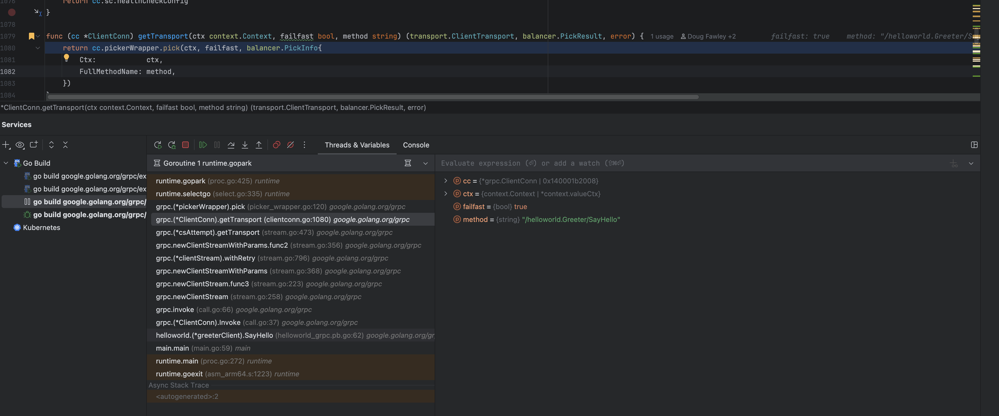

是的，有不少优秀的博客／技术文章探讨了在 gRPC / TCP 长连接中，应对“隐蔽断开”（silent drop）、“僵尸连接”（zombie connection）问题的方案。下面列几个经典与实用的，并且我还会摘关键要点供你快速对比。

你也可以根据你用的语言 / 框架（Go / Java / C++ / .NET 等）去找相应的实践版本。

------

## 📚 推荐文章与博客

| 标题 / 链接                                                 | 核心内容 / 亮点                                              | 适合读者 /用途                          |
| ----------------------------------------------------------- | ------------------------------------------------------------ | --------------------------------------- |
| *How gRPC Keepalive Solved Our Zombie Connections*          | 讲述一个真实案例：他们因为网络黑洞（节点断网）导致 gRPC 客户端一直认为连接可用，最终采用 gRPC Keepalive 机制将故障检测时间从分钟级降到秒级。 ([Medium](https://medium.com/freshworks-engineering-blog/how-grpc-keepalive-solved-our-zombie-connections-mystery-f4f626c8a9f2?utm_source=chatgpt.com)) | 适合理解为何需要 “应用层 keepalive”     |
| *Lessons learned from running a large gRPC mesh at Datadog* | 在大规模 gRPC Mesh 中的经验总结，其中讲到要开启 keepalive 通道选项、设置 MAX_CONNECTION_AGE、监控 silent connection drop 等细节。 ([Datadog](https://www.datadoghq.com/blog/grpc-at-datadog/?utm_source=chatgpt.com)) | 适合架构级设计参考                      |
| *Why TCP keepalive may be important*                        | 从更底层的 TCP 层面讲为什么要用 keepalive，默认关闭的问题，以及使用时的配置考虑。 ([redpill-linpro.com](https://www.redpill-linpro.com/techblog/2024/12/17/failovers-and-keepalive.html?utm_source=chatgpt.com)) | 用于理解 TCP 本身的补充机制             |
| *TCP Keepalive is a lie*                                    | 警示式文章，指出启用 TCP keepalive 后也不一定能快速感知连接断开的局限性。 ([Code Arcana](https://codearcana.com/posts/2015/08/28/tcp-keepalive-is-a-lie.html?utm_source=chatgpt.com)) | 用于理解 “keepalive 也有不能解决的问题” |
| *When TCP sockets refuse to die*                            | Cloudflare 的文章，除了讲 keepalive 之外，还推荐使用 `TCP_USER_TIMEOUT` 等套接字选项检测不活跃 / 卡住的连接。 ([The Cloudflare Blog](https://blog.cloudflare.com/when-tcp-sockets-refuse-to-die/?utm_source=chatgpt.com)) | 对底层网络 / 操作系统感兴趣的开发者     |
| *Need to be careful when you using gRPC keepalive*          | 一篇 medium 博文，提醒使用 keepalive 需谨慎配置，比如不能把 keepalive 时间设得太激进，容易触发服务器端限制。 ([Medium](https://lukexng.medium.com/grpc-keepalive-maxconnectionage-maxconnectionagegrace-6352909c57b8?utm_source=chatgpt.com)) | 适合实际调优阶段参考                    |
| *gRPC is easy to misconfigure*                              | 探讨一些常见 gRPC keepalive 的误用，以及 gRPC 默认设置背后的“陷阱” (比如 `TCP_USER_TIMEOUT` 被启用) ([Evan Jones](https://www.evanjones.ca/grpc-is-tricky.html?utm_source=chatgpt.com)) | 适合中级 / 进阶开发者理解坑点           |

------

## 🔍 关键要点 & 总结

从这些文章中，我们可以提炼出一些行之有效的策略，以及需要注意的坑。下面是我给你的总结、对比与建议：

| 方案 / 技术                               | 优点                                                         | 局限 / 风险                                                  | 实践建议                                                     |
| ----------------------------------------- | ------------------------------------------------------------ | ------------------------------------------------------------ | ------------------------------------------------------------ |
| **gRPC HTTP/2 Keepalive（PING）**         | 在没有流量时主动探测对端是否存活；一旦 PING 超时则断开重连。Datadog 在其 gRPC Mesh 中就用这个来缓解 silent drop 问题。 ([Datadog](https://www.datadoghq.com/blog/grpc-at-datadog/?utm_source=chatgpt.com)) | 如果配置不当，PING 太频繁可能被服务器视为 Abuse（过多 PING）而断开连接；也要与服务端的最小 PING 间隔策略匹配。 ([Datadog](https://www.datadoghq.com/blog/grpc-at-datadog/?utm_source=chatgpt.com)) | 给客户端通道设置 keepalive 时间 & 超时（timeout），不要设得太小。 |
| **设置 `TCP_USER_TIMEOUT`**               | 可使操作系统在写入数据长时间未被 ACK 时主动断开，从而及时让上层感知异常。Cloudflare 提倡此办法。 ([The Cloudflare Blog](https://blog.cloudflare.com/when-tcp-sockets-refuse-to-die/?utm_source=chatgpt.com)) | 某些操作系统 / 栈可能不支持 / 对该选项兼容性有限。需要确保你的平台支持。 | 配合 keepalive 使用，使 “探测失败” 更快地被 TCP 栈捕捉。     |
| **定期重建连接（剔除老连接 / 强制重连）** | 即使连接看似正常，也可以定期（例如每 N 分钟）主动关闭旧连接，重新做 DNS 解析或 LB 选路。Datadog 就用 `MAX_CONNECTION_AGE`。 ([Datadog](https://www.datadoghq.com/blog/grpc-at-datadog/?utm_source=chatgpt.com)) | 会引入短暂的连接重建开销和可能的抖动；需要平衡重连频率与稳定性。 | 在服务端 / 客户端都支持的情况下加上该策略。                  |
| **网络层 / 链路层检测机制（BFD 等）**     | 在网络设备层面（交换机 / 路由器）可以更快检测链路故障。BFD 是一个典型协议。 ([维基百科](https://en.wikipedia.org/wiki/Bidirectional_Forwarding_Detection?utm_source=chatgpt.com)) | 这个方案通常需要网络设备支持、配置能力强；对于端到端用户层程序控制能力有限。 | 如果你在可控网络环境（数据中心 /专有网络）中，可以考虑配合 BFD 等链路级检测。 |
| **监控 & 告警 / 可视化检查**              | 即使你有 keepalive / 探测，也要监控 socket 状态（未 ACK 的字节、重试次数等），以便及时预警。Datadog 用 `ss` 命令查看 TCP 未 ACK 字节。 ([Datadog](https://www.datadoghq.com/blog/grpc-at-datadog/?utm_source=chatgpt.com)) | 监控本身有开销；如果监控逻辑有误或漏检测，可能不够及时。     | 定期把这些指标纳入你的监控看板（如 “socket 重传次数 / 队列长度 / 重试超时次数”） |

------

如果你愿意的话，我可以根据你用的 **语言 + 框架（例如 Go gRPC / Java gRPC / gRPC-C++）**，给你一个 “在你的技术栈里最优的连接健壮性方案 + 示例配置 + 推荐博客” 的整理。要吗？

是的，有不少博客 / 技术文章或者官方文档讨论了 gRPC channel 状态、`UNAVAILABLE` 问题、连接语义 (connectivity semantics) 和如何监控通道状态。下面列几个比较有代表性的，以及你可以进一步阅读的方向：

------

## 📚 推荐的博客 / 文章 / 技术资源

| 名称                                                         | 内容概要                                                     | 价值 / 侧重点                                                |
| ------------------------------------------------------------ | ------------------------------------------------------------ | ------------------------------------------------------------ |
| *A short introduction to Channelz*                           | 介绍 gRPC 的 `channelz` 调试工具，如何用它观察连接、子通道（subchannels）、流等运行时指标。 ([gRPC](https://grpc.io/blog/a-short-introduction-to-channelz/?utm_source=chatgpt.com)) | 如果你想在生产环境里动态监控通道状态，这篇是很好的入门       |
| *gRPC Connectivity Semantics and API*                        | 官方文档，详细描述 gRPC channel 的状态机（CONNECTING, READY, TRANSIENT_FAILURE, IDLE, SHUTDOWN 等）以及状态变迁的语义。 ([grpc.github.io](https://grpc.github.io/grpc/core/md_doc_connectivity-semantics-and-api.html?utm_source=chatgpt.com)) | 最基础、权威的语义说明                                       |
| *Lessons learned from running a large gRPC mesh at Datadog*  | Datadog 在大规模 gRPC 网络中的经验分享，包括连接管理、失联恢复、keepalive、负载均衡策略等。 ([Datadog](https://www.datadoghq.com/blog/grpc-at-datadog/?utm_source=chatgpt.com)) | 实战层面的思考，可以借鉴在工程系统中的做法                   |
| *Keep Python gRPC Client Connection Truly Alive*（Jeff Li 的博客） | 讲述在 Python 客户端里 channel 被垃圾回收或长时间空闲导致 “UNAVAILABLE” 错误的案例，以及如何保持 channel 存活。 ([bluesalt.github.io](https://bluesalt.github.io/blog/2017/08/02/keep-python-grpc-client-connection-truly-alive?utm_source=chatgpt.com)) | 对于 Python 客户端特别实用                                   |
| *Trying to connect an http1.x server — gRPC error*           | 分析 “UNAVAILABLE: Trying to connect an http1.x server” 错误，指出可能是因为通过 HTTP 代理或服务器不支持 HTTP/2 导致的兼容问题。 ([putridparrot.com](https://putridparrot.com/blog/the-unavailable-trying-to-connect-an-http1-x-server-grpc-error/?utm_source=chatgpt.com)) | 在复杂网络 / 代理 / 协议环境下可能遇到这种错误，这篇能提供诊断方向 |
| *Channel State Does Not Change（grpc-node issue）*           | 虽然是 issue 而不是传统博客，但讨论当网络断开时 channel 状态不更新的问题，也就是状态检测的局限性。 ([GitHub](https://github.com/grpc/grpc-node/issues/745?utm_source=chatgpt.com)) | 提醒你“状态”并不总是能即时反映真实网络断开                   |

------

如果你愿意的话，我可以挑几篇比较贴近你使用的语言 / 框架（Java, Go, Python, etc.）的博客给你。要吗？
