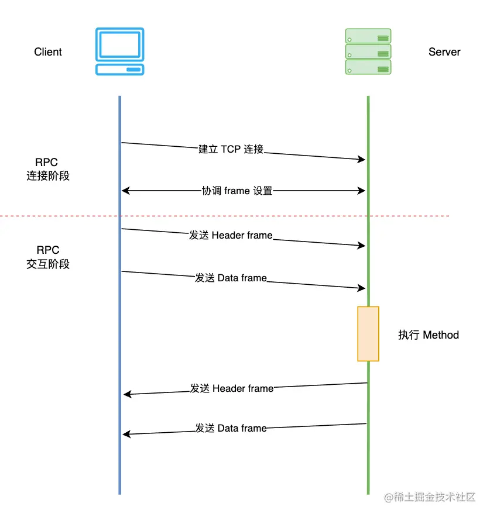

## gprc流程概括




grpc的流程可以大致分成两个阶段，分别为grpc连接阶段和grpc交互阶段，如图[^1]所示。

在RPC连接阶段，client和server之间建立起TCP连接，grpc底层依赖于HTTP2，因此client和server还需要协调frame的相关设置，例如frame的大小，滑动窗口的大小等。

在RPC交互阶段，client将数据发送给server，并等待server执行执行method之后返回结果。

### Client的流程

在RPC连接阶段，client接收到一个目标地址和一系列的DialOptions，然后

1. 配置连接参数，interceptor等，启动resolver
2. Rosovler根据目标地址获取server的地址列表（比如一个DNS name可能会指向多个server ip，dnsResolver是grpc内置的resolver之一），启动balancer
3. Balancer根据平衡策略，从诸多server地址中选择一个或者多个建立TCP连接
4. client在TCP连接建立完成之后，等待server发来的HTTP2 Setting frame，并调整自身的HTTP2相关配置，随后向server发送HTTP2 Setting frame

在RPC交互阶段，某个rpc方法被调用后

1. Client创建一个stream对象用来管理整个交互流程
2. Client将service name, method name等信息放到header frame中并发送给server
3. client将method的参数信息放到data frame中并发送给server
4. client等待server传回的header frame和data frame，一次rpc call的result status会被包含在header frame中，而method的返回值被包含在data frame中

### Server流程

在rpc连接阶段，server在完成一些初始化的配置之后，开始监听某个tcp端口，在和某个client建立了tcp连接之后完成http2 settting frame的交互。

在rpc交互阶段：

1. server等待client发来的header frame，从而创建出一个stream对象来管理真个交互流程，根据header frame中的信息，server知道client请求的是哪一个service的那一个method
2. server接受到client发来的data frame，并执行method
3. server将执行是否成功等信息放在header frame中发送给client
4. server将method执行的结果（返回值）放在data frame中发送给client

## grpc Server的rpc连接阶段

```go
func main() {
	flag.Parse()
	lis, err := net.Listen("tcp", fmt.Sprintf(":%d", *port))
	if err != nil {
		log.Fatalf("failed to listen: %v", err)
	}
	s := grpc.NewServer()
	pb.RegisterGreeterServer(s, &server{})
	log.Printf("server listening at %v", lis.Addr())
	if err := s.Serve(lis); err != nil {
		log.Fatalf("failed to serve: %v", err)
	}
}
```

如上是一个简单的服务端程序，流程如下

1. 首先通过`net.Listener`监听tcp端口，毕竟grpc服务是基于tcp的
2. 创建grpc server，并注册服务，`&server{}`实际上就是服务的实现
3. 阻塞等待来自client的访问

```go
func (s *Server) Serve(lis net.Listener) error {
	s.serve = true
	for {
		rawConn, err := lis.Accept()
		s.serveWG.Add(1)
		go func() {
			s.handleRawConn(lis.Addr().String(), rawConn)
			s.serveWG.Done()
		}()

}

```

grpc在一个for循环中等待来自client的访问，每次有新的client端访问，创建一个`net.Conn`，并创建一个新的goroutine处理这个`net.Conn`，所以这个连接上的请求，无论客户端调用哪一个远程访问或者调用几次，都会由这个goroutine处理。

```go
func (s *Server) handleRawConn(lisAddr string, rawConn net.Conn) {
  // 如果grpc server已经关闭，那么同样关闭这个tcp连接
	if s.quit.HasFired() {
		rawConn.Close()
		return
	}
  // 设置tcp超时时间
	rawConn.SetDeadline(time.Now().Add(s.opts.connectionTimeout))

	// Finish handshaking (HTTP2)
	st := s.newHTTP2Transport(rawConn)
  // 清理tcp超时时间
	rawConn.SetDeadline(time.Time{})
  // rpc交互阶段，创建新的goroutine处理来自client的数据
	go func() {
		s.serveStreams(context.Background(), st, rawConn)
		s.removeConn(lisAddr, st)
	}()
}
```

在这里，首先判断gprc server是否关闭，如果关闭，则同样关闭tcp连接。然后进行HTTP2的握手，这里专门设置了tcp超时时间，避免握手迟迟不结束，导致资源占用，在握手结束后，清理tcp超时时间，避免对后面请求的影响。最后新启动一个goroutine，用来处理实际的请求。

### grpc服务端HTTP2握手

```go
func (s *Server) newHTTP2Transport(c net.Conn) transport.ServerTransport {
  // 组装 serverconfig
	config := &transport.ServerConfig{
		MaxStreams:            s.opts.maxConcurrentStreams,
		ConnectionTimeout:     s.opts.connectionTimeout,
		...
	}
  // 根据config的配置项，和client进行http2的握手
	st, err := transport.NewServerTransport(c, config)
```

根据使用者在启动grpc server时的配置项，或者默认的配置项，调用`transport.NewServerTransport`完成和client的http2握手。

```go
	writeBufSize := config.WriteBufferSize
	readBufSize := config.ReadBufferSize
	maxHeaderListSize := defaultServerMaxHeaderListSize
	if config.MaxHeaderListSize != nil {
		maxHeaderListSize = *config.MaxHeaderListSize
	}
	framer := newFramer(conn, writeBufSize, readBufSize, config.SharedWriteBuffer, maxHeaderListSize)
```

首先创建framer，用来负责接受和发送HTTP2 frame，是server和client交流的实际接口。

```go
// Send initial settings as connection preface to client.
isettings := []http2.Setting{{
  ID:  http2.SettingMaxFrameSize,
  Val: http2MaxFrameLen,
}}
if config.MaxStreams != math.MaxUint32 {
  isettings = append(isettings, http2.Setting{
    ID:  http2.SettingMaxConcurrentStreams,
    Val: config.MaxStreams,
  })
}
...

if err := framer.fr.WriteSettings(isettings...); err != nil {
  return nil, connectionErrorf(false, err, "transport: %v", err)
}
```

grpc server端首先明确自己的HTTP2的初始配置，比如MaxFrameSize等，并将这些配置信息通过`frame.fr`发送给client，`frame.fr`实际上就是golang原生的`http2.Framer`，在底层，这些配置信息会被包装成一个Setting Frame发送给client。

client在收到Setting Frame后，根据自身情况调整参数，同样发送一个Setting Frame给sever。

```go
t := &http2Server{
  done:              done,
  conn:              conn,
  peer:              peer,
  framer:            framer,
  readerDone:        make(chan struct{}),
  loopyWriterDone:   make(chan struct{}),
  maxStreams:        config.MaxStreams,
  inTapHandle:       config.InTapHandle,
  fc:                &trInFlow{limit: uint32(icwz)},
  state:             reachable,
  activeStreams:     make(map[uint32]*ServerStream),
  stats:             config.StatsHandlers,
  kp:                kp,
  idle:              time.Now(),
  kep:               kep,
  initialWindowSize: iwz,
  bufferPool:        config.BufferPool,
}
// controlbuf用来缓存Setting Frame等和设置相关的Frame的缓存
t.controlBuf = newControlBuffer(t.done)
// 自增连接id
t.connectionID = atomic.AddUint64(&serverConnectionCounter, 1)
// flush framer，确保向client发送了setting frame
t.framer.writer.Flush()
```

grpc server在发送了setting frame之后，创建好`http2Server`对象，并等待client的后续消息。

```go
// Check the validity of client preface.
preface := make([]byte, len(clientPreface))
// 读取客户端发来的client preface，并验证是否和预期一致
if _, err := io.ReadFull(t.conn, preface); err != nil {
  // In deployments where a gRPC server runs behind a cloud load balancer
  // which performs regular TCP level health checks, the connection is
  // closed immediately by the latter.  Returning io.EOF here allows the
  // grpc server implementation to recognize this scenario and suppress
  // logging to reduce spam.
  if err == io.EOF {
    return nil, io.EOF
  }
  return nil, connectionErrorf(false, err, "transport: http2Server.HandleStreams failed to receive the preface from client: %v", err)
}
if !bytes.Equal(preface, clientPreface) {
  return nil, connectionErrorf(false, nil, "transport: http2Server.HandleStreams received bogus greeting from client: %q", preface)
}

// 读取client端发来的frame
frame, err := t.framer.fr.ReadFrame()
if err == io.EOF || err == io.ErrUnexpectedEOF {
  return nil, err
}
if err != nil {
  return nil, connectionErrorf(false, err, "transport: http2Server.HandleStreams failed to read initial settings frame: %v", err)
}
atomic.StoreInt64(&t.lastRead, time.Now().UnixNano())
// 转成SettingFrame
sf, ok := frame.(*http2.SettingsFrame)
if !ok {
  return nil, connectionErrorf(false, nil, "transport: http2Server.HandleStreams saw invalid preface type %T from client", frame)
}
// 处理SettingFrame
t.handleSettings(sf)
```

```go
func (t *http2Server) handleSettings(f *http2.SettingsFrame) {
  // 如果是ack frame，则直接返回
	if f.IsAck() {
		return
	}
	var ss []http2.Setting
	var updateFuncs []func()
	f.ForeachSetting(func(s http2.Setting) error {
		switch s.ID {
    // 更新http2Server中的配置信息
		case http2.SettingMaxHeaderListSize:
			updateFuncs = append(updateFuncs, func() {
				t.maxSendHeaderListSize = new(uint32)
				*t.maxSendHeaderListSize = s.Val
			})
		default:
			ss = append(ss, s)
		}
		return nil
	})
  // 这里又遇到了controlBuf
  // 执行updateFuncs()，然后将incommingSetting加入到controlBuf的队列中
	t.controlBuf.executeAndPut(func() bool {
		for _, f := range updateFuncs {
			f()
		}
		return true
	}, &incomingSettings{
		ss: ss,
	})
}
```

在HTTP2中，client和server都要求在建立连接前发送一个connection preface，作为对所使用协议的最终确认，并确定HTTP2连接的初始设置，client发送的preface一一个24字节的序列开始，之后紧跟着一个setting frame，用来表示client端最终决定的HTTP2配置参数。

```go
go func() {
  t.loopy = newLoopyWriter(serverSide, t.framer, t.controlBuf, t.bdpEst, t.conn, t.logger, t.outgoingGoAwayHandler, t.bufferPool)
  err := t.loopy.run()
  close(t.loopyWriterDone)
  if !isIOError(err) {
    timer := time.NewTimer(time.Second)
    defer timer.Stop()
    select {
    case <-t.readerDone:
    case <-timer.C:
    }
    t.conn.Close()
  }
}()
go t.keepalive()
```

此时server和client之间的HTTP2链接已经建立完成，RPC连接阶段完毕。在`NewServerTransport`的最后启动了`loopyWriter`，开始了rpc交互阶段，`loopyWriter`不断从`controlBuf`中读取control frames（包括setting frame)，并将缓存中的frame发送给client，可以说`loopyWriter`就是grpc server控制流量已经发送数据的地方。

这里另外启动了一个keepalive的goroutine，这个goroutine应该和grpc的keepalive机制有关。

## grpc server的rpc交互阶段

HTTP2中定义了很多类型的frame，包括data, headers等，具体如下，对于不同的frame类型，HTTP2 server应该有不同的处理逻辑。在grpc中，对frame类型的分类和处理，被包含在`func (s *Server) serveStreams`中。

```go
// FrameType represents the type of an HTTP/2 Frame.
// See [Frame Type].
//
// [Frame Type]: https://httpwg.org/specs/rfc7540.html#FrameType
type FrameType uint8

// Frame types defined in the HTTP/2 Spec.
const (
	FrameTypeData         FrameType = 0x0
	FrameTypeHeaders      FrameType = 0x1
	FrameTypeRSTStream    FrameType = 0x3
	FrameTypeSettings     FrameType = 0x4
	FrameTypePing         FrameType = 0x6
	FrameTypeGoAway       FrameType = 0x7
	FrameTypeWindowUpdate FrameType = 0x8
	FrameTypeContinuation FrameType = 0x9
)
```

```go
func (s *Server) serveStreams(ctx context.Context, st transport.ServerTransport, rawConn net.Conn) {
	streamQuota := newHandlerQuota(s.opts.maxConcurrentStreams)
  // 阻塞并接受来自client的frame
	st.HandleStreams(ctx, func(stream *transport.ServerStream) {
		s.handlersWG.Add(1)
		streamQuota.acquire()
		f := func() {
			defer streamQuota.release()
			defer s.handlersWG.Done()
      // 当一个新的stream被创建之后，进行一些配置
			s.handleStream(st, stream)
		}

		if s.opts.numServerWorkers > 0 {
			select {
			case s.serverWorkerChannel <- f:
				return
			default:
				// If all stream workers are busy, fallback to the default code path.
			}
		}
		go f()
	})
}
```

`st.HandleStreams`会阻塞当前goroutine，并等待来自client的frame，在一个for循环中等待并读取来自client的frame，并采取不同的处理方式。

```go
func (t *http2Server) HandleStreams(ctx context.Context, handle func(*ServerStream)) {
	defer func() {
		close(t.readerDone)
		<-t.loopyWriterDone
	}()
  // for循环，持续处理一个连接的上请求
	for {
    // 限流
		t.controlBuf.throttle()
    // 读取frame
		frame, err := t.framer.fr.ReadFrame()
		atomic.StoreInt64(&t.lastRead, time.Now().UnixNano())
    // 根据frame的类型分别处理
		switch frame := frame.(type) {
    // MetaHeaderFrame并不是http2的frame类型，而是经过包装的类型
    // headers frame + zero or more continuation frame + hspack编码内容的解码
		case *http2.MetaHeadersFrame:
			if err := t.operateHeaders(ctx, frame, handle); err != nil {
				// Any error processing client headers, e.g. invalid stream ID,
				// is considered a protocol violation.
				t.controlBuf.put(&goAway{
					code:      http2.ErrCodeProtocol,
					debugData: []byte(err.Error()),
					closeConn: err,
				})
				continue
			}
		case *http2.DataFrame:
			t.handleData(frame)
		case *http2.RSTStreamFrame:
			t.handleRSTStream(frame)
		case *http2.SettingsFrame:
			t.handleSettings(frame)
		case *http2.PingFrame:
			t.handlePing(frame)
		case *http2.WindowUpdateFrame:
			t.handleWindowUpdate(frame)
		case *http2.GoAwayFrame:
			// TODO: Handle GoAway from the client appropriately.
		default:
			if t.logger.V(logLevel) {
				t.logger.Infof("Received unsupported frame type %T", frame)
			}
		}
	}
}
```

### Headers Frame的处理

```go
func (t *http2Server) operateHeaders(ctx context.Context, frame *http2.MetaHeadersFrame, handle func(*ServerStream)) error {
	// Acquire max stream ID lock for entire duration
	t.maxStreamMu.Lock()
	defer t.maxStreamMu.Unlock()
	// 从客户端frame中获取streamID
	streamID := frame.Header().StreamID
	// 校验stream id
	if streamID%2 != 1 || streamID <= t.maxStreamID {
		// illegal gRPC stream id.
		return fmt.Errorf("received an illegal stream id: %v. headers frame: %+v", streamID, frame)
	}
  // 将获得的streamID设置到http2Server
	t.maxStreamID = streamID
	// 无界message缓冲
	buf := newRecvBuffer()
  // 创建stream
	s := &ServerStream{
		Stream: &Stream{
			id:  streamID,
			buf: buf,
			fc:  &inFlow{limit: uint32(t.initialWindowSize)},
		},
		st:               t,
		headerWireLength: int(frame.Header().Length),
	}
```

在grpc server和client端，存在这一个stream的概念，用来表征一次grpc call。一个grpc call总是以一个来自client的headers frame开始，因此server会在`operateHeaders`中创建一个`Stream`对象，stream有一个client和server端一致的id，也有一个buf缓存。

```go
for _, hf := range frame.Fields {
  switch hf.Name {
  case "grpc-encoding":
    s.recvCompress = hf.Value
  case ":method":
    // POST, GET这些
    httpMethod = hf.Value
  case ":path":
    // 使用grpc那个服务的那个方法
    s.method = hf.Value
  case "grpc-timeout":
    timeoutSet = true
    var err error
    if timeout, err = decodeTimeout(hf.Value); err != nil {
      headerError = status.Newf(codes.Internal, "malformed grpc-timeout: %v", err)
    }
  }
}
```

grpc server会遍历frame中的field，并将filed中的信息记录在stream中。`:method`和`:path`这两个field需要特别注意，client端需要填写好这两个field来明确地指定要调用server端提供的那一个方法，也就是说，调用哪一个server方法的信息是和调用方法的参数分开在不同的frame中的。

```go
if frame.StreamEnded() {
  // s is just created by the caller. No lock needed.
  s.state = streamReadDone
}
// 超时设置
if timeoutSet {
  s.ctx, s.cancel = context.WithTimeout(ctx, timeout)
} else {
  s.ctx, s.cancel = context.WithCancel(ctx)
}
if uint32(len(t.activeStreams)) >= t.maxStreams {
  t.mu.Unlock()
  t.controlBuf.put(&cleanupStream{
    streamID: streamID,
    rst:      true,
    rstCode:  http2.ErrCodeRefusedStream,
    onWrite:  func() {},
  })
  s.cancel()
  return nil
}
// 将stream加入activeStreams map
t.activeStreams[streamID] = s
if len(t.activeStreams) == 1 {
  t.idle = time.Time{}
}
// Start a timer to close the stream on reaching the deadline.
if timeoutSet {
  // We need to wait for s.cancel to be updated before calling
  // t.closeStream to avoid data races.
  cancelUpdated := make(chan struct{})
  timer := internal.TimeAfterFunc(timeout, func() {
    <-cancelUpdated
    t.closeStream(s, true, http2.ErrCodeCancel, false)
  })
  oldCancel := s.cancel
  s.cancel = func() {
    oldCancel()
    timer.Stop()
  }
  close(cancelUpdated)
}
s.trReader = &transportReader{
  reader: &recvBufferReader{
    ctx:     s.ctx,
    ctxDone: s.ctxDone,
    recv:    s.buf,
  },
  windowHandler: func(n int) {
    t.updateWindow(s, uint32(n))
  },
}
// Register the stream with loopy.
t.controlBuf.put(&registerStream{
  streamID: s.id,
  wq:       s.wq,
})
handle(s)
```

这个新建的stream对象会被放到server的`activeStreams` map中，并调用回调函数`handle(s)`来进一步处理这个stream，其中最重要的是调用`s.handleStream`。

```go
st.HandleStreams(ctx, func(stream *transport.ServerStream) {
  s.handlersWG.Add(1)
  streamQuota.acquire()
  f := func() {
    defer streamQuota.release()
    defer s.handlersWG.Done()
    s.handleStream(st, stream)
  }
	// 如果设置了worker池，则先尝试提交任务到worker池中，如果不行，新起goroutine执行
  if s.opts.numServerWorkers > 0 {
    select {
    case s.serverWorkerChannel <- f:
      return
    default:
      // If all stream workers are busy, fallback to the default code path.
    }
  }
  go f()
})

// initServerWorkers creates worker goroutines and a channel to process incoming
// connections to reduce the time spent overall on runtime.morestack.
func (s *Server) initServerWorkers() {
	s.serverWorkerChannel = make(chan func())
	s.serverWorkerChannelClose = sync.OnceFunc(func() {
		close(s.serverWorkerChannel)
	})
	for i := uint32(0); i < s.opts.numServerWorkers; i++ {
		go s.serverWorker()
	}
}
```

回调函数中会将处理stream的任务提交到其他goroutine中，如果可用的worker，则由worker执行，否则另起goroutine来执行。

```go
func (s *Server) handleStream(t transport.ServerTransport, stream *transport.ServerStream) {
  // 获取grpc路径
	sm := stream.Method()
	pos := strings.LastIndex(sm, "/")
  // 调用的grpc service name
	service := sm[:pos]
  // 调用的grpc method name
	method := sm[pos+1:]

  // 从grpc server注册的service和method中找是否存在
	srv, knownService := s.services[service]
	if knownService {
    // unary rpc
		if md, ok := srv.methods[method]; ok {
			s.processUnaryRPC(ctx, stream, srv, md, ti)
			return
		}
    // stream rpc
		if sd, ok := srv.streams[method]; ok {
			s.processStreamingRPC(ctx, stream, srv, sd, ti)
			return
		}
	}
}
```

根据handers frame中service和method的信息，grpc server找到注册好的method并执行，这里区分unary调用和streaming调用，分别对应`s.processUnaryRPC`和`s.processStreamingRPC`。

```go
func (s *Server) processUnaryRPC(ctx context.Context, stream *transport.ServerStream, info *serviceInfo, md *MethodDesc, trInfo *traceInfo) (err error) {
  // 接收message并且解压缩
	d, err := recvAndDecompress(&parser{r: stream, bufferPool: s.opts.bufferPool}, stream, dc, s.opts.maxReceiveMessageSize, payInfo, decomp, true)
  df := func(v any) error {
    defer dataFree()
    // 使用proto codec将获取到的数据unmarshal到对应的请求类型
    if err := s.getCodec(stream.ContentSubtype()).Unmarshal(d, v); err != nil {
      return status.Errorf(codes.Internal, "grpc: error unmarshalling request: %v", err)
    }
    ...
	ctx = NewContextWithServerTransportStream(ctx, stream)
  // 调用实际的server端方法，得到返回结果
	reply, appErr := md.Handler(info.serviceImpl, ctx, df, s.opts.unaryInt)
  // Last=true表示stream最后的写操作，实际上好像没啥用
	opts := &transport.WriteOptions{Last: true}

	if err := s.sendResponse(ctx, stream, reply, cp, opts, comp); err != nil {
	return stream.WriteStatus(statusOK)
}
```

可以看到处理UnaryRPC请求时，会先接受data frame消息，然后unmarshal到对应的请求类型，调用实际的server端方法，得到返回结果，最后将status `statusOK`发送给client，关闭stream。

```go
func recvAndDecompress(p *parser, s recvCompressor, dc Decompressor, maxReceiveMessageSize int, payInfo *payloadInfo, compressor encoding.Compressor, isServer bool,
) (out mem.BufferSlice, err error) {
	pf, compressed, err := p.recvMsg(maxReceiveMessageSize)
	compressedLength := compressed.Len()
	if pf.isCompressed() {
		defer compressed.Free()
		// To match legacy behavior, if the decompressor is set by WithDecompressor or RPCDecompressor,
		// use this decompressor as the default.
		out, err = decompress(compressor, compressed, dc, maxReceiveMessageSize, p.bufferPool)
		if err != nil {
			return nil, err
		}
	} else {
		out = compressed
	}

	if payInfo != nil {
		payInfo.compressedLength = compressedLength
		out.Ref()
		payInfo.uncompressedBytes = out
	}

	return out, nil
}
```

```go
func (p *parser) recvMsg(maxReceiveMessageSize int) (payloadFormat, mem.BufferSlice, error) {
  // 读取message的header，总共5个字节
	err := p.r.ReadMessageHeader(p.header[:])
  // 是否压缩
	pf := payloadFormat(p.header[0])
  // 数据长度
	length := binary.BigEndian.Uint32(p.header[1:])
	// 读取数据
	data, err := p.r.Read(int(length))
	return pf, data, nil
}
```

`recvMsg`根据http2的格式，读取message，`recvAndDecompress`如果数据被压缩过，返回解压缩后的数据。

```go
func _Greeter_SayHello_Handler(srv interface{}, ctx context.Context, dec func(interface{}) error, interceptor grpc.UnaryServerInterceptor) (interface{}, error) {
	in := new(HelloRequest)
  // unmarshal操作
	if err := dec(in); err != nil {
		return nil, err
	}
	if interceptor == nil {
		return srv.(GreeterServer).SayHello(ctx, in)
	}
	info := &grpc.UnaryServerInfo{
		Server:     srv,
		FullMethod: Greeter_SayHello_FullMethodName,
	}
	handler := func(ctx context.Context, req interface{}) (interface{}, error) {
		return srv.(GreeterServer).SayHello(ctx, req.(*HelloRequest))
	}
	return interceptor(ctx, in, info, handler)
}
```

这里以入门的`sayHello`服务为例，可以看到最终没有使用反射，而是直接调用。

```go
const (
	payloadLen = 1
	sizeLen    = 4
	headerLen  = payloadLen + sizeLen
)
// 这个方法很好理解，构造message header和payload
// msgHeader returns a 5-byte header for the message being transmitted and the
// payload, which is compData if non-nil or data otherwise.
func msgHeader(data, compData mem.BufferSlice, pf payloadFormat) (hdr []byte, payload mem.BufferSlice) {
	hdr = make([]byte, headerLen)
	hdr[0] = byte(pf)

	var length uint32
	if pf.isCompressed() {
		length = uint32(compData.Len())
		payload = compData
	} else {
		length = uint32(data.Len())
		payload = data
	}

	// Write length of payload into buf
	binary.BigEndian.PutUint32(hdr[payloadLen:], length)
	return hdr, payload
}
```

```go
func (s *Server) sendResponse(ctx context.Context, stream *transport.ServerStream, msg any, cp Compressor, opts *transport.WriteOptions, comp encoding.Compressor) error {
  // 编码
	data, err := encode(s.getCodec(stream.ContentSubtype()), msg)
  // 压缩
	compData, pf, err := compress(data, cp, comp, s.opts.bufferPool)
  // 构造header和payload
	hdr, payload := msgHeader(data, compData, pf)
  // 交给http2server实际发送数据
	err = stream.Write(hdr, payload, opts)
}
```

```go
// Write converts the data into HTTP2 data frame and sends it out. Non-nil error
// is returns if it fails (e.g., framing error, transport error).
func (t *http2Server) write(s *ServerStream, hdr []byte, data mem.BufferSlice, _ *WriteOptions) error {
	reader := data.Reader()

	if !s.isHeaderSent() { // Headers haven't been written yet.
		if err := t.writeHeader(s, nil); err != nil {
			_ = reader.Close()
			return err
		}
	} else {
		// Writing headers checks for this condition.
		if s.getState() == streamDone {
			_ = reader.Close()
			return t.streamContextErr(s)
		}
	}
	// 构造 data frame
	df := &dataFrame{
		streamID:    s.id,
		h:           hdr,
		reader:      reader,
		onEachWrite: t.setResetPingStrikes,
	}
  // 阻塞获取writeQuota
	if err := s.wq.get(int32(len(hdr) + df.reader.Remaining())); err != nil {
		_ = reader.Close()
		return t.streamContextErr(s)
	}
  // 将data frame放入controlBuf，异步发送
	if err := t.controlBuf.put(df); err != nil {
		_ = reader.Close()
		return err
	}
	t.incrMsgSent()
	return nil
}
```

```go
func (t *http2Server) writeStatus(s *ServerStream, st *status.Status) error {
	s.hdrMu.Lock()
	defer s.hdrMu.Unlock()

	if s.getState() == streamDone {
		return nil
	}
	// Attach the trailer metadata.
	headerFields = appendHeaderFieldsFromMD(headerFields, s.trailer)
	trailingHeader := &headerFrame{
		streamID:  s.id,
		hf:        headerFields,
		endStream: true,
		onWrite:   t.setResetPingStrikes,
	}

	// Send a RST_STREAM after the trailers if the client has not already half-closed.
	rst := s.getState() == streamActive
  // 调用 finishStream关闭stream
	t.finishStream(s, rst, http2.ErrCodeNo, trailingHeader, true)
}
```

`sendResponse`构造响应，并且将消息存储在`controlBuf`中，最后由`loopyWriter`异步发送给client，`writeStatus`发送`traling header`尾部头信息，然后关闭流。

### Data Frame的处理

```go
func (t *http2Server) handleData(f *http2.DataFrame) {
	size := f.Header().Length
	// Select the right stream to dispatch.
	s, ok := t.getStream(f)
	if !ok {
		return
	}
	if s.getState() == streamReadDone {
		t.closeStream(s, true, http2.ErrCodeStreamClosed, false)
		return
	}
	if size > 0 {
		if len(f.Data()) > 0 {
			pool := t.bufferPool
			s.write(recvMsg{buffer: mem.Copy(f.Data(), pool)})
		}
	}
	if f.StreamEnded() {
		// Received the end of stream from the client.
		s.compareAndSwapState(streamActive, streamReadDone)
		s.write(recvMsg{err: io.EOF})
	}
}
```

在处理data frame时

1. 根据stream ID，从server的activeStreams map中找到stream对象
2. 从`bufferPool`中拿到一块buffer，并将frame的数据写入到buffer
3. 将这块buffer保存到stream的`recvBuffer`中
4. 如果读取结束，修改流状态为`streamReadDone`，并且写入`io.EOF`标记

`recvBuffer`中缓存的数据，最终会被前面提到的`recvAndDecompress`函数读取，从而在server端重建rpc的参数。

### Setting Frame的处理

```go
func (t *http2Server) handleSettings(f *http2.SettingsFrame) {
	if f.IsAck() {
		return
	}
	var ss []http2.Setting
	var updateFuncs []func()
	f.ForeachSetting(func(s http2.Setting) error {
		switch s.ID {
		case http2.SettingMaxHeaderListSize:
			updateFuncs = append(updateFuncs, func() {
				t.maxSendHeaderListSize = new(uint32)
				*t.maxSendHeaderListSize = s.Val
			})
		default:
			ss = append(ss, s)
		}
		return nil
	})
	t.controlBuf.executeAndPut(func() bool {
		for _, f := range updateFuncs {
			f()
		}
		return true
	}, &incomingSettings{
		ss: ss,
	})
}
```

`handleSettings`并没有直接将settting frame的参数应用在server上，而是将其放到了`controlBuf`中。

## server如何发送frame

grpc server在每次收到一个新的来自client的连接后，会创建一个Framer，这个Framer就是实际上负责发送和接收HTTP2 frame的接口，每一个client都对应一个Framer来处理来自该client的所有frame，不管这些frame是否属于同一个stream。

```go
type framer struct {
  // 一个包含了buffer的net.Conn的writer
	writer *bufWriter
  // 原生的http2.Framer，负责数据读写
	fr     *http2.Framer
}
```

`framer`其实就是对golang原生`http2.Framer`的封装。

```go
type bufWriter struct {
	pool      *sync.Pool
	buf       []byte
	offset    int
	batchSize int
	conn      net.Conn
	err       error
}

func newBufWriter(conn net.Conn, batchSize int, pool *sync.Pool) *bufWriter {
	w := &bufWriter{
		batchSize: batchSize,
		conn:      conn,
		pool:      pool,
	}
	// this indicates that we should use non shared buf
	if pool == nil {
		w.buf = make([]byte, batchSize)
	}
	return w
}

func (w *bufWriter) Write(b []byte) (int, error) {
  // 在write之间检查上一次write是否发生了错误
	if w.err != nil {
		return 0, w.err
	}
  // 如果batchsize为0，说明不需要写缓存，直接向net.Conn写数据
	if w.batchSize == 0 { // Buffer has been disabled.
		n, err := w.conn.Write(b)
		return n, toIOError(err)
	}
	if w.buf == nil {
		b := w.pool.Get().(*[]byte)
		w.buf = *b
	}
	written := 0
  // 如果写入的数据少于batchSize，则缓存，暂时不写入conn
  // 如果写入的数据多余batchSize，则调用flushKeepBuffer不断写数据
	for len(b) > 0 {
		copied := copy(w.buf[w.offset:], b)
		b = b[copied:]
		written += copied
		w.offset += copied
		if w.offset < w.batchSize {
			continue
		}
		if err := w.flushKeepBuffer(); err != nil {
			return written, err
		}
	}
	return written, nil
}

func (w *bufWriter) Flush() error {
  // 刷新数据到conn
	err := w.flushKeepBuffer()
	// Only release the buffer if we are in a "shared" mode
	if w.buf != nil && w.pool != nil {
		b := w.buf
		w.pool.Put(&b)
		w.buf = nil
	}
	return err
}

func (w *bufWriter) flushKeepBuffer() error {
	if w.err != nil {
		return w.err
	}
	if w.offset == 0 {
		return nil
	}
	_, w.err = w.conn.Write(w.buf[:w.offset])
	w.err = toIOError(w.err)
	w.offset = 0
	return w.err
}
```

grpc server实现了一个简单的缓存写给`http2.framer`作为`io.Writer`。

```go
// 全局writeBufferPool
var writeBufferPoolMap = make(map[int]*sync.Pool)
var writeBufferMutex sync.Mutex

func newFramer(conn net.Conn, writeBufferSize, readBufferSize int, sharedWriteBuffer bool, maxHeaderListSize uint32) *framer {
	if writeBufferSize < 0 {
		writeBufferSize = 0
	}
	var r io.Reader = conn
	if readBufferSize > 0 {
    // 设置io.Reader
		r = bufio.NewReaderSize(r, readBufferSize)
	}
	var pool *sync.Pool
	if sharedWriteBuffer {
		pool = getWriteBufferPool(writeBufferSize)
	}
  // 设置io.Writer
	w := newBufWriter(conn, writeBufferSize, pool)
  // 创建framer
	f := &framer{
		writer: w,
		fr:     http2.NewFramer(w, r),
	}
	f.fr.SetMaxReadFrameSize(http2MaxFrameLen)
	// Opt-in to Frame reuse API on framer to reduce garbage.
	// Frames aren't safe to read from after a subsequent call to ReadFrame.
	f.fr.SetReuseFrames()
	f.fr.MaxHeaderListSize = maxHeaderListSize
	f.fr.ReadMetaHeaders = hpack.NewDecoder(http2InitHeaderTableSize, nil)
	return f
}

// writeBuffer 使用sync.Pool
func getWriteBufferPool(size int) *sync.Pool {
	writeBufferMutex.Lock()
	defer writeBufferMutex.Unlock()
	pool, ok := writeBufferPoolMap[size]
	if ok {
		return pool
	}
	pool = &sync.Pool{
		New: func() any {
			b := make([]byte, size)
			return &b
		},
	}
	writeBufferPoolMap[size] = pool
	return pool
}
```

传递给`http2.framer`的`io.Reader`使用了`bifio` package。

`writeBuffer`使用了go标准库中的`sync.Pool`，根据需要的size获取对应的`sync.Pool`，如果池中有对应的`byte[]`，获取然后返回，如果没有，创建新的`byte[]`并返回。池中元素的回收时机，go允许在任何时候自动回收池中的元素（gc）。

grpc server为每一个client创建一个`loopyWriter`，有这个`loopyWriter`负责发送数据。

```go
type loopyWriter struct {
	side      side
	cbuf      *controlBuffer
	sendQuota uint32
	oiws      uint32
	estdStreams map[uint32]*outStream // Established streams.
	// activeStreams is a linked-list of all streams that have data to send and some
	// stream-level flow control quota.
	// Each of these streams internally have a list of data items(and perhaps trailers
	// on the server-side) to be sent out.
	activeStreams *outStreamList
	framer        *framer
	hBuf          *bytes.Buffer  // The buffer for HPACK encoding.
	hEnc          *hpack.Encoder // HPACK encoder.
	bdpEst        *bdpEstimator
	draining      bool
	conn          net.Conn
	logger        *grpclog.PrefixLogger
	bufferPool    mem.BufferPool

	// Side-specific handlers
	ssGoAwayHandler func(*goAway) (bool, error)
}
```


## 参考文献

[^1] [gprc源码分析 zhengxinzx](https://juejin.cn/post/7089739785035579429) 一系列grpc源码分析，主要介绍了grpc的原理和流量控制
