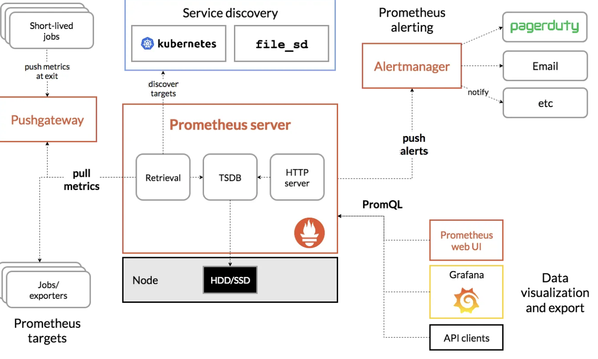

## Prometheus

https://www.youtube.com/watch?v=h4Sl21AKiDg

Prometheus Server, Pushgateway, Alertmanager

https://prometheus.io/docs/concepts/metric_types/

https://itnext.io/prometheus-for-beginners-5f20c2e89b6c

**Prometheus is essentially just another metrics collection and analysis tool,** and at its core it is made up of 3 components:

- A [**time series database**](https://en.wikipedia.org/wiki/Time_series) that will store all our metrics data
- A **data retrieval worker** that is responsible for **pulling/scraping** metrics from external sources and **pushing** them into the database
- A web server that provides a **simple web interface** for configuration and querying of the data stored.

https://prometheus.io/docs/practices/naming/#metric-names

https://prometheus.io/docs/practices/naming/#base-units