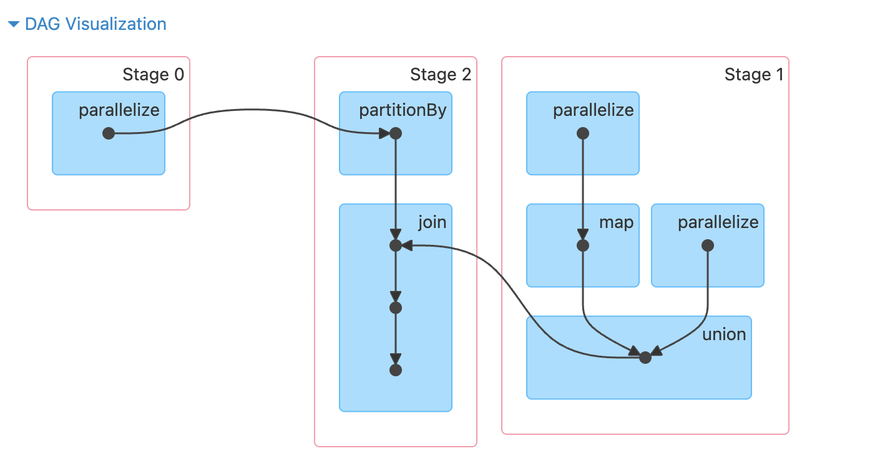
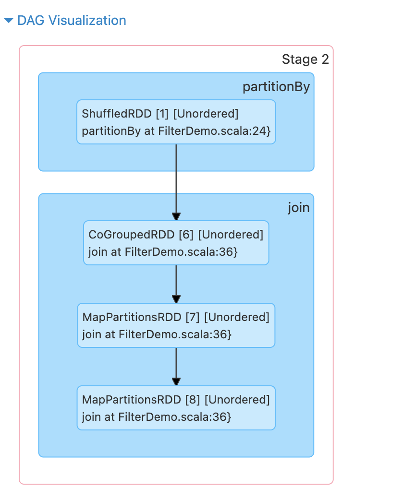
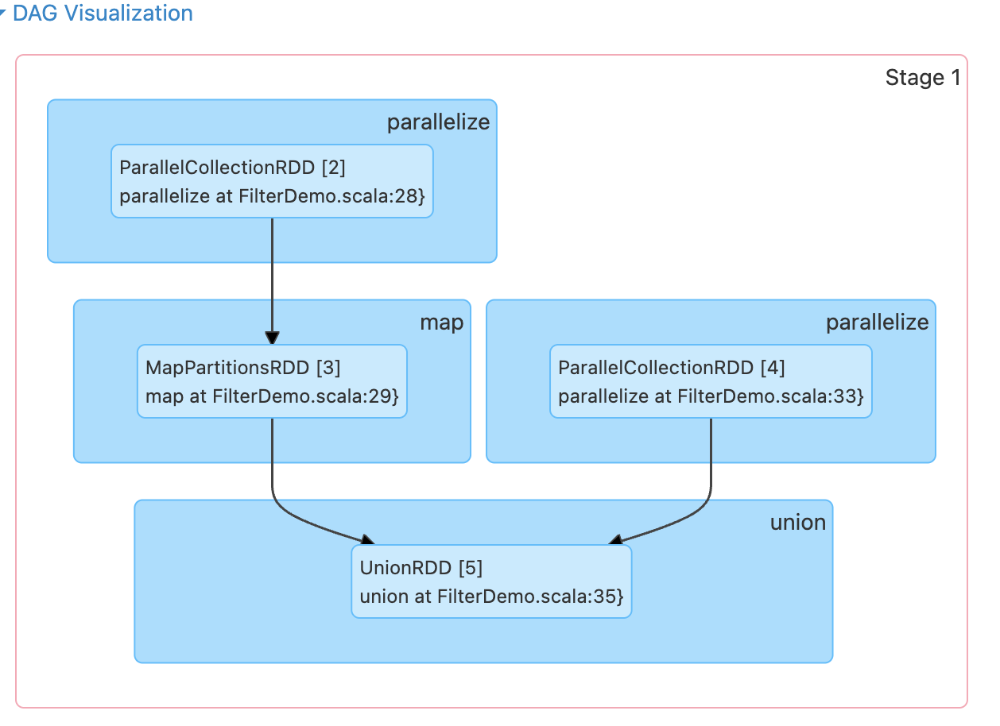

## Spark物理执行计划生成方法

Spark具体采用3个步骤来生成物理执行计划，首先根据action操作顺序将应用划分为作业（job），然后根据每个job的逻辑处理流程中的ShuffleDependency依赖关系，将job划分为执行阶段（stage）。最后在每个stage中，根据最后生成的RDD的分区个数生成多个计算任务（task）。

### 根据action操作将应用划分为作业（job）

当应用程序出现action操作时，如resultRDD.action()，表示应用会生成一个job，该job的逻辑处理流程为从输出数据到resultRDD的逻辑处理流程。

### 根据ShuffleDependency依赖关系将job划分成执行阶段（stage）

对于每个job，从其最后的RDD往前回溯整个逻辑处理流程，如果遇到NarrowDependency，则将当前RDD的parent RDD纳入，并继续向前追溯，当遇到ShuffleDependency时，停止回溯，将当前已经纳入的所有RDD按照其依赖关系建立一个执行阶段，命名为stage i。

如果将存在ShuffleDependency依赖的RDD也纳入同一个stage，计算每个分区时都需要重复计算ShuffleDependency上游的RDD，这显然没有必要。

### 根据分区计算将各个stage划分成计算任务（task）

每个分区上的计算逻辑相同，而且是独立的，因此每个分区上的计算可以独立成为一个task。同一个stage中的task可以同时分发到不同的机器并行执行。

### job、stage和task的计算顺序

job的提交时间和action被调用的时间有关，当应用程序执行到rdd.action()时，就会立即将rdd.actioin()形成的job提交给spark。job的逻辑处理流程实际上是一个DAG图，经过stage划分后，仍然是DAG图形状。每个stage的输出数据要不是job的输入数据，要不是上游stage的输出结果。因此，计算顺序从包含输入数据的stage开始，从前往后依次执行，仅当上游stage都执行完成后，再执行下游的stage。stage中的每个task因为是独立而且同构的，可以并行执行没有先后之分。

### task内部数据的存储的计算问题（流水线计算）

假设一个分区中有三条记录，分别为record1, record2, record3，需要对分区先执行f()操作，再执行g()操作，假设f()操作和g()操作都只依赖于上游分区中的单条记录，则可以采用流水线计算。类似于`record1 -> f(record1) -> record1' -> g(record') -> record''`，在task计算时只需要再内存中保留当前被处理的单个record即可，没有必要在执行f(record1)之前将record2和record3提前计算出来放入内存中。当然，如果f()操作和g()操作都依赖于上游分区中的多条记录，则流水线计算退化到计算-回收模式，需要一次读取上游分区中的所有数据，每执行完一个操作，回收之前的中间计算结果。

Spark采用流水线式计算来提高task的执行效率，减少内存使用量。这也是Spark可以在有限内存中处理大量大规模数据的原因。然而对于某些需要聚合中间计算结果的操作，还是需要占用一定的内存空间，也会在一定程度上影响流水线计算的效率。

### task间的数据传递和计算问题

stage之间存在的依赖关系是ShuffleDependency，而ShuffleDependency是部分依赖的，也就是下游stage中的每个task需要从parent RDD的每个分区中获取部分数据。ShuffleDependency的数据划分方式包括Hash划分、Range划分等，也就是要求上游stage预先将输出数据进行划分，按照分区存在，分区个数和下游task的个数一致，这个过程被称为Shuffle Write。按照分区存放完成后，下游的task将属于自己分区的数据通过网络传输获取，然后将来自上游不同分区的数据聚合在一起进行处理，这个过程被称为Shuffle Read。

### stage和task的命名方式

在Spark中，stage也可以有多个，有些stage既包含类似reduce的聚合操作有包含map操作，所以一般不区分是map stage还是reduce stage，而直接使用stage i来命名。

如果task的输出结果需要进行ShuffleWrite，以便传输给下一个stage，那么这些task被称为ShuffleMapTasks，而如果task的输出结果会汇总到Driver端或者直接写入分布式文件系统，那么这些task被称为ResultTasks。

## 生成物理执行计划的源码分析

### demo程序

```scala

// scalastyle:off println
package org.apache.spark.examples

import java.util.concurrent.TimeUnit

import scala.collection.compat.immutable.ArraySeq

import org.apache.spark.{HashPartitioner, SparkContext}
import org.apache.spark.sql.SparkSession

object FilterDemo {
  def main(args: Array[String]): Unit = {
    val spark = SparkSession
      .builder()
      .appName("MapDemo")
      .master("local")
      .getOrCreate()
    val sc = spark.sparkContext.asInstanceOf[SparkContext]

    val data1 = Array[(Int, Char)]((1, 'a'), (2, 'b'), (3, 'c'),
      (4, 'd'), (5, 'e'), (3, 'f'), (2, 'g'), (1, 'h'))
    val rdd1 = sc.parallelize(ArraySeq.unsafeWrapArray(data1), 3)
    val partitionedRDD = rdd1.partitionBy(new HashPartitioner(3))

    val data2 = Array[(Int, String)]((1, "A"), (2, "B"),
      (3, "C"), (4, "D"))
    val rdd2 = sc.parallelize(ArraySeq.unsafeWrapArray(data2), 2)
      .map(x => (x._1, x._2 + "" + x._2))

    val data3 = Array[(Int, String)]((3, "X"), (5, "Y"),
      (3, "Z"), (4, "Y"))
    val rdd3 = sc.parallelize(ArraySeq.unsafeWrapArray(data3), 2)

    val unionedRDD = rdd2.union(rdd3)
    val resultRDD = partitionedRDD.join(unionedRDD)
    resultRDD.count()
    spark.stop()

  }
}

```







涉及到以下RDD类别

- ParallelCollectionRDD
- ShuffledRDD
- CoGroupedRDD
- MapPartitionsRDD
- UnionRDD

### ### runJob

```scala
def count(): Long = sc.runJob(this, Utils.getIteratorSize _).sum
def runJob[T, U: ClassTag](rdd: RDD[T], func: Iterator[T] => U): Array[U] = {
  runJob(rdd, func, rdd.partitions.indices)
}
def runJob[T, U: ClassTag](
    rdd: RDD[T],
    func: Iterator[T] => U,
    partitions: Seq[Int]): Array[U] = {
  val cleanedFunc = clean(func)
  runJob(rdd, (ctx: TaskContext, it: Iterator[T]) => cleanedFunc(it), partitions)
}
def runJob[T, U: ClassTag](
    rdd: RDD[T],
    func: (TaskContext, Iterator[T]) => U,
    partitions: Seq[Int]): Array[U] = {
  val results = new Array[U](partitions.size)
  runJob[T, U](rdd, func, partitions, (index, res) => results(index) = res)
  results
}
def runJob[T, U: ClassTag](
    rdd: RDD[T],
    func: (TaskContext, Iterator[T]) => U,
    partitions: Seq[Int],
    resultHandler: (Int, U) => Unit): Unit = {
  if (stopped.get()) {
    throw new IllegalStateException("SparkContext has been shutdown")
  }
  val callSite = getCallSite()
  val cleanedFunc = clean(func)
  logInfo(log"Starting job: ${MDC(LogKeys.CALL_SITE_SHORT_FORM, callSite.shortForm)}")
  if (conf.getBoolean("spark.logLineage", false)) {
    logInfo(log"RDD's recursive dependencies:\n" +
      log"${MDC(LogKeys.RDD_DEBUG_STRING, rdd.toDebugString)}")
  }
  dagScheduler.runJob(rdd, cleanedFunc, partitions, callSite, resultHandler, localProperties.get)
  progressBar.foreach(_.finishAll())
  rdd.doCheckpoint()
}
```

count操作会调用runJob创建并执行新的job，`getCallSite`通过堆栈找到用户调用代码的位置以及调用的spark方法，类似于`union at FilterDemo.scala:35`。

```scala
def runJob[T, U](
    rdd: RDD[T],
    func: (TaskContext, Iterator[T]) => U,
    partitions: Seq[Int],
    callSite: CallSite,
    resultHandler: (Int, U) => Unit,
    properties: Properties): Unit = {
  val start = System.nanoTime
  val waiter = submitJob(rdd, func, partitions, callSite, resultHandler, properties)
  ThreadUtils.awaitReady(waiter.completionFuture, Duration.Inf)
  waiter.completionFuture.value.get match {
    case scala.util.Success(_) =>
      logInfo(log"Job ${MDC(LogKeys.JOB_ID, waiter.jobId)} finished: " +
        log"${MDC(LogKeys.CALL_SITE_SHORT_FORM, callSite.shortForm)}, took " +
        log"${MDC(LogKeys.TIME, (System.nanoTime - start) / 1e6)} ms")
    case scala.util.Failure(exception) =>
      logInfo(log"Job ${MDC(LogKeys.JOB_ID, waiter.jobId)} failed: " +
        log"${MDC(LogKeys.CALL_SITE_SHORT_FORM, callSite.shortForm)}, took " +
        log"${MDC(LogKeys.TIME, (System.nanoTime - start) / 1e6)} ms")
      // SPARK-8644: Include user stack trace in exceptions coming from DAGScheduler.
      val callerStackTrace = Thread.currentThread().getStackTrace.tail
      exception.setStackTrace(exception.getStackTrace ++ callerStackTrace)
      throw exception
  }
}
```

`runJob`会调用`submitJob` 提交任务，获得JobWaiter句柄，并等待任务结束。

```scala
def submitJob[T, U](
    rdd: RDD[T],
    func: (TaskContext, Iterator[T]) => U,
    partitions: Seq[Int],
    callSite: CallSite,
    resultHandler: (Int, U) => Unit,
    properties: Properties): JobWaiter[U] = {
  // Check to make sure we are not launching a task on a partition that does not exist.
  val maxPartitions = rdd.partitions.length
  partitions.find(p => p >= maxPartitions || p < 0).foreach { p =>
    throw new IllegalArgumentException(
      "Attempting to access a non-existent partition: " + p + ". " +
        "Total number of partitions: " + maxPartitions)
  }

  // SPARK-23626: `RDD.getPartitions()` can be slow, so we eagerly compute
  // `.partitions` on every RDD in the DAG to ensure that `getPartitions()`
  // is evaluated outside of the DAGScheduler's single-threaded event loop:
  eagerlyComputePartitionsForRddAndAncestors(rdd)

  val jobId = nextJobId.getAndIncrement()
  if (partitions.isEmpty) {
    val clonedProperties = Utils.cloneProperties(properties)
    if (sc.getLocalProperty(SparkContext.SPARK_JOB_DESCRIPTION) == null) {
      clonedProperties.setProperty(SparkContext.SPARK_JOB_DESCRIPTION, callSite.shortForm)
    }
    val time = clock.getTimeMillis()
    listenerBus.post(
      SparkListenerJobStart(jobId, time, Seq.empty, clonedProperties))
    listenerBus.post(
      SparkListenerJobEnd(jobId, time, JobSucceeded))
    // Return immediately if the job is running 0 tasks
    return new JobWaiter[U](this, jobId, 0, resultHandler)
  }

  assert(partitions.nonEmpty)
  val func2 = func.asInstanceOf[(TaskContext, Iterator[_]) => _]
  val waiter = new JobWaiter[U](this, jobId, partitions.size, resultHandler)
  eventProcessLoop.post(JobSubmitted(
    jobId, rdd, func2, partitions.toArray, callSite, waiter,
    JobArtifactSet.getActiveOrDefault(sc),
    Utils.cloneProperties(properties)))
  waiter
}
```

submitJob会计算DAG中每个RDD的`.partitions`，确保`getPartitinos`在`DAGScheduler`单线程事件循环外计算，避免`RDD.getPartitions`的计算影响调度效率，最后向eventProcessLoop中发布一条`JobSubmitted`消息，并返回waiter。

`eagerlyComputePartitionsForRddAndAncestors`函数对DAG中每个RDD调用`partitions`生成分区。为了避免StackOverFlowError，没有直接采用递归的方式遍历DAG，而是采用手动维护栈的方式遍历DAG。维护已经遍历的RDD的Set和还没有遍历过的RDD的列表，每次从列表中取出一个RDD，判断是否已经遍历过，如果已经遍历过，则忽略，否则计算`partitions`，并且将它依赖的RDD也加入到列表中，直到列表为空，所有RDD都已经遍历结束。

提交job会包装成`JobSubmitted`类型的event提交到DAGScheduler的event loop中，然后单线程消费这些event。

`JobSubmitted` event最终会被`handleJobSubmitted`处理。里面会调用`createResultStage`生成ResultStage，并创建对应的ActiveJob，向listenerBus中发布SparkListenerJobStart事件，最终调用`submitStage`提交stage。

### createResultStage

```scala
private def createResultStage(
    rdd: RDD[_],
    func: (TaskContext, Iterator[_]) => _,
    partitions: Array[Int],
    jobId: Int,
    callSite: CallSite): ResultStage = {
  // 获取当前RDD直接依赖的shuffleDependencies
  val (shuffleDeps, resourceProfiles) = getShuffleDependenciesAndResourceProfiles(rdd)
  val resourceProfile = mergeResourceProfilesForStage(resourceProfiles)
  checkBarrierStageWithDynamicAllocation(rdd)
  checkBarrierStageWithNumSlots(rdd, resourceProfile)
  checkBarrierStageWithRDDChainPattern(rdd, partitions.toSet.size)
  // 获取parent stages，这里其他是一个递归过程，内部会调用getShuffleDependenciesAndResourceProfiles
  val parents = getOrCreateParentStages(shuffleDeps, jobId)
  // stageId是整个SparkContext范围内唯一的
  val id = nextStageId.getAndIncrement()
  // 创建新的ResultStage，将parent stages传入作为参数
  val stage = new ResultStage(id, rdd, func, partitions, parents, jobId,
    callSite, resourceProfile.id)
  stageIdToStage(id) = stage
  updateJobIdStageIdMaps(jobId, stage)
  stage
}
```

`createResultStage`负责构建整个Job的Stage依赖关系，通过递归地获取ShuffleDependency将job切割成多个stage，并最终返回ResultStage。

```scala
private[scheduler] def getShuffleDependenciesAndResourceProfiles(
    rdd: RDD[_]): (HashSet[ShuffleDependency[_, _, _]], HashSet[ResourceProfile]) = {
  val parents = new HashSet[ShuffleDependency[_, _, _]]
  val resourceProfiles = new HashSet[ResourceProfile]
  val visited = new HashSet[RDD[_]]
  val waitingForVisit = new ListBuffer[RDD[_]]
  waitingForVisit += rdd
  while (waitingForVisit.nonEmpty) {
    val toVisit = waitingForVisit.remove(0)
    if (!visited(toVisit)) {
      visited += toVisit
      Option(toVisit.getResourceProfile()).foreach(resourceProfiles += _)
      toVisit.dependencies.foreach {
        case shuffleDep: ShuffleDependency[_, _, _] =>
          parents += shuffleDep
        case dependency =>
          waitingForVisit.prepend(dependency.rdd)
      }
    }
  }
  (parents, resourceProfiles)
}
```

`getShuffleDependenciesAndResourceProfiles`返回给定 RDD 直接依赖的ShuffleDependency，以及该stage中与这些 RDD 相关联的ResourceProfiles。

遍历当前RDD的所有依赖，将RDD的ResourceProfile添加到结果resourceProfiles，依赖如果是ShuffleDependency，则将ShuffleDependency添加到结果集中，如果遇到其他类型的依赖，则开始递归遍历父RDD。当然实际实现了为了避免StackOverFlowError，采用了手动维护栈的方法。

```scala
private def getOrCreateParentStages(shuffleDeps: HashSet[ShuffleDependency[_, _, _]],
    firstJobId: Int): List[Stage] = {
  shuffleDeps.map { shuffleDep =>
    getOrCreateShuffleMapStage(shuffleDep, firstJobId)
  }.toList
}
private def getOrCreateShuffleMapStage(
    shuffleDep: ShuffleDependency[_, _, _],
    firstJobId: Int): ShuffleMapStage = {
  shuffleIdToMapStage.get(shuffleDep.shuffleId) match {
    case Some(stage) =>
      stage

    case None =>
      // Create stages for all missing ancestor shuffle dependencies.
      getMissingAncestorShuffleDependencies(shuffleDep.rdd).foreach { dep =>
        // Even though getMissingAncestorShuffleDependencies only returns shuffle dependencies
        // that were not already in shuffleIdToMapStage, it's possible that by the time we
        // get to a particular dependency in the foreach loop, it's been added to
        // shuffleIdToMapStage by the stage creation process for an earlier dependency. See
        // SPARK-13902 for more information.
        if (!shuffleIdToMapStage.contains(dep.shuffleId)) {
          createShuffleMapStage(dep, firstJobId)
        }
      }
      // Finally, create a stage for the given shuffle dependency.
      createShuffleMapStage(shuffleDep, firstJobId)
  }
}
```

对于每个ShuffleDependency，获取对应的ShuffleMapStage。

通过shuffleId查询ShuffleMapStage，如果存在，直接返回。

如果不存在，获取当前ShuffleDependency直接或间接依赖的所有上游缺失的ShuffleDependency，再次检查ShuffleDependency是否已经创建ShuffleMapStage，如果没有创建，则调用`createShuffleMapStage`创建，最后所有上游的ShuffleMapStage已经创建完毕，创建当前ShuffleDependency的ShuffleMapStage。

```scala
/** Find ancestor shuffle dependencies that are not registered in shuffleToMapStage yet */
private def getMissingAncestorShuffleDependencies(
    rdd: RDD[_]): ListBuffer[ShuffleDependency[_, _, _]] = {
  val ancestors = new ListBuffer[ShuffleDependency[_, _, _]]
  val visited = new HashSet[RDD[_]]
  // We are manually maintaining a stack here to prevent StackOverflowError
  // caused by recursively visiting
  val waitingForVisit = new ListBuffer[RDD[_]]
  waitingForVisit += rdd
  while (waitingForVisit.nonEmpty) {
    val toVisit = waitingForVisit.remove(0)
    if (!visited(toVisit)) {
      visited += toVisit
      val (shuffleDeps, _) = getShuffleDependenciesAndResourceProfiles(toVisit)
      shuffleDeps.foreach { shuffleDep =>
        if (!shuffleIdToMapStage.contains(shuffleDep.shuffleId)) {
          ancestors.prepend(shuffleDep)
          waitingForVisit.prepend(shuffleDep.rdd)
        } // Otherwise, the dependency and its ancestors have already been registered.
      }
    }
  }
  ancestors
}
```

`getMissingAncestorShuffleDependencies`通过`getShuffleDependenciesAndResourceProflies`获取rdd直接依赖的ShuffleDependency，遍历每个ShuffleDependency，如果ShuffleDependency还没有创建对应的MapShuffleStage，则添加到结果集，并对`shuffleDep.rdd`展开递归操作，继续获取缺失的shuffleDependency，最终返回rdd直接或者间接依赖的ShuffleDependeny集合。

```scala
/**
 * Creates a ShuffleMapStage that generates the given shuffle dependency's partitions. If a
 * previously run stage generated the same shuffle data, this function will copy the output
 * locations that are still available from the previous shuffle to avoid unnecessarily
 * regenerating data.
 */
def createShuffleMapStage[K, V, C](
    shuffleDep: ShuffleDependency[K, V, C], jobId: Int): ShuffleMapStage = {
  val rdd = shuffleDep.rdd
  // 获取直接依赖的ShuffleDependency列表
  val (shuffleDeps, resourceProfiles) = getShuffleDependenciesAndResourceProfiles(rdd)
  val resourceProfile = mergeResourceProfilesForStage(resourceProfiles)
  checkBarrierStageWithDynamicAllocation(rdd)
  checkBarrierStageWithNumSlots(rdd, resourceProfile)
  checkBarrierStageWithRDDChainPattern(rdd, rdd.getNumPartitions)
  val numTasks = rdd.partitions.length
  // 创建上游的ShuffleMapStage
  val parents = getOrCreateParentStages(shuffleDeps, jobId)
  val id = nextStageId.getAndIncrement()
  // 创建当前ShuffleDependency对应的ShuffleMapStage
  val stage = new ShuffleMapStage(
    id, rdd, numTasks, parents, jobId, rdd.creationSite, shuffleDep, mapOutputTracker,
    resourceProfile.id)

  stageIdToStage(id) = stage
  shuffleIdToMapStage(shuffleDep.shuffleId) = stage
  updateJobIdStageIdMaps(jobId, stage)

  if (!mapOutputTracker.containsShuffle(shuffleDep.shuffleId)) {
    // Kind of ugly: need to register RDDs with the cache and map output tracker here
    // since we can't do it in the RDD constructor because # of partitions is unknown
    logInfo(log"Registering RDD ${MDC(RDD_ID, rdd.id)} " +
      log"(${MDC(CREATION_SITE, rdd.getCreationSite)}) as input to " +
      log"shuffle ${MDC(SHUFFLE_ID, shuffleDep.shuffleId)}")
    // partition是在eagerlyComputePartitionsForRddAndAncestors中计算得到的，创建RDD时还不存在
    mapOutputTracker.registerShuffle(shuffleDep.shuffleId, rdd.partitions.length,
      shuffleDep.partitioner.numPartitions)
  }
  stage
}
```

`createShuffleMapStage`先创建上游缺失的ShuffleMapStage，然后创建当前的ShuffleMapStage，并在mapOuputTracker中注册shuffle。

### submitStage

```scala
/** Submits stage, but first recursively submits any missing parents. */
private def submitStage(stage: Stage): Unit = {
  val jobId = activeJobForStage(stage)
  if (jobId.isDefined) {
    logDebug(s"submitStage($stage (name=${stage.name};" +
      s"jobs=${stage.jobIds.toSeq.sorted.mkString(",")}))")
    // waitingStages 正在等待的stage集合
    // runningStages 正在执行的stage集合
    // failedStages 失败等待手动提交重试的集合
    if (!waitingStages(stage) && !runningStages(stage) && !failedStages(stage)) {
      // stage尝试次数超过最大限制，abort stage
      if (stage.getNextAttemptId >= maxStageAttempts) {
        val reason = s"$stage (name=${stage.name}) has been resubmitted for the maximum " +
          s"allowable number of times: ${maxStageAttempts}, which is the max value of " +
          s"config `${config.STAGE_MAX_ATTEMPTS.key}` and " +
          s"`${config.STAGE_MAX_CONSECUTIVE_ATTEMPTS.key}`."
        abortStage(stage, reason, None)
      } else {
        // 找到stage直接依赖的缺失的stage
        val missing = getMissingParentStages(stage).sortBy(_.id)
        logDebug("missing: " + missing)
        if (missing.isEmpty) {
          logInfo(log"Submitting ${MDC(STAGE, stage)} (${MDC(RDD_ID, stage.rdd)}), " +
                  log"which has no missing parents")
          // 依赖的stage都已经就绪，直接提交当前stage的task
          submitMissingTasks(stage, jobId.get)
        } else {
          // 否则尝试提交依赖的stage，进入递归流程
          for (parent <- missing) {
            submitStage(parent)
          }
          // 当前stage加入等待集合
          waitingStages += stage
        }
      }
    }
  } else {
    abortStage(stage, "No active job for stage " + stage.id, None)
  }
}
```

`submitStage`首先需要查找并提交任何缺失的父stage，如果存在这样的父stage，会递归提交父stage，并将自身加入等待集合中，否则，直接提交当前stage的缺失task。

### getMissingParentStages

```scala
private def getMissingParentStages(stage: Stage): List[Stage] = {
  val missing = new HashSet[Stage]
  val visited = new HashSet[RDD[_]]
  // We are manually maintaining a stack here to prevent StackOverflowError
  // caused by recursively visiting
  val waitingForVisit = new ListBuffer[RDD[_]]
  waitingForVisit += stage.rdd
  def visit(rdd: RDD[_]): Unit = {
    if (!visited(rdd)) {
      visited += rdd
      // stage依赖的rdd是否已经计算过并且缓存
      val rddHasUncachedPartitions = getCacheLocs(rdd).contains(Nil)
      if (rddHasUncachedPartitions) {
        // 如果rdd需要重新计算，遍历rdd的依赖关系
        for (dep <- rdd.dependencies) {
          dep match {
            // 获取ShuffleDependency对应的ShuffleMapStage，如果mapStage的结果不可得，添加到结果集中
            case shufDep: ShuffleDependency[_, _, _] =>
              val mapStage = getOrCreateShuffleMapStage(shufDep, stage.firstJobId)
              // Mark mapStage as available with shuffle outputs only after shuffle merge is
              // finalized with push based shuffle. If not, subsequent ShuffleMapStage won't
              // read from merged output as the MergeStatuses are not available.
              if (!mapStage.isAvailable || !mapStage.shuffleDep.shuffleMergeFinalized) {
                missing += mapStage
              } else {
                // Forward the nextAttemptId if skipped and get visited for the first time.
                // Otherwise, once it gets retried,
                // 1) the stuffs in stage info become distorting, e.g. task num, input byte, e.t.c
                // 2) the first attempt starts from 0-idx, it will not be marked as a retry
                mapStage.increaseAttemptIdOnFirstSkip()
              }
            // 如果是窄依赖，则继续回溯
            case narrowDep: NarrowDependency[_] =>
              waitingForVisit.prepend(narrowDep.rdd)
          }
        }
      }
    }
  }
  while (waitingForVisit.nonEmpty) {
    visit(waitingForVisit.remove(0))
  }
  missing.toList
}
```

`getMissingParentStages`找到当前stage直接依赖的缺失的stage。

### submitMissingTasks

通过`findMissingPartitions`找到stage对应的所有需要计算的分区的id，调用`getPreferredLocs`得到每个partition的首选位置。

调用`stage.makeNewStageAttempt`创建新的stage尝试。记录stage的`submissionTime`向listenerBus发布SparkListenerStageSubmitted事件

```scala
// TODO: Maybe we can keep the taskBinary in Stage to avoid serializing it multiple times.
// Broadcasted binary for the task, used to dispatch tasks to executors. Note that we broadcast
// the serialized copy of the RDD and for each task we will deserialize it, which means each
// task gets a different copy of the RDD. This provides stronger isolation between tasks that
// might modify state of objects referenced in their closures. This is necessary in Hadoop
// where the JobConf/Configuration object is not thread-safe.
var taskBinary: Broadcast[Array[Byte]] = null
var partitions: Array[Partition] = null
try {
  // For ShuffleMapTask, serialize and broadcast (rdd, shuffleDep).
  // For ResultTask, serialize and broadcast (rdd, func).
  var taskBinaryBytes: Array[Byte] = null
  // taskBinaryBytes and partitions are both effected by the checkpoint status. We need
  // this synchronization in case another concurrent job is checkpointing this RDD, so we get a
  // consistent view of both variables.
  RDDCheckpointData.synchronized {
    taskBinaryBytes = stage match {
      case stage: ShuffleMapStage =>
        JavaUtils.bufferToArray(
          closureSerializer.serialize((stage.rdd, stage.shuffleDep): AnyRef))
      case stage: ResultStage =>
        JavaUtils.bufferToArray(closureSerializer.serialize((stage.rdd, stage.func): AnyRef))
    }

    partitions = stage.rdd.partitions
  }

  if (taskBinaryBytes.length > TaskSetManager.TASK_SIZE_TO_WARN_KIB * 1024) {
    logWarning(log"Broadcasting large task binary with size " +
      log"${MDC(NUM_BYTES, Utils.bytesToString(taskBinaryBytes.length))}")
  }
  taskBinary = sc.broadcast(taskBinaryBytes)
} catch {
  // In the case of a failure during serialization, abort the stage.
  case e: NotSerializableException =>
    abortStage(stage, "Task not serializable: " + e.toString, Some(e))
    runningStages -= stage

    // Abort execution
    return
  case e: Throwable =>
    abortStage(stage, s"Task serialization failed: $e\n${Utils.exceptionString(e)}", Some(e))
    runningStages -= stage

    // Abort execution
    return
}

val artifacts = jobIdToActiveJob(jobId).artifacts

val tasks: Seq[Task[_]] = try {
  val serializedTaskMetrics = closureSerializer.serialize(stage.latestInfo.taskMetrics).array()
  stage match {
    case stage: ShuffleMapStage =>
      stage.pendingPartitions.clear()
      partitionsToCompute.map { id =>
        val locs = taskIdToLocations(id)
        val part = partitions(id)
        stage.pendingPartitions += id
        new ShuffleMapTask(stage.id, stage.latestInfo.attemptNumber(), taskBinary,
          part, stage.numPartitions, locs, artifacts, properties, serializedTaskMetrics,
          Option(jobId), Option(sc.applicationId), sc.applicationAttemptId,
          stage.rdd.isBarrier())
      }

    case stage: ResultStage =>
      partitionsToCompute.map { id =>
        val p: Int = stage.partitions(id)
        val part = partitions(p)
        val locs = taskIdToLocations(id)
        new ResultTask(stage.id, stage.latestInfo.attemptNumber(),
          taskBinary, part, stage.numPartitions, locs, id, artifacts, properties,
          serializedTaskMetrics, Option(jobId), Option(sc.applicationId),
          sc.applicationAttemptId, stage.rdd.isBarrier())
      }
  }
} catch {
  case NonFatal(e) =>
    abortStage(stage, s"Task creation failed: $e\n${Utils.exceptionString(e)}", Some(e))
    runningStages -= stage
    return
}
if (tasks.nonEmpty) {
  logInfo(log"Submitting ${MDC(NUM_TASKS, tasks.size)} missing tasks from " +
    log"${MDC(STAGE, stage)} (${MDC(RDD_ID, stage.rdd)}) (first 15 tasks are " +
    log"for partitions ${MDC(PARTITION_IDS, tasks.take(15).map(_.partitionId))})")
  val shuffleId = stage match {
    case s: ShuffleMapStage => Some(s.shuffleDep.shuffleId)
    case _: ResultStage => None
  }

  taskScheduler.submitTasks(new TaskSet(
    tasks.toArray, stage.id, stage.latestInfo.attemptNumber(), jobId, properties,
    stage.resourceProfileId, shuffleId))
```

对于ShuffleMapStage，序列化stage.rdd和stage.shuffleDep，对于ResultStage，序列化stage.rdd和stage.func。调用`SparkContext.broadcast`将序列化结果广播。

对于需要计算的分区，每个分区创建一个task，如果stage是ShuffleMapStage，创建ShuffleMapTask，如果stage是ResultStage创建ResultTask。

最终将这些任务打包成TaskSet，并调用`submitTasks`函数提交到`TaskScheduler`进行调度。`submitTasks`从TaskSet创建TaskSetManager，并调用`SchedulerBackend.reviveOffers`更新当前的资源情况并调度task。

`SchedulerBackend`这是一个用于调度系统的后端接口，允许在 TaskSchedulerImpl 之下接入不同的调度实现。
我们假设一种模型：当机器资源变得可用时，应用程序会接收到资源供给（resource offers），然后可以在这些机器上启动任务。常见的实现有以下几种:

- `StandaloneSchedulerBackend` → 适用于 Spark 自带的独立集群模式；
- `YarnSchedulerBackend` → 用于对接 Hadoop YARN；
- `KubernetesClusterSchedulerBackend` → 用于运行在 Kubernetes 上的 Spark 应用。
- `LocalSchedulerBackend` →  用于本地Spark应用

前三种都基于`CoarseGrainedSchedulerBackend`实现。

```scala
// CoarseGrainedSchedulerBackend
override def reviveOffers(): Unit = Utils.tryLogNonFatalError {
  driverEndpoint.send(ReviveOffers)
}
// LocalSchedulerBackend
override def reviveOffers(): Unit = {
  localEndpoint.send(ReviveOffers)
}
```

`reviveOffers`调用`driveEndpoint`发送`ReviceOffers`消息。在`DriverEndPoint.receive`方法中发现实际调用了`makeOffers`函数。(RPC调用)

```scala
// Make fake resource offers on all executors
private def makeOffers(): Unit = {
  // Make sure no executor is killed while some task is launching on it
  val taskDescs = withLock {
    // Filter out executors under killing
    val activeExecutors = executorDataMap.filter { case (id, _) => isExecutorActive(id) }
    val workOffers = activeExecutors.map {
      case (id, executorData) => buildWorkerOffer(id, executorData)
    }.toIndexedSeq
    scheduler.resourceOffers(workOffers, true)
  }
  if (taskDescs.nonEmpty) {
    launchTasks(taskDescs)
  }
}
```

`makeOffers`首先过滤出活跃的executor，然后调用`resourceOffers`，这个函数确定是否有足够的资源让某个任务执行，并且确定任务会被调度到哪一个executor节点。最后调用`launchTask`在executor上启动任务。

### resoruceOffers

TODO

### TaskDescription

```scala
private[spark] class TaskDescription(
    val taskId: Long, // taskId
    val attemptNumber: Int, // task attemp number，唯一标记每次重试
    val executorId: String, // 执行task的executor节点
    val name: String, 
    val index: Int,    // Index within this task's TaskSet
    val partitionId: Int, // 实际计算的分区id
    val artifacts: JobArtifactSet, // jar包和文件等
    val properties: Properties, // 属性
    val cpus: Int, // 需要分配的cpu个数
    // resources is the total resources assigned to the task
    // Eg, Map("gpu" -> Map("0" -> ResourceAmountUtils.toInternalResource(0.7))):
    // assign 0.7 of the gpu address "0" to this task
    val resources: immutable.Map[String, immutable.Map[String, Long]], // 需要分配的其他资源
    val serializedTask: ByteBuffer) { // 序列化的Task

  assert(cpus > 0, "CPUs per task should be > 0")

  override def toString: String = s"TaskDescription($name)"
}
```

`TaskDescription`描述一个将被传到executor上进行执行的task，通常由`TaskSetManager.resourceOffer`创建，TaskDescription和Task需要被序列化传到executor上，当TaskDescription被executor接收到，executor首先需要得到一系列的jar包和文件，并添加这些到classpath，然后设置属性，再反序列化Task对象（serializedTask)，这也是为什么属性properties被包含在TaskDescription中，尽管它们同样包含在serialized task中。

可以看到，TaskDescription已经确定了task将被发送到的executorId以及对应的RDD分区和资源需求。

### launchTasks

```scala
// Launch tasks returned by a set of resource offers
private def launchTasks(tasks: Seq[Seq[TaskDescription]]): Unit = {
  for (task <- tasks.flatten) {
    val serializedTask = TaskDescription.encode(task)
    if (serializedTask.limit() >= maxRpcMessageSize) {
      Option(scheduler.taskIdToTaskSetManager.get(task.taskId)).foreach { taskSetMgr =>
        try {
          var msg = "Serialized task %s:%d was %d bytes, which exceeds max allowed: " +
            s"${RPC_MESSAGE_MAX_SIZE.key} (%d bytes). Consider increasing " +
            s"${RPC_MESSAGE_MAX_SIZE.key} or using broadcast variables for large values."
          msg = msg.format(task.taskId, task.index, serializedTask.limit(), maxRpcMessageSize)
          taskSetMgr.abort(msg)
        } catch {
          case e: Exception => logError("Exception in error callback", e)
        }
      }
    }
    else {
      val executorData = executorDataMap(task.executorId)
      // Do resources allocation here. The allocated resources will get released after the task
      // finishes.
      executorData.freeCores -= task.cpus
      task.resources.foreach { case (rName, addressAmounts) =>
        executorData.resourcesInfo(rName).acquire(addressAmounts)
      }
      logDebug(s"Launching task ${task.taskId} on executor id: ${task.executorId} hostname: " +
        s"${executorData.executorHost}.")

      executorData.executorEndpoint.send(LaunchTask(new SerializableBuffer(serializedTask)))
    }
  }
}
```

`launchTasks`批量处理TaskDecription，首先序列化TaskDescription，如果序列化后的长度高于阈值，则放弃当前任务，否则，申请对应的cpu和其他各类资源，最终调用`executorEndpoint.send`发送RPC请求`LaunchTask`携带序列化后的TaskDescription。

这样任务就可以被executor接收，并且执行了。

### getPreferredLocs

```scala
def getPreferredLocs(rdd: RDD[_], partition: Int): Seq[TaskLocation] = {
  getPreferredLocsInternal(rdd, partition, new HashSet)
}
private def getPreferredLocsInternal(
    rdd: RDD[_],
    partition: Int,
    visited: HashSet[(RDD[_], Int)]): Seq[TaskLocation] = {
  // If the partition has already been visited, no need to re-visit.
  // This avoids exponential path exploration.  SPARK-695
  if (!visited.add((rdd, partition))) {
    // Nil has already been returned for previously visited partitions.
    return Nil
  }
  // If the partition is cached, return the cache locations
  val cached = getCacheLocs(rdd)(partition)
  if (cached.nonEmpty) {
    return cached
  }
  // If the RDD has some placement preferences (as is the case for input RDDs), get those
  val rddPrefs = rdd.preferredLocations(rdd.partitions(partition)).toList
  if (rddPrefs.nonEmpty) {
    return rddPrefs.filter(_ != null).map(TaskLocation(_))
  }

  // If the RDD has narrow dependencies, pick the first partition of the first narrow dependency
  // that has any placement preferences. Ideally we would choose based on transfer sizes,
  // but this will do for now.
  rdd.dependencies.foreach {
    case n: NarrowDependency[_] =>
      for (inPart <- n.getParents(partition)) {
        val locs = getPreferredLocsInternal(n.rdd, inPart, visited)
        if (locs != Nil) {
          return locs
        }
      }

    case _ =>
  }

  Nil
}
```

`getPreferredLocs`获取与特定 RDD 的某个分区相关联的位置（locality）信息。首先检查partition是否被cache，如果被cache，直接返回，否则如果RDD自身有位置信息，直接使用，假设RDD是一个input RDD的场景，最后尝试获取RDD第一个窄依赖的第一个分区的位置信息，这里Spark也提到，理想情况下应该基于transfer size进行选择。


### JobWaiter的实现

```java
private[spark] trait JobListener {
  def taskSucceeded(index: Int, result: Any): Unit
  def jobFailed(exception: Exception): Unit
}
```

JobListerner接口用于监听task完成或者失败的事件，当一个task完成或者整个job失败时被通知。

```scala
/**
 * An object that waits for a DAGScheduler job to complete. As tasks finish, it passes their
 * results to the given handler function.
 */
private[spark] class JobWaiter[T](
    dagScheduler: DAGScheduler,
    val jobId: Int,
    totalTasks: Int,
    resultHandler: (Int, T) => Unit)
  extends JobListener with Logging {

  private val finishedTasks = new AtomicInteger(0)
  // If the job is finished, this will be its result. In the case of 0 task jobs (e.g. zero
  // partition RDDs), we set the jobResult directly to JobSucceeded.
  private val jobPromise: Promise[Unit] =
    if (totalTasks == 0) Promise.successful(()) else Promise()

  def jobFinished: Boolean = jobPromise.isCompleted

  def completionFuture: Future[Unit] = jobPromise.future

  /**
   * Sends a signal to the DAGScheduler to cancel the job with an optional reason. The
   * cancellation itself is handled asynchronously. After the low level scheduler cancels
   * all the tasks belonging to this job, it will fail this job with a SparkException.
   */
  def cancel(reason: Option[String]): Unit = {
    dagScheduler.cancelJob(jobId, reason)
  }

  /**
   * Sends a signal to the DAGScheduler to cancel the job. The cancellation itself is
   * handled asynchronously. After the low level scheduler cancels all the tasks belonging
   * to this job, it will fail this job with a SparkException.
   */
  def cancel(): Unit = cancel(None)

  override def taskSucceeded(index: Int, result: Any): Unit = {
    // resultHandler call must be synchronized in case resultHandler itself is not thread safe.
    synchronized {
      resultHandler(index, result.asInstanceOf[T])
    }
    if (finishedTasks.incrementAndGet() == totalTasks) {
      jobPromise.success(())
    }
  }

  override def jobFailed(exception: Exception): Unit = {
    if (!jobPromise.tryFailure(exception)) {
      logWarning("Ignore failure", exception)
    }
  }

}
```

jobPromise字段是一个Promise对象，Promise 是一个表示未来结果的对象，它可以被手动完成（赋值）或失败（抛出异常）。

### getPartitions

```scala
final def partitions: Array[Partition] = {
  checkpointRDD.map(_.partitions).getOrElse {
    if (partitions_ == null) {
      stateLock.synchronized {
        if (partitions_ == null) {
          partitions_ = getPartitions
          partitions_.zipWithIndex.foreach { case (partition, index) =>
            require(partition.index == index,
              s"partitions($index).partition == ${partition.index}, but it should equal $index")
          }
        }
      }
    }
    partitions_
  }
}
```

`getPartitions`是RDD中的虚方法，由RDD子类负责实现。

```scala
/**
 * An identifier for a partition in an RDD.
 */
trait Partition extends Serializable {
  /**
   * Get the partition's index within its parent RDD
   */
  def index: Int

  // A better default implementation of HashCode
  override def hashCode(): Int = index

  override def equals(other: Any): Boolean = super.equals(other)
}
```


```scala
private[spark] class ParallelCollectionRDD[T: ClassTag](
  sc: SparkContext,
  @transient private val data: Seq[T],
  numSlices: Int,
  locationPrefs: Map[Int, Seq[String]])
  extends RDD[T](sc, Nil) {
// TODO: Right now, each split sends along its full data, even if later down the RDD chain it gets
// cached. It might be worthwhile to write the data to a file in the DFS and read it in the split
// instead.
// UPDATE: A parallel collection can be checkpointed to HDFS, which achieves this goal.

override def getPartitions: Array[Partition] = {
  val slices = ParallelCollectionRDD.slice(data, numSlices).toArray
  slices.indices.map(i => new ParallelCollectionPartition(id, i, slices(i))).toArray
}
```

ParallelCollectionRDD的getPartitions函数首先将输入的数据分成numSlices份，然后生成对应的分区。

```scala
private[spark] class MapPartitionsRDD[U: ClassTag, T: ClassTag](
    var prev: RDD[T],
    f: (TaskContext, Int, Iterator[T]) => Iterator[U],  // (TaskContext, partition index, iterator)
    preservesPartitioning: Boolean = false,
    isFromBarrier: Boolean = false,
    isOrderSensitive: Boolean = false)
  extends RDD[U](prev) {
  override def getPartitions: Array[Partition] = firstParent[T].partitions
```

MapPartitionsRDD直接继承父RDD的分区。

```scala
@DeveloperApi
class UnionRDD[T: ClassTag](
    sc: SparkContext,
    var rdds: Seq[RDD[T]])
  extends RDD[T](sc, Nil) {  // Nil since we implement getDependencies

  // visible for testing
  private[spark] val isPartitionListingParallel: Boolean =
    rdds.length > conf.get(RDD_PARALLEL_LISTING_THRESHOLD)

  override def getPartitions: Array[Partition] = {
    val parRDDs = if (isPartitionListingParallel) {
      // scalastyle:off parvector
      val parArray = new ParVector(rdds.toVector)
      parArray.tasksupport = UnionRDD.partitionEvalTaskSupport
      // scalastyle:on parvector
      parArray
    } else {
      rdds
    }
    val array = new Array[Partition](parRDDs.iterator.map(_.partitions.length).sum)
    var pos = 0
    for ((rdd, rddIndex) <- rdds.zipWithIndex; split <- rdd.partitions) {
      array(pos) = new UnionPartition(pos, rdd, rddIndex, split.index)
      pos += 1
    }
    array
  }
```

UnionRDD类似于MapPartitionsRDD，分区依据父RDD的分区生成。依次遍历每个父RDD的每个分区，生成对应的UnionRDD的分区。

```scala
@DeveloperApi
class ShuffledRDD[K: ClassTag, V: ClassTag, C: ClassTag](
    @transient var prev: RDD[_ <: Product2[K, V]],
    part: Partitioner)
  extends RDD[(K, C)](prev.context, Nil) {
  override def getPartitions: Array[Partition] = {
    Array.tabulate[Partition](part.numPartitions)(i => new ShuffledRDDPartition(i))
  }
private[spark] class ShuffledRDDPartition(val idx: Int) extends Partition {
  override val index: Int = idx
}
```

ShuffledRDD的分区总数通过`partitioner.numPartitions`得到，生成的分区为ShuffledRDDPartition。

```scala
@DeveloperApi
class CoGroupedRDD[K: ClassTag](
    @transient var rdds: Seq[RDD[_ <: Product2[K, _]]],
    part: Partitioner)
  extends RDD[(K, Array[Iterable[_]])](rdds.head.context, Nil) {
    
  override def getPartitions: Array[Partition] = {
    val array = new Array[Partition](part.numPartitions)
    for (i <- array.indices) {
      // Each CoGroupPartition will have a dependency per contributing RDD
      array(i) = new CoGroupPartition(i, rdds.zipWithIndex.map { case (rdd, j) =>
        // Assume each RDD contributed a single dependency, and get it
        dependencies(j) match {
          case s: ShuffleDependency[_, _, _] =>
            None
          case _ =>
            Some(new NarrowCoGroupSplitDep(rdd, i, rdd.partitions(i)))
        }
      }.toArray)
    }
    array
  }
```

CoGroupedRDD通过`numPartitions`获取到当前rdd的分区个数，生成CoGroupPartition分区。当前RDD可能有很多父RDD，如果RDD之间的依赖关系为窄依赖，则记录依赖的父RDD中的对应分区信息，如果是宽依赖，则忽略。每个分区都保存自己依赖的父RDD的对应窄依赖分区。

### Stage

一个stage是一组并行的task，这些task都执行相同的函数，并且需要作为一个spark job的一部分来运行，具有相同的shuffle依赖。每一个由调度器执行的任务DAG都会在发生shuffle的边界处分割成多个stage，然后DAGScheduler按照拓扑顺序来依次运行这些stage。

每个stage可以是shuffle map stage，或者是result stage。如果是shuffle map stage，那么他的task结果将作为其他stage的输入；如果是result stage，那么它的task会直接通过在一个RDD上运行某个函数来执行一个spark action。对于shuffle map stage，Spark还会追踪每个输出分区所在的节点位置。

每个Stage还有一个`firstJobId`用于标识最终提交该stage的job，当使用FIFO调度策略时，这个字段可以让调度器优先计算来自较早job的stages，或者在失败时更快的恢复这些较早的stages。

由于容错恢复（fault recovery）的需要，一个stage可能会被多次重试执行。在这种情况下，stage对象会维护多个`StageInfo`实例，用于传递给监听器（listeners）或者web ui，最新的一次尝试信息可以通过`latestInfo`字段访问。

```scala
private[scheduler] abstract class Stage(
    val id: Int,
    val rdd: RDD[_],
    val numTasks: Int,
    val parents: List[Stage],
    val firstJobId: Int,
    val callSite: CallSite,
    val resourceProfileId: Int)
  extends Logging {

  val numPartitions = rdd.partitions.length

  /** Set of jobs that this stage belongs to. */
  val jobIds = new HashSet[Int]

  /** The ID to use for the next new attempt for this stage. */
  private var nextAttemptId: Int = 0
  private[scheduler] def getNextAttemptId: Int = nextAttemptId

  val name: String = callSite.shortForm
  val details: String = callSite.longForm

  /**
   * Pointer to the [[StageInfo]] object for the most recent attempt. This needs to be initialized
   * here, before any attempts have actually been created, because the DAGScheduler uses this
   * StageInfo to tell SparkListeners when a job starts (which happens before any stage attempts
   * have been created).
   */
  private var _latestInfo: StageInfo =
    StageInfo.fromStage(this, nextAttemptId, resourceProfileId = resourceProfileId)

  /**
   * Set of stage attempt IDs that have failed. We keep track of these failures in order to avoid
   * endless retries if a stage keeps failing.
   * We keep track of each attempt ID that has failed to avoid recording duplicate failures if
   * multiple tasks from the same stage attempt fail (SPARK-5945).
   */
  val failedAttemptIds = new HashSet[Int]

  private[scheduler] def clearFailures() : Unit = {
    failedAttemptIds.clear()
  }

  /** Creates a new attempt for this stage by creating a new StageInfo with a new attempt ID. */
  def makeNewStageAttempt(
      numPartitionsToCompute: Int,
      taskLocalityPreferences: Seq[Seq[TaskLocation]] = Seq.empty): Unit = {
    val metrics = new TaskMetrics
    metrics.register(rdd.sparkContext)
    _latestInfo = StageInfo.fromStage(
      this, nextAttemptId, Some(numPartitionsToCompute), metrics, taskLocalityPreferences,
      resourceProfileId = resourceProfileId)
    nextAttemptId += 1
  }

  /** Forward the nextAttemptId if skipped and get visited for the first time. */
  def increaseAttemptIdOnFirstSkip(): Unit = {
    if (nextAttemptId == 0) {
      nextAttemptId = 1
    }
  }

  /** Returns the StageInfo for the most recent attempt for this stage. */
  def latestInfo: StageInfo = _latestInfo

  override final def hashCode(): Int = id

  override final def equals(other: Any): Boolean = other match {
    case stage: Stage => stage != null && stage.id == id
    case _ => false
  }

  /** Returns the sequence of partition ids that are missing (i.e. needs to be computed). */
  def findMissingPartitions(): Seq[Int]

  def isIndeterminate: Boolean = {
    rdd.outputDeterministicLevel == DeterministicLevel.INDETERMINATE
  }
}
```


构造参数:

- id 唯一的stage id
- rdd 该stage所运行的RDD，如果是shuffle map stage，那么就是我们要在其上运行map任务的rdd，如果是result stage，那么就是我们执行某个action操作所针对的目标rdd
- numTasks stage中的task总数，特别地result stage可能不会计算rdd的所有分区，比如first, lookup, take等操作
- parents 这个stage依赖的stage列表（通过shuffle dependeny依赖）
- firstJobId 这个stage所属的首个job，用于FIFO 调度

其他字段：

- jobIds 这个stage所属的所有job
- nextAttemptId stage每次重试都会获得新的newAttemptId，初始值为0
- _latestInfo 最新一次尝试的StageInfo
- failedAttemptId stage尝试失败的集合

方法：

- makeNewStageAttempt 
    创建新的TaskMetrics，并注册到SparkContext中。创建新的StageInfo并递增nextAttemptId
- findMissingPartitions 返回需要计算的partition id 的序列

#### ResultStage

```scala
private[spark] class ResultStage(
    id: Int,
    rdd: RDD[_],
    val func: (TaskContext, Iterator[_]) => _,
    val partitions: Array[Int],
    parents: List[Stage],
    firstJobId: Int,
    callSite: CallSite,
    resourceProfileId: Int)
  extends Stage(id, rdd, partitions.length, parents, firstJobId, callSite, resourceProfileId) {

  /**
   * The active job for this result stage. Will be empty if the job has already finished
   * (e.g., because the job was cancelled).
   */
  private[this] var _activeJob: Option[ActiveJob] = None

  def activeJob: Option[ActiveJob] = _activeJob

  def setActiveJob(job: ActiveJob): Unit = {
    _activeJob = Option(job)
  }

  def removeActiveJob(): Unit = {
    _activeJob = None
  }

  /**
   * Returns the sequence of partition ids that are missing (i.e. needs to be computed).
   *
   * This can only be called when there is an active job.
   */
  override def findMissingPartitions(): Seq[Int] = {
    val job = activeJob.get
    (0 until job.numPartitions).filter(id => !job.finished(id))
  }

  override def toString: String = "ResultStage " + id
}
```


ResultStage是job中最后一个stage，通过对目标RDD的一个或者多个分区应用函数从而计算一个action的结果。ResultStage对象会记录要执行的函数func（将应用于每个目标分区），以及目标分区集合。有些Stage可能不会对RDD的所有分区执行，比如first、lookup等操作。

字段：

- func 应用于每个目标分区的函数
- partitions 目标分区集合
- _activeJob 这个result stage对应的active job，如果job已经完成, activeJob将为空

方法：

- findMissingPartitions 需要计算的分区的序列，仅可在activeJob存在时调用

#### ShuffleMapStage

ShuffleMapStage是DAG执行计划中的中间stage，用于给shuffle产生数据，ShuffleMapStage发生在每次shuffle操作前，并且可能包含多个流水线操作。当执行时，保存map输出文件，这些文件后续可以被reduce task获取到。

```scala
private[spark] class ShuffleMapStage(
    id: Int,
    rdd: RDD[_],
    numTasks: Int,
    parents: List[Stage],
    firstJobId: Int,
    callSite: CallSite,
    val shuffleDep: ShuffleDependency[_, _, _],
    mapOutputTrackerMaster: MapOutputTrackerMaster,
    resourceProfileId: Int)
  extends Stage(id, rdd, numTasks, parents, firstJobId, callSite, resourceProfileId) {

  private[this] var _mapStageJobs: List[ActiveJob] = Nil

  /**
   * Partitions that either haven't yet been computed, or that were computed on an executor
   * that has since been lost, so should be re-computed.  This variable is used by the
   * DAGScheduler to determine when a stage has completed. Task successes in both the active
   * attempt for the stage or in earlier attempts for this stage can cause partition ids to get
   * removed from pendingPartitions. As a result, this variable may be inconsistent with the pending
   * tasks in the TaskSetManager for the active attempt for the stage (the partitions stored here
   * will always be a subset of the partitions that the TaskSetManager thinks are pending).
   */
  val pendingPartitions = new HashSet[Int]

  override def toString: String = "ShuffleMapStage " + id

  /**
   * Returns the list of active jobs,
   * i.e. map-stage jobs that were submitted to execute this stage independently (if any).
   */
  def mapStageJobs: Seq[ActiveJob] = _mapStageJobs

  /** Adds the job to the active job list. */
  def addActiveJob(job: ActiveJob): Unit = {
    _mapStageJobs = job :: _mapStageJobs
  }

  /** Removes the job from the active job list. */
  def removeActiveJob(job: ActiveJob): Unit = {
    _mapStageJobs = _mapStageJobs.filter(_ != job)
  }

  /**
   * Number of partitions that have shuffle outputs.
   * When this reaches [[numPartitions]], this map stage is ready.
   */
  def numAvailableOutputs: Int = mapOutputTrackerMaster.getNumAvailableOutputs(shuffleDep.shuffleId)

  /**
   * Returns true if the map stage is ready, i.e. all partitions have shuffle outputs.
   */
  def isAvailable: Boolean = numAvailableOutputs == numPartitions

  /** Returns the sequence of partition ids that are missing (i.e. needs to be computed). */
  override def findMissingPartitions(): Seq[Int] = {
    mapOutputTrackerMaster
      .findMissingPartitions(shuffleDep.shuffleId)
      .getOrElse(0 until numPartitions)
  }
}
```

方法：

- findMissingPartitions 返回需要重新计算的分区id列表
    从mapOutputTrackerMaster中查找shuffleId对应的missing分区，如果不存在，假设所有分区需要重新计算
- isAvailable MapShuffleStage是否就绪，如果所有的分区都有shuffle输出，则认为stage已经就绪
- numAvailableOutputs shuffle输出就绪的分区个数，通过查询mapOutputTrackerMaster得知

### ActiveJob

```scala
private[spark] class ActiveJob(
    val jobId: Int,
    val finalStage: Stage,
    val callSite: CallSite,
    val listener: JobListener,
    val artifacts: JobArtifactSet,
    val properties: Properties) {

  /**
   * Number of partitions we need to compute for this job. Note that result stages may not need
   * to compute all partitions in their target RDD, for actions like first() and lookup().
   */
  val numPartitions = finalStage match {
    case r: ResultStage => r.partitions.length
    case m: ShuffleMapStage => m.numPartitions
  }

  /** Which partitions of the stage have finished */
  val finished = Array.fill[Boolean](numPartitions)(false)

  var numFinished = 0
}
```

DAGScheduler中的一个运行中job，job可以有两个逻辑类型，result job通过计算ResultStage执行action，map-stage job在下游stage被提交前计算ShuffleMapStage的map输出。后者被用于自适应查询计划，在提交后续stage之前查看map输出的统计信息，我们通过该类中的finalStage区分这两类job。

只有客户端通过DAGScheduler的submitJob或者submitMapStage方法直接提交的叶子stage，才会被作为job进行追踪，但是，无论是那种类型的job，都可能会触发其依赖的前面stage的执行（这些stage是DAG中所以来的RDD所对应的stage），并且多个job可能会共享其中的一些前置stage。这些依赖关系有DAGScheduler内部进行管理。

一个job起始于一个目标RDD，但最终可能会包含RDD血缘关系中涉及到的其他所有RDD

ActiveJob的构造参数包括：

- JobId job的唯一id
- finalStage job计算的stage

`mapPartitions`字段表示job中需要计算的分区的个数，注意，ResultStage可能不需要计算RDD中的所有分区，比如对于first或者lookup操作。

`finished`字段记录stage中的哪些分区已经计算完成。

`numFinished`字段记录已经计算完成的分区的个数。

