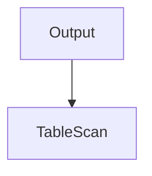
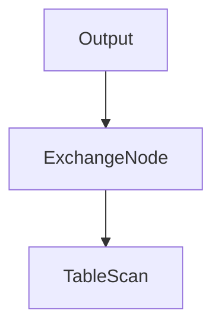
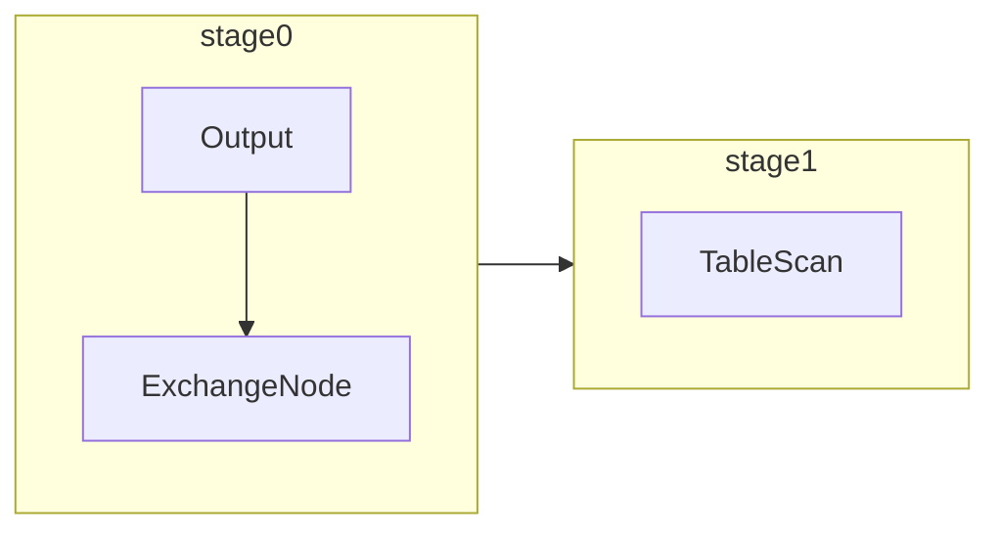

## 简单拉取数据查询的实现原理

```sql
SELECT ss_item_sk, ss_sales_price
FROM store_sales;
```

### 执行计划的生成和优化

#### 初始逻辑执行计划



TableScan节点：负责从数据源连接器拉取数据

Output节点：逻辑执行计划的根节点，表示输出计算结果，其自身没有计算逻辑

```java
public class TableScanNode
        extends PlanNode
{
  	// TableHandle表示的是与当前TableScanNode对应的是数据源存储中的那个类
    private final TableHandle table;
  	// outputSymbols: TableScanNode输出的symbols列表，在Presto中使用Symbol表示要输出哪些列
    private final List<Symbol> outputSymbols;
  	// assignments：对于outputSymbols中的每个Symbol，明确其来源于数据源Connector的那个Column（用ColumnHandle表示）
    private final Map<Symbol, ColumnHandle> assignments; // symbol -> column

    private final TupleDomain<ColumnHandle> enforcedConstraint;
    private final boolean forDelete;
```

查询执行时，只要将TableHandle、ColumnHandl交给数据源连接器，它就知道拉取那些表、哪些列的数据，这是一个基本抽象，在考虑到各种下推优化时，这两个概念将发挥更大的作用

```java
public class OutputNode
        extends PlanNode
{
  	// 上游PlanNode节点
    private final PlanNode source;
  	// SELECT语句最终要输出结果的列名称
    private final List<String> columnNames;
  	// OutputNode输出的Symbol表示，与ColumnNames--对应
    private final List<Symbol> outputs; 
```

#### 优化后的逻辑执行计划



为了提升从数据源拉取数据的并发度，可将TableScanNode设计为多个任务并分别放置在多个节点上以并发拉取数据，对于OutputNode来说，其并行度只能是1，因为它需要将上游TableScanNode拉取的数据合并到一起，给到查询发起者。由于执行TableScanNode与OutputNode的并行度不同，在OutputNode与TableScanNode中间需要插入一个ExchangeNode来实现数据交换，改变并行度。

#### 查询执行阶段划分

Presto的AddExchange优化器基于逻辑执行计划的ExchangeNode划分逻辑执行计划的PlanFragment，每个PlanFragment对应生成一个查询执行阶段，。简而言之，凡是上游节点和下游节点要求的数据分布不一致，就需要做一次数据交换（无论是REPARTITION还是GATHER方式），两侧需要划分到不同的查询执行阶段。逻辑执行计划由AddExchanges优化器划分为2个PlanFragment，对应分布式执行时的2个查询执行阶段。




stage1：从数据源连接器拉取数据，stage1的输出数据会放到OutputBuffer中，等待下游stage0的任务来拉取。

stage0：从上游stage1拉取数据，输出结果给到集群协调节点，stage0输出的数据会放到OutputBuffer中，等待集群协调节点来取

### 分布式调度与执行的设计实现
