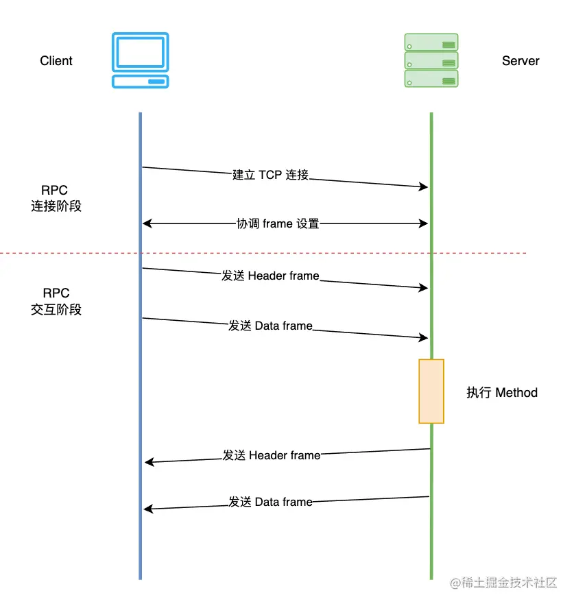
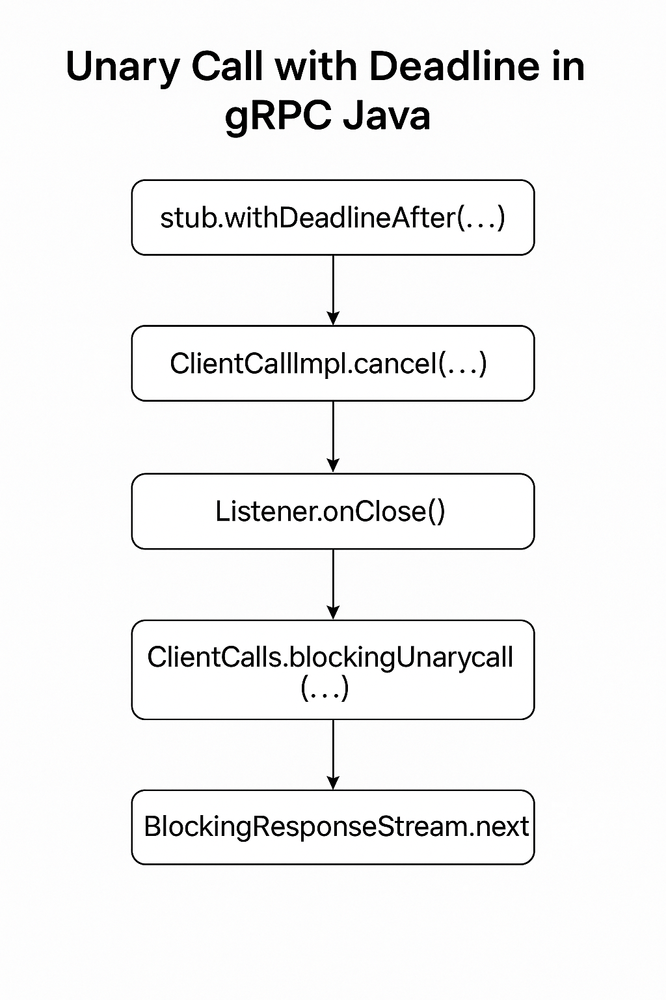

# Grpc源码分析


## gprc流程概括




grpc的流程可以大致分成两个阶段，分别为grpc连接阶段和grpc交互阶段，如图所示（此图来自后面的参考文献）。

在RPC连接阶段，client和server之间建立起TCP连接，grpc底层依赖于HTTP2，因此client和server还需要协调frame的相关设置，例如frame的大小，滑动窗口的大小等。

在RPC交互阶段，client将数据发送给server，并等待server执行执行method之后返回结果。

### Client的流程

在RPC连接阶段，client接收到一个目标地址和一系列的DialOptions，然后

1. 配置连接参数，interceptor等，启动resolver
2. Rosovler根据目标地址获取server的地址列表（比如一个DNS name可能会指向多个server ip，dnsResolver是grpc内置的resolver之一），启动balancer
3. Balancer根据平衡策略，从诸多server地址中选择一个或者多个建立TCP连接
4. client在TCP连接建立完成之后，等待server发来的HTTP2 Setting frame，并调整自身的HTTP2相关配置，随后向server发送HTTP2 Setting frame

在RPC交互阶段，某个rpc方法被调用后

1. Client创建一个stream对象用来管理整个交互流程
2. Client将service name, method name等信息放到header frame中并发送给server
3. client将method的参数信息放到data frame中并发送给server
4. client等待server传回的header frame和data frame，一次rpc call的result status会被包含在header frame中，而method的返回值被包含在data frame中

### Server流程

在rpc连接阶段，server在完成一些初始化的配置之后，开始监听某个tcp端口，在和某个client建立了tcp连接之后完成http2 settting frame的交互。

在rpc交互阶段：

1. server等待client发来的header frame，从而创建出一个stream对象来管理真个交互流程，根据header frame中的信息，server知道client请求的是哪一个service的那一个method
2. server接受到client发来的data frame，并执行method
3. server将执行是否成功等信息放在header frame中发送给client
4. server将method执行的结果（返回值）放在data frame中发送给client

## grpc Server的rpc连接阶段

```go
func main() {
	flag.Parse()
	lis, err := net.Listen("tcp", fmt.Sprintf(":%d", *port))
	if err != nil {
		log.Fatalf("failed to listen: %v", err)
	}
	s := grpc.NewServer()
	pb.RegisterGreeterServer(s, &server{})
	log.Printf("server listening at %v", lis.Addr())
	if err := s.Serve(lis); err != nil {
		log.Fatalf("failed to serve: %v", err)
	}
}
```

如上是一个简单的服务端程序，流程如下

1. 首先通过`net.Listener`监听tcp端口，毕竟grpc服务是基于tcp的
2. 创建grpc server，并注册服务，`&server{}`实际上就是服务的实现
3. 阻塞等待来自client的访问

```go
func (s *Server) Serve(lis net.Listener) error {
	s.serve = true
	for {
		rawConn, err := lis.Accept()
		s.serveWG.Add(1)
		go func() {
			s.handleRawConn(lis.Addr().String(), rawConn)
			s.serveWG.Done()
		}()

}

```

grpc在一个for循环中等待来自client的访问，每次有新的client端访问，创建一个`net.Conn`，并创建一个新的goroutine处理这个`net.Conn`，所以这个连接上的请求，无论客户端调用哪一个远程访问或者调用几次，都会由这个goroutine处理。

```go
func (s *Server) handleRawConn(lisAddr string, rawConn net.Conn) {
  // 如果grpc server已经关闭，那么同样关闭这个tcp连接
	if s.quit.HasFired() {
		rawConn.Close()
		return
	}
  // 设置tcp超时时间
	rawConn.SetDeadline(time.Now().Add(s.opts.connectionTimeout))

	// Finish handshaking (HTTP2)
	st := s.newHTTP2Transport(rawConn)
  // 清理tcp超时时间
	rawConn.SetDeadline(time.Time{})
  // rpc交互阶段，创建新的goroutine处理来自client的数据
	go func() {
		s.serveStreams(context.Background(), st, rawConn)
		s.removeConn(lisAddr, st)
	}()
}
```

在这里，首先判断gprc server是否关闭，如果关闭，则同样关闭tcp连接。然后进行HTTP2的握手，这里专门设置了tcp超时时间，避免握手迟迟不结束，导致资源占用，在握手结束后，清理tcp超时时间，避免对后面请求的影响。最后新启动一个goroutine，用来处理实际的请求。

### grpc服务端HTTP2握手

```go
func (s *Server) newHTTP2Transport(c net.Conn) transport.ServerTransport {
  // 组装 serverconfig
	config := &transport.ServerConfig{
		MaxStreams:            s.opts.maxConcurrentStreams,
		ConnectionTimeout:     s.opts.connectionTimeout,
		...
	}
  // 根据config的配置项，和client进行http2的握手
	st, err := transport.NewServerTransport(c, config)
```

根据使用者在启动grpc server时的配置项，或者默认的配置项，调用`transport.NewServerTransport`完成和client的http2握手。

```go
	writeBufSize := config.WriteBufferSize
	readBufSize := config.ReadBufferSize
	maxHeaderListSize := defaultServerMaxHeaderListSize
	if config.MaxHeaderListSize != nil {
		maxHeaderListSize = *config.MaxHeaderListSize
	}
	framer := newFramer(conn, writeBufSize, readBufSize, config.SharedWriteBuffer, maxHeaderListSize)
```

首先创建framer，用来负责接受和发送HTTP2 frame，是server和client交流的实际接口。

```go
// Send initial settings as connection preface to client.
isettings := []http2.Setting{{
  ID:  http2.SettingMaxFrameSize,
  Val: http2MaxFrameLen,
}}
if config.MaxStreams != math.MaxUint32 {
  isettings = append(isettings, http2.Setting{
    ID:  http2.SettingMaxConcurrentStreams,
    Val: config.MaxStreams,
  })
}
...

if err := framer.fr.WriteSettings(isettings...); err != nil {
  return nil, connectionErrorf(false, err, "transport: %v", err)
}
```

grpc server端首先明确自己的HTTP2的初始配置，比如MaxFrameSize等，并将这些配置信息通过`frame.fr`发送给client，`frame.fr`实际上就是golang原生的`http2.Framer`，在底层，这些配置信息会被包装成一个Setting Frame发送给client。

client在收到Setting Frame后，根据自身情况调整参数，同样发送一个Setting Frame给sever。

```go
t := &http2Server{
  done:              done,
  conn:              conn,
  peer:              peer,
  framer:            framer,
  readerDone:        make(chan struct{}),
  loopyWriterDone:   make(chan struct{}),
  maxStreams:        config.MaxStreams,
  inTapHandle:       config.InTapHandle,
  fc:                &trInFlow{limit: uint32(icwz)},
  state:             reachable,
  activeStreams:     make(map[uint32]*ServerStream),
  stats:             config.StatsHandlers,
  kp:                kp,
  idle:              time.Now(),
  kep:               kep,
  initialWindowSize: iwz,
  bufferPool:        config.BufferPool,
}
// controlbuf用来缓存Setting Frame等和设置相关的Frame的缓存
t.controlBuf = newControlBuffer(t.done)
// 自增连接id
t.connectionID = atomic.AddUint64(&serverConnectionCounter, 1)
// flush framer，确保向client发送了setting frame
t.framer.writer.Flush()
```

grpc server在发送了setting frame之后，创建好`http2Server`对象，并等待client的后续消息。

```go
// Check the validity of client preface.
preface := make([]byte, len(clientPreface))
// 读取客户端发来的client preface，并验证是否和预期一致
if _, err := io.ReadFull(t.conn, preface); err != nil {
  // In deployments where a gRPC server runs behind a cloud load balancer
  // which performs regular TCP level health checks, the connection is
  // closed immediately by the latter.  Returning io.EOF here allows the
  // grpc server implementation to recognize this scenario and suppress
  // logging to reduce spam.
  if err == io.EOF {
    return nil, io.EOF
  }
  return nil, connectionErrorf(false, err, "transport: http2Server.HandleStreams failed to receive the preface from client: %v", err)
}
if !bytes.Equal(preface, clientPreface) {
  return nil, connectionErrorf(false, nil, "transport: http2Server.HandleStreams received bogus greeting from client: %q", preface)
}

// 读取client端发来的frame
frame, err := t.framer.fr.ReadFrame()
if err == io.EOF || err == io.ErrUnexpectedEOF {
  return nil, err
}
if err != nil {
  return nil, connectionErrorf(false, err, "transport: http2Server.HandleStreams failed to read initial settings frame: %v", err)
}
atomic.StoreInt64(&t.lastRead, time.Now().UnixNano())
// 转成SettingFrame
sf, ok := frame.(*http2.SettingsFrame)
if !ok {
  return nil, connectionErrorf(false, nil, "transport: http2Server.HandleStreams saw invalid preface type %T from client", frame)
}
// 处理SettingFrame
t.handleSettings(sf)
```

```go
func (t *http2Server) handleSettings(f *http2.SettingsFrame) {
  // 如果是ack frame，则直接返回
	if f.IsAck() {
		return
	}
	var ss []http2.Setting
	var updateFuncs []func()
	f.ForeachSetting(func(s http2.Setting) error {
		switch s.ID {
    // 更新http2Server中的配置信息
		case http2.SettingMaxHeaderListSize:
			updateFuncs = append(updateFuncs, func() {
				t.maxSendHeaderListSize = new(uint32)
				*t.maxSendHeaderListSize = s.Val
			})
		default:
			ss = append(ss, s)
		}
		return nil
	})
  // 这里又遇到了controlBuf
  // 执行updateFuncs()，然后将incommingSetting加入到controlBuf的队列中
	t.controlBuf.executeAndPut(func() bool {
		for _, f := range updateFuncs {
			f()
		}
		return true
	}, &incomingSettings{
		ss: ss,
	})
}
```

在HTTP2中，client和server都要求在建立连接前发送一个connection preface，作为对所使用协议的最终确认，并确定HTTP2连接的初始设置，client发送的preface一一个24字节的序列开始，之后紧跟着一个setting frame，用来表示client端最终决定的HTTP2配置参数。

```go
go func() {
  t.loopy = newLoopyWriter(serverSide, t.framer, t.controlBuf, t.bdpEst, t.conn, t.logger, t.outgoingGoAwayHandler, t.bufferPool)
  err := t.loopy.run()
  close(t.loopyWriterDone)
  if !isIOError(err) {
    timer := time.NewTimer(time.Second)
    defer timer.Stop()
    select {
    case <-t.readerDone:
    case <-timer.C:
    }
    t.conn.Close()
  }
}()
go t.keepalive()
```

此时server和client之间的HTTP2链接已经建立完成，RPC连接阶段完毕。在`NewServerTransport`的最后启动了`loopyWriter`，开始了rpc交互阶段，`loopyWriter`不断从`controlBuf`中读取control frames（包括setting frame)，并将缓存中的frame发送给client，可以说`loopyWriter`就是grpc server控制流量已经发送数据的地方。

这里另外启动了一个keepalive的goroutine，这个goroutine应该和grpc的keepalive机制有关。

## grpc server的rpc交互阶段

HTTP2中定义了很多类型的frame，包括data, headers等，具体如下，对于不同的frame类型，HTTP2 server应该有不同的处理逻辑。在grpc中，对frame类型的分类和处理，被包含在`func (s *Server) serveStreams`中。

```go
// FrameType represents the type of an HTTP/2 Frame.
// See [Frame Type].
//
// [Frame Type]: https://httpwg.org/specs/rfc7540.html#FrameType
type FrameType uint8

// Frame types defined in the HTTP/2 Spec.
const (
	FrameTypeData         FrameType = 0x0
	FrameTypeHeaders      FrameType = 0x1
	FrameTypeRSTStream    FrameType = 0x3
	FrameTypeSettings     FrameType = 0x4
	FrameTypePing         FrameType = 0x6
	FrameTypeGoAway       FrameType = 0x7
	FrameTypeWindowUpdate FrameType = 0x8
	FrameTypeContinuation FrameType = 0x9
)
```

```go
func (s *Server) serveStreams(ctx context.Context, st transport.ServerTransport, rawConn net.Conn) {
	streamQuota := newHandlerQuota(s.opts.maxConcurrentStreams)
  // 阻塞并接受来自client的frame
	st.HandleStreams(ctx, func(stream *transport.ServerStream) {
		s.handlersWG.Add(1)
		streamQuota.acquire()
		f := func() {
			defer streamQuota.release()
			defer s.handlersWG.Done()
      // 当一个新的stream被创建之后，进行一些配置
			s.handleStream(st, stream)
		}

		if s.opts.numServerWorkers > 0 {
			select {
			case s.serverWorkerChannel <- f:
				return
			default:
				// If all stream workers are busy, fallback to the default code path.
			}
		}
		go f()
	})
}
```

`st.HandleStreams`会阻塞当前goroutine，并等待来自client的frame，在一个for循环中等待并读取来自client的frame，并采取不同的处理方式。

grpc服务端使用一个goroutine向外发送数据`loopyWriter`，使用另一个goroutine读取数据`serverStreams`。

```go
func (t *http2Server) HandleStreams(ctx context.Context, handle func(*ServerStream)) {
	defer func() {
		close(t.readerDone)
		<-t.loopyWriterDone
	}()
  // for循环，持续处理一个连接的上请求
	for {
    // 限流
		t.controlBuf.throttle()
    // 读取frame
		frame, err := t.framer.fr.ReadFrame()
		atomic.StoreInt64(&t.lastRead, time.Now().UnixNano())
    // 根据frame的类型分别处理
		switch frame := frame.(type) {
    // MetaHeaderFrame并不是http2的frame类型，而是经过包装的类型
    // headers frame + zero or more continuation frame + hspack编码内容的解码
		case *http2.MetaHeadersFrame:
			if err := t.operateHeaders(ctx, frame, handle); err != nil {
				// Any error processing client headers, e.g. invalid stream ID,
				// is considered a protocol violation.
				t.controlBuf.put(&goAway{
					code:      http2.ErrCodeProtocol,
					debugData: []byte(err.Error()),
					closeConn: err,
				})
				continue
			}
		case *http2.DataFrame:
			t.handleData(frame)
		case *http2.RSTStreamFrame:
			t.handleRSTStream(frame)
		case *http2.SettingsFrame:
			t.handleSettings(frame)
		case *http2.PingFrame:
			t.handlePing(frame)
		case *http2.WindowUpdateFrame:
			t.handleWindowUpdate(frame)
		case *http2.GoAwayFrame:
			// TODO: Handle GoAway from the client appropriately.
		default:
			if t.logger.V(logLevel) {
				t.logger.Infof("Received unsupported frame type %T", frame)
			}
		}
	}
}
```

### Headers Frame的处理

```go
func (t *http2Server) operateHeaders(ctx context.Context, frame *http2.MetaHeadersFrame, handle func(*ServerStream)) error {
	// Acquire max stream ID lock for entire duration
	t.maxStreamMu.Lock()
	defer t.maxStreamMu.Unlock()
	// 从客户端frame中获取streamID
	streamID := frame.Header().StreamID
	// 校验stream id
	if streamID%2 != 1 || streamID <= t.maxStreamID {
		// illegal gRPC stream id.
		return fmt.Errorf("received an illegal stream id: %v. headers frame: %+v", streamID, frame)
	}
  // 将获得的streamID设置到http2Server
	t.maxStreamID = streamID
	// 无界message缓冲
	buf := newRecvBuffer()
  // 创建stream
	s := &ServerStream{
		Stream: &Stream{
			id:  streamID,
			buf: buf,
			fc:  &inFlow{limit: uint32(t.initialWindowSize)},
		},
		st:               t,
		headerWireLength: int(frame.Header().Length),
	}
```

在grpc server和client端，存在这一个stream的概念，用来表征一次grpc call。一个grpc call总是以一个来自client的headers frame开始，因此server会在`operateHeaders`中创建一个`Stream`对象，stream有一个client和server端一致的id，也有一个buf缓存。

```go
for _, hf := range frame.Fields {
  switch hf.Name {
  case "grpc-encoding":
    s.recvCompress = hf.Value
  case ":method":
    // POST, GET这些
    httpMethod = hf.Value
  case ":path":
    // 使用grpc那个服务的那个方法
    s.method = hf.Value
  case "grpc-timeout":
    timeoutSet = true
    var err error
    if timeout, err = decodeTimeout(hf.Value); err != nil {
      headerError = status.Newf(codes.Internal, "malformed grpc-timeout: %v", err)
    }
  }
}
```

grpc server会遍历frame中的field，并将filed中的信息记录在stream中。`:method`和`:path`这两个field需要特别注意，client端需要填写好这两个field来明确地指定要调用server端提供的那一个方法，也就是说，调用哪一个server方法的信息是和调用方法的参数分开在不同的frame中的。

```go
if frame.StreamEnded() {
  // s is just created by the caller. No lock needed.
  s.state = streamReadDone
}
// 超时设置
if timeoutSet {
  s.ctx, s.cancel = context.WithTimeout(ctx, timeout)
} else {
  s.ctx, s.cancel = context.WithCancel(ctx)
}
if uint32(len(t.activeStreams)) >= t.maxStreams {
  t.mu.Unlock()
  t.controlBuf.put(&cleanupStream{
    streamID: streamID,
    rst:      true,
    rstCode:  http2.ErrCodeRefusedStream,
    onWrite:  func() {},
  })
  s.cancel()
  return nil
}
// 将stream加入activeStreams map
t.activeStreams[streamID] = s
if len(t.activeStreams) == 1 {
  t.idle = time.Time{}
}
// Start a timer to close the stream on reaching the deadline.
if timeoutSet {
  // We need to wait for s.cancel to be updated before calling
  // t.closeStream to avoid data races.
  cancelUpdated := make(chan struct{})
  timer := internal.TimeAfterFunc(timeout, func() {
    <-cancelUpdated
    t.closeStream(s, true, http2.ErrCodeCancel, false)
  })
  oldCancel := s.cancel
  s.cancel = func() {
    oldCancel()
    timer.Stop()
  }
  close(cancelUpdated)
}
s.trReader = &transportReader{
  reader: &recvBufferReader{
    ctx:     s.ctx,
    ctxDone: s.ctxDone,
    recv:    s.buf,
  },
  windowHandler: func(n int) {
    t.updateWindow(s, uint32(n))
  },
}
// Register the stream with loopy.
t.controlBuf.put(&registerStream{
  streamID: s.id,
  wq:       s.wq,
})
handle(s)
```

这个新建的stream对象会被放到server的`activeStreams` map中，并调用回调函数`handle(s)`来进一步处理这个stream，其中最重要的是调用`s.handleStream`。

```go
st.HandleStreams(ctx, func(stream *transport.ServerStream) {
  s.handlersWG.Add(1)
  streamQuota.acquire()
  f := func() {
    defer streamQuota.release()
    defer s.handlersWG.Done()
    s.handleStream(st, stream)
  }
	// 如果设置了worker池，则先尝试提交任务到worker池中，如果不行，新起goroutine执行
  if s.opts.numServerWorkers > 0 {
    select {
    case s.serverWorkerChannel <- f:
      return
    default:
      // If all stream workers are busy, fallback to the default code path.
    }
  }
  go f()
})

// initServerWorkers creates worker goroutines and a channel to process incoming
// connections to reduce the time spent overall on runtime.morestack.
func (s *Server) initServerWorkers() {
	s.serverWorkerChannel = make(chan func())
	s.serverWorkerChannelClose = sync.OnceFunc(func() {
		close(s.serverWorkerChannel)
	})
	for i := uint32(0); i < s.opts.numServerWorkers; i++ {
		go s.serverWorker()
	}
}
```

回调函数中会将处理stream的任务提交到其他goroutine中，如果可用的worker，则由worker执行，否则另起goroutine来执行。

```go
func (s *Server) handleStream(t transport.ServerTransport, stream *transport.ServerStream) {
  // 获取grpc路径
	sm := stream.Method()
	pos := strings.LastIndex(sm, "/")
  // 调用的grpc service name
	service := sm[:pos]
  // 调用的grpc method name
	method := sm[pos+1:]

  // 从grpc server注册的service和method中找是否存在
	srv, knownService := s.services[service]
	if knownService {
    // unary rpc
		if md, ok := srv.methods[method]; ok {
			s.processUnaryRPC(ctx, stream, srv, md, ti)
			return
		}
    // stream rpc
		if sd, ok := srv.streams[method]; ok {
			s.processStreamingRPC(ctx, stream, srv, sd, ti)
			return
		}
	}
}
```

从这里也可以看出来，不同stream不会相互阻塞，不会因为应用层处理某个stream时间过长而导致其他stream失去响应。

根据handers frame中service和method的信息，grpc server找到注册好的method并执行，这里区分unary调用和streaming调用，分别对应`s.processUnaryRPC`和`s.processStreamingRPC`。

```go
func (s *Server) processUnaryRPC(ctx context.Context, stream *transport.ServerStream, info *serviceInfo, md *MethodDesc, trInfo *traceInfo) (err error) {
  // 接收message并且解压缩
	d, err := recvAndDecompress(&parser{r: stream, bufferPool: s.opts.bufferPool}, stream, dc, s.opts.maxReceiveMessageSize, payInfo, decomp, true)
  df := func(v any) error {
    defer dataFree()
    // 使用proto codec将获取到的数据unmarshal到对应的请求类型
    if err := s.getCodec(stream.ContentSubtype()).Unmarshal(d, v); err != nil {
      return status.Errorf(codes.Internal, "grpc: error unmarshalling request: %v", err)
    }
    ...
	ctx = NewContextWithServerTransportStream(ctx, stream)
  // 调用实际的server端方法，得到返回结果
	reply, appErr := md.Handler(info.serviceImpl, ctx, df, s.opts.unaryInt)
  // Last=true表示stream最后的写操作，实际上好像没啥用
	opts := &transport.WriteOptions{Last: true}

	if err := s.sendResponse(ctx, stream, reply, cp, opts, comp); err != nil {
	return stream.WriteStatus(statusOK)
}
```

可以看到处理UnaryRPC请求时，会先接受data frame消息，然后unmarshal到对应的请求类型，调用实际的server端方法，得到返回结果，最后将status `statusOK`发送给client，关闭stream。

```go
func recvAndDecompress(p *parser, s recvCompressor, dc Decompressor, maxReceiveMessageSize int, payInfo *payloadInfo, compressor encoding.Compressor, isServer bool,
) (out mem.BufferSlice, err error) {
	pf, compressed, err := p.recvMsg(maxReceiveMessageSize)
	compressedLength := compressed.Len()
	if pf.isCompressed() {
		defer compressed.Free()
		// To match legacy behavior, if the decompressor is set by WithDecompressor or RPCDecompressor,
		// use this decompressor as the default.
		out, err = decompress(compressor, compressed, dc, maxReceiveMessageSize, p.bufferPool)
		if err != nil {
			return nil, err
		}
	} else {
		out = compressed
	}

	if payInfo != nil {
		payInfo.compressedLength = compressedLength
		out.Ref()
		payInfo.uncompressedBytes = out
	}

	return out, nil
}
```

```go
func (p *parser) recvMsg(maxReceiveMessageSize int) (payloadFormat, mem.BufferSlice, error) {
  // 读取message的header，总共5个字节
	err := p.r.ReadMessageHeader(p.header[:])
  // 是否压缩
	pf := payloadFormat(p.header[0])
  // 数据长度
	length := binary.BigEndian.Uint32(p.header[1:])
	// 读取数据
	data, err := p.r.Read(int(length))
	return pf, data, nil
}
```

`recvMsg`根据http2的格式，读取message，`recvAndDecompress`如果数据被压缩过，返回解压缩后的数据。

```go
func _Greeter_SayHello_Handler(srv interface{}, ctx context.Context, dec func(interface{}) error, interceptor grpc.UnaryServerInterceptor) (interface{}, error) {
	in := new(HelloRequest)
  // unmarshal操作
	if err := dec(in); err != nil {
		return nil, err
	}
	if interceptor == nil {
		return srv.(GreeterServer).SayHello(ctx, in)
	}
	info := &grpc.UnaryServerInfo{
		Server:     srv,
		FullMethod: Greeter_SayHello_FullMethodName,
	}
	handler := func(ctx context.Context, req interface{}) (interface{}, error) {
		return srv.(GreeterServer).SayHello(ctx, req.(*HelloRequest))
	}
	return interceptor(ctx, in, info, handler)
}
```

这里以入门的`sayHello`服务为例，可以看到最终没有使用反射，而是直接调用。

```go
const (
	payloadLen = 1
	sizeLen    = 4
	headerLen  = payloadLen + sizeLen
)
// 这个方法很好理解，构造message header和payload
// msgHeader returns a 5-byte header for the message being transmitted and the
// payload, which is compData if non-nil or data otherwise.
func msgHeader(data, compData mem.BufferSlice, pf payloadFormat) (hdr []byte, payload mem.BufferSlice) {
	hdr = make([]byte, headerLen)
	hdr[0] = byte(pf)

	var length uint32
	if pf.isCompressed() {
		length = uint32(compData.Len())
		payload = compData
	} else {
		length = uint32(data.Len())
		payload = data
	}

	// Write length of payload into buf
	binary.BigEndian.PutUint32(hdr[payloadLen:], length)
	return hdr, payload
}
```

```go
func (s *Server) sendResponse(ctx context.Context, stream *transport.ServerStream, msg any, cp Compressor, opts *transport.WriteOptions, comp encoding.Compressor) error {
  // 编码
	data, err := encode(s.getCodec(stream.ContentSubtype()), msg)
  // 压缩
	compData, pf, err := compress(data, cp, comp, s.opts.bufferPool)
  // 构造header和payload
	hdr, payload := msgHeader(data, compData, pf)
  // 交给http2server实际发送数据
	err = stream.Write(hdr, payload, opts)
}
```

```go
// Write converts the data into HTTP2 data frame and sends it out. Non-nil error
// is returns if it fails (e.g., framing error, transport error).
func (t *http2Server) write(s *ServerStream, hdr []byte, data mem.BufferSlice, _ *WriteOptions) error {
	reader := data.Reader()

	if !s.isHeaderSent() { // Headers haven't been written yet.
		if err := t.writeHeader(s, nil); err != nil {
			_ = reader.Close()
			return err
		}
	} else {
		// Writing headers checks for this condition.
		if s.getState() == streamDone {
			_ = reader.Close()
			return t.streamContextErr(s)
		}
	}
	// 构造 data frame
	df := &dataFrame{
		streamID:    s.id,
		h:           hdr,
		reader:      reader,
		onEachWrite: t.setResetPingStrikes,
	}
  // 阻塞获取writeQuota
	if err := s.wq.get(int32(len(hdr) + df.reader.Remaining())); err != nil {
		_ = reader.Close()
		return t.streamContextErr(s)
	}
  // 将data frame放入controlBuf，异步发送
	if err := t.controlBuf.put(df); err != nil {
		_ = reader.Close()
		return err
	}
	t.incrMsgSent()
	return nil
}
```

```go
func (t *http2Server) writeStatus(s *ServerStream, st *status.Status) error {
	s.hdrMu.Lock()
	defer s.hdrMu.Unlock()

	if s.getState() == streamDone {
		return nil
	}
	// Attach the trailer metadata.
	headerFields = appendHeaderFieldsFromMD(headerFields, s.trailer)
	trailingHeader := &headerFrame{
		streamID:  s.id,
		hf:        headerFields,
		endStream: true,
		onWrite:   t.setResetPingStrikes,
	}

	// Send a RST_STREAM after the trailers if the client has not already half-closed.
	rst := s.getState() == streamActive
  // 调用 finishStream关闭stream
	t.finishStream(s, rst, http2.ErrCodeNo, trailingHeader, true)
}
```

`sendResponse`构造响应，并且将消息存储在`controlBuf`中，最后由`loopyWriter`异步发送给client，`writeStatus`发送`traling header`尾部头信息，然后关闭流。

### Data Frame的处理

```go
func (t *http2Server) handleData(f *http2.DataFrame) {
	size := f.Header().Length
	// Select the right stream to dispatch.
	s, ok := t.getStream(f)
	if !ok {
		return
	}
	if s.getState() == streamReadDone {
		t.closeStream(s, true, http2.ErrCodeStreamClosed, false)
		return
	}
	if size > 0 {
		if len(f.Data()) > 0 {
			pool := t.bufferPool
			s.write(recvMsg{buffer: mem.Copy(f.Data(), pool)})
		}
	}
	if f.StreamEnded() {
		// Received the end of stream from the client.
		s.compareAndSwapState(streamActive, streamReadDone)
		s.write(recvMsg{err: io.EOF})
	}
}
```

在处理data frame时

1. 根据stream ID，从server的activeStreams map中找到stream对象
2. 从`bufferPool`中拿到一块buffer，并将frame的数据写入到buffer
3. 将这块buffer保存到stream的`recvBuffer`中
4. 如果读取结束，修改流状态为`streamReadDone`，并且写入`io.EOF`标记

`recvBuffer`中缓存的数据，最终会被前面提到的`recvAndDecompress`函数读取，从而在server端重建rpc的参数。

### Setting Frame的处理

```go
func (t *http2Server) handleSettings(f *http2.SettingsFrame) {
	if f.IsAck() {
		return
	}
	var ss []http2.Setting
	var updateFuncs []func()
	f.ForeachSetting(func(s http2.Setting) error {
		switch s.ID {
		case http2.SettingMaxHeaderListSize:
			updateFuncs = append(updateFuncs, func() {
				t.maxSendHeaderListSize = new(uint32)
				*t.maxSendHeaderListSize = s.Val
			})
		default:
			ss = append(ss, s)
		}
		return nil
	})
	t.controlBuf.executeAndPut(func() bool {
		for _, f := range updateFuncs {
			f()
		}
		return true
	}, &incomingSettings{
		ss: ss,
	})
}
```

`handleSettings`并没有直接将settting frame的参数应用在server上，而是将其放到了`controlBuf`中。

## server如何发送frame

grpc server在每次收到一个新的来自client的连接后，会创建一个Framer，这个Framer就是实际上负责发送和接收HTTP2 frame的接口，每一个client都对应一个Framer来处理来自该client的所有frame，不管这些frame是否属于同一个stream。

```go
type framer struct {
  // 一个包含了buffer的net.Conn的writer
	writer *bufWriter
  // 原生的http2.Framer，负责数据读写
	fr     *http2.Framer
}
```

`framer`其实就是对golang原生`http2.Framer`的封装。

```go
type bufWriter struct {
	pool      *sync.Pool
	buf       []byte
	offset    int
	batchSize int
	conn      net.Conn
	err       error
}

func newBufWriter(conn net.Conn, batchSize int, pool *sync.Pool) *bufWriter {
	w := &bufWriter{
		batchSize: batchSize,
		conn:      conn,
		pool:      pool,
	}
	// this indicates that we should use non shared buf
	if pool == nil {
		w.buf = make([]byte, batchSize)
	}
	return w
}

func (w *bufWriter) Write(b []byte) (int, error) {
  // 在write之间检查上一次write是否发生了错误
	if w.err != nil {
		return 0, w.err
	}
  // 如果batchsize为0，说明不需要写缓存，直接向net.Conn写数据
	if w.batchSize == 0 { // Buffer has been disabled.
		n, err := w.conn.Write(b)
		return n, toIOError(err)
	}
	if w.buf == nil {
		b := w.pool.Get().(*[]byte)
		w.buf = *b
	}
	written := 0
  // 如果写入的数据少于batchSize，则缓存，暂时不写入conn
  // 如果写入的数据多余batchSize，则调用flushKeepBuffer不断写数据
	for len(b) > 0 {
		copied := copy(w.buf[w.offset:], b)
		b = b[copied:]
		written += copied
		w.offset += copied
		if w.offset < w.batchSize {
			continue
		}
		if err := w.flushKeepBuffer(); err != nil {
			return written, err
		}
	}
	return written, nil
}

func (w *bufWriter) Flush() error {
  // 刷新数据到conn
	err := w.flushKeepBuffer()
	// Only release the buffer if we are in a "shared" mode
	if w.buf != nil && w.pool != nil {
		b := w.buf
		w.pool.Put(&b)
		w.buf = nil
	}
	return err
}

func (w *bufWriter) flushKeepBuffer() error {
	if w.err != nil {
		return w.err
	}
	if w.offset == 0 {
		return nil
	}
	_, w.err = w.conn.Write(w.buf[:w.offset])
	w.err = toIOError(w.err)
	w.offset = 0
	return w.err
}
```

grpc server实现了一个简单的缓存写给`http2.framer`作为`io.Writer`。

```go
// 全局writeBufferPool
var writeBufferPoolMap = make(map[int]*sync.Pool)
var writeBufferMutex sync.Mutex

func newFramer(conn net.Conn, writeBufferSize, readBufferSize int, sharedWriteBuffer bool, maxHeaderListSize uint32) *framer {
	if writeBufferSize < 0 {
		writeBufferSize = 0
	}
	var r io.Reader = conn
	if readBufferSize > 0 {
    // 设置io.Reader
		r = bufio.NewReaderSize(r, readBufferSize)
	}
	var pool *sync.Pool
	if sharedWriteBuffer {
		pool = getWriteBufferPool(writeBufferSize)
	}
  // 设置io.Writer
	w := newBufWriter(conn, writeBufferSize, pool)
  // 创建framer
	f := &framer{
		writer: w,
		fr:     http2.NewFramer(w, r),
	}
	f.fr.SetMaxReadFrameSize(http2MaxFrameLen)
	// Opt-in to Frame reuse API on framer to reduce garbage.
	// Frames aren't safe to read from after a subsequent call to ReadFrame.
	f.fr.SetReuseFrames()
	f.fr.MaxHeaderListSize = maxHeaderListSize
	f.fr.ReadMetaHeaders = hpack.NewDecoder(http2InitHeaderTableSize, nil)
	return f
}

// writeBuffer 使用sync.Pool
func getWriteBufferPool(size int) *sync.Pool {
	writeBufferMutex.Lock()
	defer writeBufferMutex.Unlock()
	pool, ok := writeBufferPoolMap[size]
	if ok {
		return pool
	}
	pool = &sync.Pool{
		New: func() any {
			b := make([]byte, size)
			return &b
		},
	}
	writeBufferPoolMap[size] = pool
	return pool
}
```

传递给`http2.framer`的`io.Reader`使用了`bifio` package。

`writeBuffer`使用了go标准库中的`sync.Pool`，根据需要的size获取对应的`sync.Pool`，如果池中有对应的`byte[]`，获取然后返回，如果没有，创建新的`byte[]`并返回。池中元素的回收时机，go允许在任何时候自动回收池中的元素（gc）。

grpc server为每一个client创建一个`loopyWriter`，有这个`loopyWriter`负责发送数据。

```go
type loopyWriter struct {
  // 客户端还是服务端
	side      side
  // controlBuffer
	cbuf      *controlBuffer
  // 发送配额
	sendQuota uint32
  // 发送端初始窗口大小 outbound initial window size
	oiws      uint32
  // 已经建立未清理的stream，在客户端，指所有已经将Headers发送出去的stream，
  // 在服务端，指所有已经接收到Headers的stream
	estdStreams map[uint32]*outStream
  // 活跃stream列表，有数据需要发送且包含stream-level流控，里面的每个stream内部都有一个数据列表用来存放发送的数据
	activeStreams *outStreamList
  // http2.Framer的包装，用来实际读写数
	framer        *framer
	hBuf          *bytes.Buffer  // The buffer for HPACK encoding.
	hEnc          *hpack.Encoder // HPACK encoder.
	bdpEst        *bdpEstimator
	draining      bool
  // 底层tcp连接
	conn          net.Conn
	logger        *grpclog.PrefixLogger
	bufferPool    mem.BufferPool

	// Side-specific handlers
	ssGoAwayHandler func(*goAway) (bool, error)
}
```

`loopyWriter`从control buffer中接收frame，每个frame被单独处理，`loopyWriter`所做的大部分工作都用在处理data frame。loopWriter维护一个活跃stream的队列，每个stream维护data frame的列表。当loopyWriter获取到data frame，它将被加入对应stream的队列中。

loopyWriter遍历活跃stream的列表，每次处理一个节点，可以视作在所有stream上做round-robin调度。当处理一个stream时，loopyWriter将数据发送到对端，但不能超过流控的最大值，即需要小于`http2MaxFrameLen`，也要小于connection-level流控和stream-level流控的限制。

```go
go func() {
  t.loopy = newLoopyWriter(serverSide, t.framer, t.controlBuf, t.bdpEst, t.conn, t.logger, t.outgoingGoAwayHandler, t.bufferPool)
  err := t.loopy.run()
  close(t.loopyWriterDone)
  if !isIOError(err) {
    timer := time.NewTimer(time.Second)
    defer timer.Stop()
    select {
    case <-t.readerDone:
    case <-timer.C:
    }
    t.conn.Close()
  }
}()
```

还记得之前在gprc server端rpc连接阶段启动的一个goroutine吗？在其中创建了`loopWriter`，并且调用了`loopyWriter#run`方法。

```go
func (l *loopyWriter) run() (err error) {
	for {
    // 阻塞获取数据
		it, err := l.cbuf.get(true)
		if err != nil {
			return err
		}
    // 处理controlBuffer中取出的数据，对于dataFrame来说，会将dataFrame放到对应stream的itemList的末尾
		if err = l.handle(it); err != nil {
			return err
		}
    // 发送acitveStreams中第一个stream中最多16kb的数据
		if _, err = l.processData(); err != nil {
			return err
		}
		gosched := true
	hasdata:
		for {
      // 非阻塞获取数据
			it, err := l.cbuf.get(false)
			if err != nil {
				return err
			}
			if it != nil {
				if err = l.handle(it); err != nil {
					return err
				}
				if _, err = l.processData(); err != nil {
					return err
				}
        // 将controlBuffer中所有数据都处理完
				continue hasdata
			}
      // 没有activeStreams或者没有connection-level write quota时isEmpty为true
			isEmpty, err := l.processData()
			if err != nil {
				return err
			}
      // 如果还有数据需要处理，继续处理
			if !isEmpty {
				continue hasdata
			}
			if gosched {
				gosched = false
        // 当framer的writer buffer中数据过少时，yield processor来让其他goroutine向controlBuffer中填充数据
				if l.framer.writer.offset < minBatchSize {
					runtime.Gosched()
					continue hasdata
				}
			}
      // 将写数据刷新，返回到上层循环阻塞等待
			l.framer.writer.Flush()
			break hasdata
		}
	}
}
```

`run`方法从`controlBuf`中读取control frame，然后更新loopyWriter的内部状态或者将http2 frame发送到对端。loopyWriter将有数据需要发送的活跃stream保存在链表中，所有在活跃stream链表中的stream必须同时满足两个条件：

1. 有数据需要发送
2. stream-level流控配额可用

在每次run循环的迭代中，除了处理传入的control frame外，loopyWriter还会调用`processData`，每次处理activeStreams中的一个节点。这导致HTTP2 frame被写入底层的write buffer，当controlBuf没有更多的control frame可供读取时，loopyWriter会刷新写缓冲区。作为一种优化，如果批大小过小loopyWriter会让出处理器，从而给流的goroutine一个机会来填充controlBuf。

```go
func (l *loopyWriter) handle(i any) error {
	switch i := i.(type) {
	case *incomingWindowUpdate:
		l.incomingWindowUpdateHandler(i)
	case *outgoingWindowUpdate:
		return l.outgoingWindowUpdateHandler(i)
	case *incomingSettings:
		return l.incomingSettingsHandler(i)
	case *outgoingSettings:
		return l.outgoingSettingsHandler(i)
	case *headerFrame:
		return l.headerHandler(i)
	case *registerStream:
		l.registerStreamHandler(i)
	case *cleanupStream:
		return l.cleanupStreamHandler(i)
	case *earlyAbortStream:
		return l.earlyAbortStreamHandler(i)
	case *incomingGoAway:
		return l.incomingGoAwayHandler(i)
	case *dataFrame:
		l.preprocessData(i)
	case *ping:
		return l.pingHandler(i)
	case *goAway:
		return l.goAwayHandler(i)
	case *outFlowControlSizeRequest:
		l.outFlowControlSizeRequestHandler(i)
	case closeConnection:
		// Just return a non-I/O error and run() will flush and close the
		// connection.
		return ErrConnClosing
	default:
		return fmt.Errorf("transport: unknown control message type %T", i)
	}
	return nil
}
```

```go
func (l *loopyWriter) preprocessData(df *dataFrame) {
	str, ok := l.estdStreams[df.streamID]
	if !ok {
		return
	}
	// If we got data for a stream it means that
	// stream was originated and the headers were sent out.
	str.itl.enqueue(df)
	if str.state == empty {
		str.state = active
		l.activeStreams.enqueue(str)
	}
}
```

`handle`函数对于不同类型的消息，使用不同的处理函数进行处理，如果消息是data frame，会将data frame塞进对应stream的itemList，如果stream状态为empty，则将stream状态切换成active，并将stream加入到activeStreams。

```go
func (l *loopyWriter) processData() (bool, error) {
  // connection level流量控制
	if l.sendQuota == 0 {
		return true, nil
	}
  // 取出activeStreams中的第一个stream
	str := l.activeStreams.dequeue() // Remove the first stream.
	if str == nil {
		return true, nil
	}
  // 第一个item一定是dataFrame，dataFrame是grpc中定义的数据结构，可能转换成多个http2 data frame在网络中传输
  // 每个dataFrame有两个buffer，h保存grpc-message的header，data保存实际数据， 为了降低网络通信流量，data中
  // 的数据会被拷贝到h中，从而使http2 frame尽可能大
	dataItem := str.itl.peek().(*dataFrame) // Peek at the first data item this stream.

	if len(dataItem.h) == 0 && dataItem.reader.Remaining() == 0 { // Empty data frame
    ...
	}

	// Figure out the maximum size we can send
  // http2MaxFrameLen是一个常数，16kb
	maxSize := http2MaxFrameLen
  // stream-level流控，byteOutStanding 表示未收到确认的字节数
	if strQuota := int(l.oiws) - str.bytesOutStanding; strQuota <= 0 { // stream-level flow control.
		str.state = waitingOnStreamQuota
		return false, nil
	} else if maxSize > strQuota {
		maxSize = strQuota
	}
  // connection-level流控
	if maxSize > int(l.sendQuota) { // connection-level flow control.
		maxSize = int(l.sendQuota)
	}
	// Compute how much of the header and data we can send within quota and max frame length
	hSize := min(maxSize, len(dataItem.h))
	dSize := min(maxSize-hSize, dataItem.reader.Remaining())
	remainingBytes := len(dataItem.h) + dataItem.reader.Remaining() - hSize - dSize
	size := hSize + dSize

	var buf *[]byte

	if hSize != 0 && dSize == 0 {
		buf = &dataItem.h
	} else {
    // 将header和data的一部分写入buf中
		pool := l.bufferPool
		buf = pool.Get(size)
		defer pool.Put(buf)

		copy((*buf)[:hSize], dataItem.h)
		_, _ = dataItem.reader.Read((*buf)[hSize:])
	}

	// 补充stream-level write quota
	str.wq.replenish(size)
	var endStream bool
	// If this is the last data message on this stream and all of it can be written in this iteration.
	if dataItem.endStream && remainingBytes == 0 {
		endStream = true
	}
	if dataItem.onEachWrite != nil {
		dataItem.onEachWrite()
	}
  // 通过framer向client发送数据
	if err := l.framer.fr.WriteData(dataItem.streamID, endStream, (*buf)[:size]); err != nil {
		return false, err
	}
	str.bytesOutStanding += size
  // 更新connection-level流量控制
	l.sendQuota -= uint32(size)
	dataItem.h = dataItem.h[hSize:]

	if remainingBytes == 0 { // All the data from that message was written out.
		_ = dataItem.reader.Close()
		str.itl.dequeue()
	}
	if str.itl.isEmpty() {
		str.state = empty
	} else if trailer, ok := str.itl.peek().(*headerFrame); ok { // The next item is trailers.
		if err := l.writeHeader(trailer.streamID, trailer.endStream, trailer.hf, trailer.onWrite); err != nil {
			return false, err
		}
		if err := l.cleanupStreamHandler(trailer.cleanup); err != nil {
			return false, err
		}
	} else if int(l.oiws)-str.bytesOutStanding <= 0 { // Ran out of stream quota.
		str.state = waitingOnStreamQuota
	} else { // Otherwise add it back to the list of active streams.
    // 如果 stream 中还有数据待发送, 那么将这个 stream enqueue 回 activeStreams
		l.activeStreams.enqueue(str)
	}
	return false, nil
}
```

```go
type dataFrame struct {
	streamID  uint32
	endStream bool
	h         []byte
	reader    mem.Reader
	// onEachWrite is called every time
	// a part of data is written out.
	onEachWrite func()
}
```


`processData`从activeStreams中移除第一个stream，向对端发送最多16kb的数据，如果有更多数据需要发送且还具有stream-level流控配额的话，将stream加入到activeStreams的末尾。

## grpc server的流量控制

grpc在应用层实现了自己的流量控制，并将流量控制分成了三个层级

- sample level 流量控制
- connection level 流量控制
- stream level 流量控制

流量控制可以说是grpc高性能的关键，通过动态地控制数据发送和接收的速率，grpc保证在任何网络情况下都能发挥最大的性能，尽量提高传输带宽并降低传输延迟。

### 采样流量控制 BDP估算和动态流量控制窗口

BDP和动态流量控制窗口缩小了grpc和http1.1在高延迟网络中的性能表现。带宽延迟积（BDP，Bandwidth Delay Product）是网络连接的带宽和数据往返延迟的乘积，能够有效地表示在网络被完全利用时网络上有多少字节数据。

BDP算法基本思路如下：

每次接收方收到一个data frame时，它就会发送一个BDP ping（一个带有唯一数据、仅用于BDP估算的ping）。在这之后，接收方开始统计它接收到的字节数（包括触发该BDP ping的那部分数据），直到它收到该ping的ack为止。这个在大约1.5个RTT（round-trip time）内接收到的字节总数，约为BDP的1.5倍。如果这个总字节数接近当前的窗口（比如超过窗口的2/3），那么我们必须增大窗口。我们将窗口大小（包括stremaing和connection窗口）设为采样得到的BDP的两倍（也就是接收到的字节总数的两倍）。

在grpc server端定义了一个`bdpEstimator`，是用来计算BDP的核心。

```go
const (
	// bdpLimit is the maximum value the flow control windows will be increased
	// to.  TCP typically limits this to 4MB, but some systems go up to 16MB.
	// Since this is only a limit, it is safe to make it optimistic.
	bdpLimit = (1 << 20) * 16
	// alpha is a constant factor used to keep a moving average
	// of RTTs.
	alpha = 0.9
	// If the current bdp sample is greater than or equal to
	// our beta * our estimated bdp and the current bandwidth
	// sample is the maximum bandwidth observed so far, we
	// increase our bbp estimate by a factor of gamma.
	beta = 0.66
	// To put our bdp to be smaller than or equal to twice the real BDP,
	// we should multiply our current sample with 4/3, however to round things out
	// we use 2 as the multiplication factor.
	gamma = 2
)

// Adding arbitrary data to ping so that its ack can be identified.
// Easter-egg: what does the ping message say?
var bdpPing = &ping{data: [8]byte{2, 4, 16, 16, 9, 14, 7, 7}}

type bdpEstimator struct {
	// sentAt is the time when the ping was sent.
	sentAt time.Time

	mu sync.Mutex
	// bdp is the current bdp estimate.
	bdp uint32
	// sample is the number of bytes received in one measurement cycle.
	sample uint32
	// bwMax is the maximum bandwidth noted so far (bytes/sec).
	bwMax float64
	// bool to keep track of the beginning of a new measurement cycle.
	isSent bool
	// Callback to update the window sizes.
	updateFlowControl func(n uint32)
	// sampleCount is the number of samples taken so far.
	sampleCount uint64
	// round trip time (seconds)
	rtt float64
}
```

`bdpEstimator`有两个主要的方法`add`和`calculate`

```go
// add的返回值指示loopyWriter是否发送BDP ping frame给client
func (b *bdpEstimator) add(n uint32) bool {
	b.mu.Lock()
	defer b.mu.Unlock()
  // 如果bdp已经达到上限，就不再发送bdp ping进行采样
	if b.bdp == bdpLimit {
		return false
	}
  // 如果在当前时间点没有bdp ping frame发送出去，就应该发送，来进行采样
	if !b.isSent {
		b.isSent = true
		b.sample = n
		b.sentAt = time.Time{}
		b.sampleCount++
		return true
	}
  // 已经有bdp ping frame发送出去了，但是还没有收到ack，累加收到的字节数
	b.sample += n
	return false
}
```

`add`函数有两个作用：

- 告知`loopyWriter`是否开始采样
- 记录采样开始的时间和初始数据量

```go
func (t *http2Server) handleData(f *http2.DataFrame) {
	size := f.Header().Length
	var sendBDPPing bool
	if t.bdpEst != nil {
		sendBDPPing = t.bdpEst.add(size)
	}
	if w := t.fc.onData(size); w > 0 {
		t.controlBuf.put(&outgoingWindowUpdate{
			streamID:  0,
			increment: w,
		})
	}
	if sendBDPPing {
		// Avoid excessive ping detection (e.g. in an L7 proxy)
		// by sending a window update prior to the BDP ping.
		if w := t.fc.reset(); w > 0 {
			t.controlBuf.put(&outgoingWindowUpdate{
				streamID:  0,
				increment: w,
			})
		}
		t.controlBuf.put(bdpPing)
	}
	// Select the right stream to dispatch.
	s, ok := t.getStream(f)

}
```

`handleData`函数是grpc serve收到来自client的http2 data frame之后执行的函数，可以看到，grpc server和每个client之间都维护着一个bdpEstimator，每次收到一个data frame，grpc server都会判断是否需要进行采样，如果需要采样，就向client发送一个bdpPing frame，这个frame也是加入controlBuffer，异步处理的。

这里也将连接的流量控制和应用程序读取数据的行为解耦，也就是说，连接级别的窗口更新不应该依赖于应用是否读取了数据。stream-level流控已经有这个限制（必须等待应用读取后才能更新窗口），所以如果某个stream很慢，发送方已经被阻塞（因为窗口耗尽）。解耦可以避免下面的情况发生，当某些strema很慢（或者压根没有读取数据）时，导致其他活跃的stream由于没有connection-level流控窗口而被阻塞。

```go
func (l *loopyWriter) pingHandler(p *ping) error {
	if !p.ack {
		l.bdpEst.timesnap(p.data)
	}
	return l.framer.fr.WritePing(p.ack, p.data)
}
func (b *bdpEstimator) timesnap(d [8]byte) {
	if bdpPing.data != d {
		return
	}
	b.sentAt = time.Now()
}
```

前面提到bdp ping frame是通过control framer异步发送出去的，这个时间点可能和之前决定发送ping的时间点有一定的距离，为了更准确的计算RTT，所以在使用`http2.framer`实际发送数据前，重新更新了bdp ping frame的发送时间。

Client端在收到一个bdp ping frame之后，会立刻返回一个ack，server会捕捉到这个ack。

```go
func (t *http2Server) handlePing(f *http2.PingFrame) {
	if f.IsAck() {
		if f.Data == goAwayPing.data && t.drainEvent != nil {
			t.drainEvent.Fire()
			return
		}
		// Maybe it's a BDP ping.
		if t.bdpEst != nil {
			t.bdpEst.calculate(f.Data)
		}
		return
	}
```

`handlePing`是server在收到一个http2 ping frame之后调用的函数，可以看到当ping frame是一个ack时，会调用`calculate`这个函数。

```go
func (b *bdpEstimator) calculate(d [8]byte) {
	// Check if the ping acked for was the bdp ping.
	if bdpPing.data != d {
		return
	}
	b.mu.Lock()
  // 这次RTT时间
	rttSample := time.Since(b.sentAt).Seconds()
  // 最终得到的RTT是rtt的统计平均，越近的RTT时间权重越高
	if b.sampleCount < 10 {
		// Bootstrap rtt with an average of first 10 rtt samples.
		b.rtt += (rttSample - b.rtt) / float64(b.sampleCount)
	} else {
		// Heed to the recent past more.
		b.rtt += (rttSample - b.rtt) * float64(alpha)
	}
	b.isSent = false
  // 1.5感觉是接收到一个data frame耗时 0.5 rtt，然后dbp ping frame以及ack花费 1 rtt
	bwCurrent := float64(b.sample) / (b.rtt * float64(1.5))
	if bwCurrent > b.bwMax {
		b.bwMax = bwCurrent
	}
	if float64(b.sample) >= beta*float64(b.bdp) && bwCurrent == b.bwMax && b.bdp != bdpLimit {
		sampleFloat := float64(b.sample)
		b.bdp = uint32(gamma * sampleFloat)
		if b.bdp > bdpLimit {
			b.bdp = bdpLimit
		}
		bdp := b.bdp
		b.mu.Unlock()
		b.updateFlowControl(bdp)
		return
	}
	b.mu.Unlock()
}
```

在`calculate`中，经过一系列的计算得到了最新的`bdp`值，如果需要更新流量控制，会调用之前注册在`bdpEstimator`中的`updateFlowControl`函数，并将新的bdp值传递进去。

```go
func (t *http2Server) updateFlowControl(n uint32) {
	t.mu.Lock()
  // 将所有活跃activeStreams的inflow limit增加到n
	for _, s := range t.activeStreams {
		s.fc.newLimit(n)
	}
  // 如果新创建stream，会使用initialWindowSize作为inflow的limit，所以这里也进行了修改
	t.initialWindowSize = int32(n)
	t.mu.Unlock()
  // 告诉client，增加整个连接的发送窗口trInflow, n - limit,最终会修改sendQuota
	t.controlBuf.put(&outgoingWindowUpdate{
		streamID:  0,
		increment: t.fc.newLimit(n),
	})
  // 发送setting frame，增加所有strema的发送配额
	t.controlBuf.put(&outgoingSettings{
		ss: []http2.Setting{
			{
				ID:  http2.SettingInitialWindowSize,
				Val: n,
			},
		},
	})

}
```


```go
func (l *loopyWriter) applySettings(ss []http2.Setting) {
	for _, s := range ss {
		switch s.ID {
		case http2.SettingInitialWindowSize:
      // 修改outbound initial window size
			o := l.oiws
			l.oiws = s.Val
			if o < l.oiws {
				// If the new limit is greater make all depleted streams active.
				for _, stream := range l.estdStreams {
					if stream.state == waitingOnStreamQuota {
						stream.state = active
						l.activeStreams.enqueue(stream)
					}
				}
			}
		case http2.SettingHeaderTableSize:
			updateHeaderTblSize(l.hEnc, s.Val)
		}
	}
}
```

setting frame最终会被`applySetting`函数处理，修改outbound initial window size并且将所有等待stream quota的stream加入到activeStreams中。

对于server来说，bdp影响的是incoming traffic，也就是说影响的是client发送数据的速率和server接收数据的速率，而并不会影响server发送数据的速率。bdp采样结果会影响connection-level的窗口大小以及stream-level的窗口大小。

```go
// newLimit updates the inflow window to a new value n.
// It assumes that n is always greater than the old limit.
func (f *inFlow) newLimit(n uint32) {
	f.mu.Lock()
	f.limit = n
	f.mu.Unlock()
}
```


### controlBuffer数据结构

先介绍一个重要的数据结果`controlBuffer`，这个在之前已经提到过了，在向外发送数据前，其实都会加入`controlBuffer`中，然后再进行处理。

```go
type controlBuffer struct {
  // wakeupch的作用是在阻塞读取缓存中的内容时，当有新的frame加入itemList，可以解决阻塞并返回itemList中的frame
	wakeupCh chan struct{}   // Unblocks readers waiting for something to read.
  // 
	done     <-chan struct{} // Closed when the transport is done.

	// Mutex guards all the fields below, except trfChan which can be read
	// atomically without holding mu.
	mu              sync.Mutex
  // 和wakeupCh配置使用，确保不向wakeupCh中放入多余的struct，保证阻塞读取缓存不会因为wakeupCh中的多余元素错误解除阻塞
	consumerWaiting bool      // True when readers are blocked waiting for new data.
	closed          bool      // True when the controlbuf is finished.
	list            *itemList // List of queued control frames.

  // 记录排队的响应帧数量
	transportResponseFrames int
  // 当transportResponseFrames >= maxQueuedTransportResponseFrames时，
  // 创建trfChan，用于控制是否继续从client读取frame
	trfChan                 atomic.Pointer[chan struct{}]
}
```

`controlBuffer`中的数据被称为control frame，一个control frame不止表示向外发送的data、message、headers，也被用来指示`loopyWriter`更新自身的内部状态。control frame和http2 frame没有直接关系，尽管有些control frame，比如说 dataFrame和headerFrame确实作为http2 frame向外传输。

controlBuffer维护了一个`itemList`（单向链表），本质上是一块缓存区，这块缓存区主要有两个作用：

1. 缓存需要发送的frame
2. 根据缓存中`transportResponseFrame`的数量，决定是否暂时停止读取从client发来的frame

下面看`controlBuffer`中的一些主要函数，加深理解

```go
func newControlBuffer(done <-chan struct{}) *controlBuffer {
	return &controlBuffer{
		wakeupCh: make(chan struct{}, 1),
		list:     &itemList{},
		done:     done,
	}
}
```

`newControlBuffer`用于创建controlBuffer实例，其中wakeupCh是缓冲区为1的channel。

```go
func (c *controlBuffer) throttle() {
	if ch := c.trfChan.Load(); ch != nil {
		select {
		case <-(*ch):
		case <-c.done:
		}
	}
}
```

`throttle`函数会被阻塞，如果controlBuffer中存在太多的响应帧，比如incommingSettings、cleanupStrema等。在grpc server的代码中，`throttle`函数通常出现在grpc server接收client frame的开头，也就是说，当`transportResponseFrames`数量过多时，grpc server会暂停接受来自client的frame，maxQueuedTransportResponseFrames为50。

```go
func (c *controlBuffer) executeAndPut(f func() bool, it cbItem) (bool, error) {
	c.mu.Lock()
	defer c.mu.Unlock()

	if c.closed {
		return false, ErrConnClosing
	}
	if f != nil {
		if !f() { // f wasn't successful
			return false, nil
		}
	}
	if it == nil {
		return true, nil
	}

	var wakeUp bool
	if c.consumerWaiting {
		wakeUp = true
		c.consumerWaiting = false
	}
  // 将item加入到buffer中
	c.list.enqueue(it)
	if it.isTransportResponseFrame() {
		c.transportResponseFrames++
		if c.transportResponseFrames == maxQueuedTransportResponseFrames {
			// We are adding the frame that puts us over the threshold; create
			// a throttling channel.
			ch := make(chan struct{})
			c.trfChan.Store(&ch)
		}
	}
	if wakeUp {
		select {
		case c.wakeupCh <- struct{}{}:
		default:
		}
	}
	return true, nil
}
```

`executeAndPut`运行f函数，如果f函数返回true，添加给定的item到controlBuf。如果`consumerWaiting`为true，也就是`loopyWriter`发现没有消息可供处理，所以阻塞获取control frame，这里会向`wakeupCh`中放入一个元素，来通知消费者可以读取frame了。在这里也会检查响应帧的数量，如果超过阈值，则创建`trfChan`。

```go
func (c *controlBuffer) get(block bool) (any, error) {
  // for循环
	for {
		c.mu.Lock()
		frame, err := c.getOnceLocked()
		if frame != nil || err != nil || !block {
			c.mu.Unlock()
			return frame, err
		}
    // 设置状态为consumerWaiting
		c.consumerWaiting = true
		c.mu.Unlock()

		// Release the lock above and wait to be woken up.
		select {
    // control buffer中没有control frame，阻塞等待
		case <-c.wakeupCh:
		case <-c.done:
			return nil, errors.New("transport closed by client")
		}
	}
}

func (c *controlBuffer) getOnceLocked() (any, error) {
	if c.closed {
		return false, ErrConnClosing
	}
	if c.list.isEmpty() {
		return nil, nil
	}
	h := c.list.dequeue().(cbItem)
  // 将controlframe移除响应帧，可能会解封对client请求的读取
	if h.isTransportResponseFrame() {
		if c.transportResponseFrames == maxQueuedTransportResponseFrames {
			// We are removing the frame that put us over the
			// threshold; close and clear the throttling channel.
			ch := c.trfChan.Swap(nil)
			close(*ch)
		}
		c.transportResponseFrames--
	}
	return h, nil
}
```

`get`从control buffer中获取下一个control frame，如果block参数为true并且control buffer中没有control frame，调用被阻塞直到有control frame或者buffer被关闭。

### connection level流量控制

connection level流量控制会控制对于某个client某一时刻能够发送的数据总量。

```go
type loopyWriter struct {
	......
	sendQuota uint32
	......
}
```

控制的方式就是在`loopyWriter`中用一个`sendQuota`来标记该client目前可发送数据的配额。

```go
func (l *loopyWriter) processData() (bool, error) {
	......
	l.sendQuota -= uint32(size)
	......
}
```

`sendQuota`会被初始化为65535，并且每当有数据被grpc server发送给client的时候，`sendQuota`都会减少和被发送数据相等的大小。

为了配合server端的流量控制，client端在连接初始化时被分配了一个limit，默认为65536字节，client端会记录收到的数据量的总和unacked，当unacked超过了limit的1/4后，client就会向server段发送一个window update（数值为unacked）,通知server可以将quota加回来，同时将unacked置零。

可以看到为了避免频繁的发送window update占用网络带宽，client并不会在每次接收到数据之后就发送window update，而是等待接收的数据量达到某一阈值后再发送。

```go
// trInFlow 是 client 端决定是否发送 window update 给 server 的核心
type trInFlow struct {
	// server 端能够发送数据的上限, 会被 server 端根据采用控制的结果更新
	limit               uint32
	// client 端已经接收到的数据
	unacked             uint32
	// 用于 metric 记录, 不影响流量控制
	effectiveWindowSize uint32
}
// 参数 n 是 client 接收到的数据大小, 返回值表示需要向 server 发送的 window update 中的数值大小.
// 返回 0 代表不需要发送 window update
func (f *trInFlow) onData(n uint32) uint32 {
	f.unacked += n
	// 超过 1/4 * limit 才会发送 window update, 且数值为已经接收到的数据总量
	if f.unacked >= f.limit/4 {
		w := f.unacked
		f.unacked = 0
		f.updateEffectiveWindowSize()
		return w
	}
	f.updateEffectiveWindowSize()
	return 0
}

```

`trInFlow`是client端控制是否发送window update的核心，limit会随server端发来的window update而改变。

```go
type outgoingWindowUpdate struct {
	streamID  uint32
	increment uint32
}
```

最终向对端发送的是WindowUpdate Frame，其中streamID为0，表示作用于整个连接，increment表示quota的增量。

```go
func (t *http2Server) handleWindowUpdate(f *http2.WindowUpdateFrame) {
	t.controlBuf.put(&incomingWindowUpdate{
		streamID:  f.Header().StreamID,
		increment: f.Increment,
	})
}
```

服务端收到WindowUpdateFrame后，会将消息包装成`incomingWindowUpdate`放入controlBuf中

```go
func (l *loopyWriter) incomingWindowUpdateHandler(w *incomingWindowUpdate) error {
	// Otherwise update the quota.
	if w.streamID == 0 {
		l.sendQuota += w.increment
		return nil
	}
	......
}
```

当grpc server收到来自client的http2 FrameWindowUpdate frame时，才会将这一quota增加，也就是说`sendQuota`会在server发出数据时减少，在收到来自client的FrameWindowUpdate frame时增加，connection level的流量控制是server和client相互交互的结果，由双方共同决定窗口大小。

```go
func (l *loopyWriter) processData() (bool, error) {
	if l.sendQuota == 0 {
		return true, nil
	}
	if maxSize > int(l.sendQuota) { // connection-level flow control.
		maxSize = int(l.sendQuota)
	}
```

当`loopyWriter`打算向外发送数据时，如果`sendQuota`为零，就停止向外发送数据，如果打算向外发送的数据超过sendquota，则只发送sendQuota大小的数据。

### stream level流量控制

一个stream的流量控制有三种状态，分别是

- active: stream中有数据且数据可以被发送
- empty: stream中没有数据
- waitingOnStreamQuota: stream的quota不足，等待有quota时再发送数据

一个stream一开始的状态为empty，因为一个stream在被创建出来时还没有待发送的数据。

```go
func (l *loopyWriter) preprocessData(df *dataFrame) error {
	str, ok := l.estdStreams[df.streamID]
	if !ok {
		return nil
	}
	// If we got data for a stream it means that
	// stream was originated and the headers were sent out.
	str.itl.enqueue(df)
	if str.state == empty {
		str.state = active
		l.activeStreams.enqueue(str)
	}
	return nil
}

```

当server处理controlBuffer时遇到某个stream的frame时，会将该stream转成active状态，active状态的stream可以发送数据。

```go
func (l *loopyWriter) processData() (bool, error) {
	......
	if strQuota := int(l.oiws) - str.bytesOutStanding; strQuota <= 0 { // stream-level flow control.
		str.state = waitingOnStreamQuota
		return false, nil
	}
	......
	str.bytesOutStanding += size
	......
}

```

发送数据之后，`byteOutStanding`会增加相应的数据大小，表明该stream有这些数据被发送给client，还没有收到回应。而当`byteOutStanding`的大小超过`loopyWriter.oiws`，也就是65535后，会拒绝为该stream继续发送数据，这种策略避免了不断向一个失去回应的client发送数据，避免浪费网络带宽。

stream level的流量控制和connenction level的流量控制原理基本上一直，主要的区别有两点：

- stream level的流量控制中的quota只针对单个stream，每个stream既受限于stream level流量控制，又受限于conection level流量控制
- client端决定反馈给server windowUpdate frame的时机更负责一些

```go
// 入站流量控制（inbound flow control
type inFlow struct {
	mu sync.Mutex
	// stream能接受的数据上限，初始为65535字节，受到采样流量控制的影响
	limit uint32
	// 收到但未被应用消费（未被读取）的数据量
	pendingData uint32
	// 应用已经消费但还未发送windowUpdate frame的数据量，用于减低windowUpdate frame的发送频率
	pendingUpdate uint32
	// 是在limit基础上额外增加的数据量，当应用试着读取超过limit大小的数据是，会临时在limit上增加delta，来允许应用读取数据
	delta uint32
}
```

steam level的流量控制不光要记录已经收到的数据量，还需要记录被stream消费掉的数据量，以达到更精准的流量控制，对应的数据结构为`inFlow`。

```go
// 当data frame被接收时，调用onData更新pendingData
func (f *inFlow) onData(n uint32) error {
	f.mu.Lock()
	f.pendingData += n
	if f.pendingData+f.pendingUpdate > f.limit+f.delta {
		limit := f.limit
		rcvd := f.pendingData + f.pendingUpdate
		f.mu.Unlock()
		return fmt.Errorf("received %d-bytes data exceeding the limit %d bytes", rcvd, limit)
	}
	f.mu.Unlock()
	return nil
}
```

当client接收到来自server的data frame的时候，pendingData增加接收到的数据量。

```go
// 当应用读取数据时调用onRead，返回增加的窗口大小
func (f *inFlow) onRead(n uint32) uint32 {
	f.mu.Lock()
	if f.pendingData == 0 {
		f.mu.Unlock()
		return 0
	}
	f.pendingData -= n
	if n > f.delta {
		n -= f.delta
		f.delta = 0
	} else {
		f.delta -= n
		n = 0
	}
	f.pendingUpdate += n
	if f.pendingUpdate >= f.limit/4 {
		wu := f.pendingUpdate
		f.pendingUpdate = 0
		f.mu.Unlock()
		return wu
	}
	f.mu.Unlock()
	return 0
}
```

当应用读取n字节数据时，pendingData减去n，pendingUpdate增加n，如果存在delta，则需要先还清之前delta的欠债，然后才能将余额增加到pengingUpdate，如果pendignUpdate超过1/4 limit，返回pendingUpdate作为增加的窗口大小，对端可以继续在stream上发送数据，这一切都是为了渐渐消除之前为了允许server发送大量数据而临时增加的额度。

```go
func (f *inFlow) maybeAdjust(n uint32) uint32 {
	if n > uint32(math.MaxInt32) {
		n = uint32(math.MaxInt32)
	}
	f.mu.Lock()
	defer f.mu.Unlock()
  // 接收者的视角下发送者可以继续发送的最大字节数
	estSenderQuota := int32(f.limit - (f.pendingData + f.pendingUpdate))
  // 假设要读取n字节长度的grpc message，estUntransmittedData表示发送者可能还没有发送的最大字节数
	estUntransmittedData := int32(n - f.pendingData)
  // 这意味着除非我们发送一个window update frame，否则发送者可能无法发送message的所有字节
  // 由于有来自应用的活跃读请求，因此我们需要发送window update frame，允许超过原先的limit
	if estUntransmittedData > estSenderQuota {
		if f.limit+n > maxWindowSize {
			f.delta = maxWindowSize - f.limit
		} else {
      // 这里更新窗口到可以接受message，主要考虑到message可能存在padding
			f.delta = n
		}
		return f.delta
	}
	return 0
}
```

`maybeAdjust`的核心逻辑是保证grpc message一定有足够的窗口能够被发送，避免陷入停滞，如果由于message需要临时增加窗口大小，则增加delta，而不是limit。最终向对端发送window update frame，提示对端可以继续发送数据。

### grpc流量控制小结

流量控制，一般是指在网络传输过程中，发送者主动限制自身发送数据的速率或者发送的数据量，以适应接收者处理数据的速度，当接收者的处理速度较慢是，来不及处理的数据会被存放在内存中，而当内存中的数据缓存区被填满后，新收到的数据就会被扔掉，导致发送者不得不重新发送，造成网络带宽的浪费。

流量控制是一个网络组件的基本功能，我们熟知的TCP协议就规定了流量控制算法，grpc建立在TCP之上，也依赖于http2 WindowUupdate Frame实现了自己在应用层的流量控制。

在grpc中，流量控制体现在三个维度：

1. 采样流量控制：grpc接收者检测一段时间内收到的数据量，从而推测出bdp，并指导发送者调整流量控制窗口
2. connection level流量控制：发送者在初始化时被分配一定的quota，quota随数据发送而降低，并在收到接收者的反馈之后增加，发送者在耗尽quota之后不能再发送数据
3. stream level流量控制：和connection level的流量控制类似，只不过connection level管理的是一个连接的所有流量，而stream level管理的是connection中诸多stream中的一个。

grpc中的流量控制仅针对HTTP2 data frame。

## grpc timeout实现

[Deadline](https://grpc.io/docs/guides/deadlines/)对于一个网络服务来说很重要，client可以指定一个deadline，从而当时间超过后，可以及时放弃请求，返回`DEADLINE_EXCEEDED`。可以解决类似于

- 尾部延迟，某些请求相比于其他请求花费太多时间才返回
- 避免客户端无意义阻塞等待，比如服务器已经挂掉了，等待已经没有意义了
- 避免资源的不合理占用，rpc请求可能会持有一些资源，通过及时中断，可以释放这些资源

怎么得到一个合理的[deadlines](https://grpc.io/blog/deadlines/)，需要考虑多方面因素，包括整个系统的端到端延迟，哪些RPC是串行的，哪些是并行的，然后尝试估算每一阶段的耗时，最终得到一个粗略的估计。

在grpc中，client和server会分别独立和局地的判断rpc调用是否成功，这意味着client和server得到的结论可能不一致，一个在server端成功的rpc调用可能在client端被认为是失败的，比如服务器可以发送响应，但响应达到是client的超时已经触发，client最终会终止当前rpc调用调用并返回`DEADLINE_EXCEEDED`。

```go
clientDeadline := time.Now().Add(time.Duration(*deadlineMs) * time.Millisecond)
ctx, cancel := context.WithDeadline(ctx, clientDeadline)
```

在go中通过对`ctx`指定超时时间来设置grpc超时。

```java
response = blockingStub.withDeadlineAfter(deadlineMs, TimeUnit.MILLISECONDS).sayHello(request);
```

在java中通过调用client stub的方法`withDeadLineAfter`来设置超时时间。

在服务端，server可以查询某个rpc是否已经超时，在server可以处理rpc请求时，检查是否client还在等待非常重要，特别是在做一些很费时间的处理时。

```go
if ctx.Err() == context.Canceled {
	return status.New(codes.Canceled, "Client cancelled, abandoning.")
}
```

```java
if (Context.current().isCancelled()) {
  responseObserver.onError(Status.CANCELLED.withDescription("Cancelled by client").asRuntimeException());
  return;
}
```


[grpc over http2](https://github.com/grpc/grpc/blob/master/doc/PROTOCOL-HTTP2.md)规定了deadline是通过在请求的Headers frame中指定`grpc-timeout`字段实现的，其值的格式包含两部分：

1. TimeoutValue ascii形式的正整数字符串，最多8位
2. TimeoutUnit 可以为Hour -> H / Minute -> M / Second -> S / Millisecond -> m / Microsecond -> u / Nanosecond -> n


```go
func (t *http2Server) operateHeaders(ctx context.Context, frame *http2.MetaHeadersFrame, handle func(*ServerStream)) error {
	streamID := frame.Header().StreamID
	s := &ServerStream{
		Stream: &Stream{
			id:  streamID,
			buf: buf,
			fc:  &inFlow{limit: uint32(t.initialWindowSize)},
		},
		st:               t,
		headerWireLength: int(frame.Header().Length),
	}
  // 找到grpc-timeout字段
	for _, hf := range frame.Fields {
  		case "grpc-timeout":
			timeoutSet = true
			var err error
			if timeout, err = decodeTimeout(hf.Value); err != nil {
				headerError = status.Newf(codes.Internal, "malformed grpc-timeout: %v", err)
			}
  // 为stream设置deadline
 	if timeoutSet {
		s.ctx, s.cancel = context.WithTimeout(ctx, timeout)
	} else {
		s.ctx, s.cancel = context.WithCancel(ctx)
	}
	// 启动一个timer在超时的情况下关闭stream
	if timeoutSet {
		// We need to wait for s.cancel to be updated before calling
		// t.closeStream to avoid data races.
		cancelUpdated := make(chan struct{})
		timer := internal.TimeAfterFunc(timeout, func() {
			<-cancelUpdated
      // 最终会发送http2 RST frame关闭stream
			t.closeStream(s, true, http2.ErrCodeCancel, false)
		})
		oldCancel := s.cancel
		s.cancel = func() {
			oldCancel()
			timer.Stop()
		}
		close(cancelUpdated)
	}
```

server端获得headers frame后，在`operateHeaders`中进行处理。

### grpc deadline在java中的实现

```java
private static <V> V getUnchecked(Future<V> future) {
  try {
    return future.get();
  } catch (InterruptedException e) {
    // 恢复中断
    Thread.currentThread().interrupt();
    // 抛出StatusRuntimeException
    throw Status.CANCELLED
        .withDescription("Thread interrupted")
        .withCause(e)
        .asRuntimeException();
  } catch (ExecutionException e) {
    throw toStatusRuntimeException(e.getCause());
  }
}
```

返回`future.get()`的结果，而且是可中断的，适用于不会抛出受检异常的任务，如果发生中断，线程在抛出异常前会先恢复中断。

- 如果get抛出`CancellationException`，原样抛出异常
- 如果get抛出`ExecutionException`或者`InterruptedException`，则抛出`StatusRuntimeException`

```java
public class StatusRuntimeException extends RuntimeException {
    private static final long serialVersionUID = 1950934672280720624L;
    private final Status status;
    private final Metadata trailers;

    public StatusRuntimeException(Status status) {
        this(status, (Metadata)null);
    }

    public StatusRuntimeException(Status status, @Nullable Metadata trailers) {
        super(Status.formatThrowableMessage(status), status.getCause());
        this.status = status;
        this.trailers = trailers;
    }

    public final Status getStatus() {
        return this.status;
    }

    @Nullable
    public final Metadata getTrailers() {
        return this.trailers;
    }
}
```

`StatusRuntimeExceptioni`是`Status`的RuntimeException形式，为了能够通过异常传播Status。

```java
public final class Status {
  private final Code code;
  private final String description;
  private final Throwable cause;
```

Status定义了操作的状态通过提供标准的`Code`和可选的描述。对于客户端，每个远程调用调用都会在完成时返回一个status，如果发生错误status会被传播到blocking stub作为StatusRuntimeExcpetion，或者作为listener的显式参数，类似的，服务端可以抛出StatusRuntimeException或者将status传递给callback函数。

Code是一个enum类型，这里列出一些值得更多关注的code：

- OK 操作成功结束
- CALCELLED 操作被取消，一般是被调用者取消
- UNKNOWN 未知错误
- INVALID_ARGUMENT 客户单提供了无效的参数
- DEADLINE_EXCEEDED 在操作完成前超时
- UNIMPLEMENTED 服务中的的操作未实现
- INTERNAL 内部错误，表示底层系统所期望的一些不变量遭到了破坏
- UNAVAILABLE 服务当前不可用，可能是瞬时错误，可以通过backoff重试纠正，然后对于非幂等操作重试不一定安全

#### ListenableFuture

```java
public interface ListenableFuture<V extends @Nullable Object> extends Future<V> {
  void addListener(Runnable listener, Executor executor);
}
```

google在[ListenableFutureExplained](https://github.com/google/guava/wiki/ListenableFutureExplained)文章中推荐总是使用`ListenableFuture`而不是`Future`，并给出了以下原因：

- 大多数`Futures`方法需要`ListenableFutures`
- 省去后续更改为`ListenableFuture`的麻烦
- 提供工具方法时不再需要提供`Future`和`ListenableFuture`两种变体

传统的`Future`表示异步计算的结果，一个计算可能也可能还没有产生结果，`Future`可以作为正在进行中的计算的句柄，服务承诺未来提供结果给我们。

`ListenableFuture`允许注册回调函数，一旦计算完成，这些回调函数将被执行，或者如果注册回调函数时计算已经开始，则立即开始执行。

`addListenr`方法表示当`future`完成时，注册的回调函数将在提供的线程池中被执行。

推荐通过`Futures.addCallback(ListenableFuture<V>, FutureCallback<V>, Executor)`添加回调函数，`FutureCallback<V>`实现了两个方法

- `onSuccess(V)` 当future成功后基于执行结果执行行动
- `onFailure(Throwable)` 在future失败时基于失败原因执行行动

对应于JDK通过`ExecutorService.submit(Callable)`初始化一个异步计算，guava提供了`ListerningExecutorService`接口，在任何`ExecutorService`返回`Future`的地方都改成返回`ListenableFuture`。可以通过使用`MoreExecutors.listerningDecorator(ExecutorSerivce)`将`ExecutorService`转换成`ListerningExecutorService`。

如果你打算转换`FutureTask`，guava提供了`ListenableFutureTask.create(Callable<V>)`和`ListenableFutureTask.create(Runnable, V)`，不同于jdk，`ListenableFutureTask`不希望被直接继承。

如果你需要的future抽象希望直接设置future的值而不是实现一个方法去计算这个值，可以考虑拓展`AbstractFuture<V>`或者直接使用`SettableFuture`。

如果你必须将其他API提供的future转换成ListenableFuture，那么你可能别无选择，只能使用较为重量级的`JdkFutureAdapters.listenInPoolThread(Future)` 方法来完成转换。但在可能的情况下，建议你修改原始代码，使其直接返回 ListenableFuture。

推荐使用`ListenableFuture`的最重要原因为它使得构建复杂的异步操作链变得可行，类似于JDK中提供了`CompletableFuture`。

#### GrpcFuture

```java
  private static final class GrpcFuture<RespT> extends AbstractFuture<RespT> {
    private final ClientCall<?, RespT> call;

    // Non private to avoid synthetic class
    GrpcFuture(ClientCall<?, RespT> call) {
      this.call = call;
    }

    @Override
    protected void interruptTask() {
      call.cancel("GrpcFuture was cancelled", null);
    }

    @Override
    protected boolean set(@Nullable RespT resp) {
      return super.set(resp);
    }

    @Override
    protected boolean setException(Throwable throwable) {
      return super.setException(throwable);
    }

    @SuppressWarnings("MissingOverride") // Add @Override once Java 6 support is dropped
    protected String pendingToString() {
      return MoreObjects.toStringHelper(this).add("clientCall", call).toString();
    }
  }
```

`GrpcFuture`继承了`AbstractFuture`，可以通过`interruptTask`取消grpc调用，通过`set`或者`setException`方法直接设置future的结果。

```java
private static final class UnaryStreamToFuture<RespT> extends StartableListener<RespT> {
  private final GrpcFuture<RespT> responseFuture;
  private RespT value;
  private boolean isValueReceived = false;

  // Non private to avoid synthetic class
  UnaryStreamToFuture(GrpcFuture<RespT> responseFuture) {
    this.responseFuture = responseFuture;
  }

  @Override
  public void onHeaders(Metadata headers) {
  }

  // 当收到server返回的信息后，保存相关信息
  @Override
  public void onMessage(RespT value) {
    if (this.isValueReceived) {
      throw Status.INTERNAL.withDescription("More than one value received for unary call")
          .asRuntimeException();
    }
    this.value = value;
    this.isValueReceived = true;
  }

  // clientcall关闭时设置future的值
  @Override
  public void onClose(Status status, Metadata trailers) {
    if (status.isOk()) {
      if (!isValueReceived) {
        // No value received so mark the future as an error
        responseFuture.setException(
            Status.INTERNAL.withDescription("No value received for unary call")
                .asRuntimeException(trailers));
      }
      responseFuture.set(value);
    } else {
      responseFuture.setException(status.asRuntimeException(trailers));
    }
  }

  // clientcall start后调用onstart
  @Override
  void onStart() {
    responseFuture.call.request(2);
  }
}
```


```java
public static <ReqT, RespT> RespT blockingUnaryCall(
    Channel channel, MethodDescriptor<ReqT, RespT> method, CallOptions callOptions, ReqT req) {
  ThreadlessExecutor executor = new ThreadlessExecutor();
  boolean interrupt = false;
  ClientCall<ReqT, RespT> call = channel.newCall(method,
      callOptions.withOption(ClientCalls.STUB_TYPE_OPTION, StubType.BLOCKING)
          .withExecutor(executor));
  try {
    ListenableFuture<RespT> responseFuture = futureUnaryCall(call, req);
    while (!responseFuture.isDone()) {
      try {
        executor.waitAndDrain();
      } catch (InterruptedException e) {
        interrupt = true;
        call.cancel("Thread interrupted", e);
        // Now wait for onClose() to be called, so interceptors can clean up
      }
    }
    executor.shutdown();
    return getUnchecked(responseFuture);
  } catch (RuntimeException | Error e) {
    // Something very bad happened. All bets are off; it may be dangerous to wait for onClose().
    throw cancelThrow(call, e);
  } finally {
    if (interrupt) {
      Thread.currentThread().interrupt();
    }
  }
}
```

`blockingUnaryCall`执行unary call并且阻塞等待结果，`call`不应该已经启动，在调用完这个函数后`call`不应该再被使用。

```java
public static <ReqT, RespT> ListenableFuture<RespT> futureUnaryCall(
    ClientCall<ReqT, RespT> call, ReqT req) {
  GrpcFuture<RespT> responseFuture = new GrpcFuture<>(call);
  asyncUnaryRequestCall(call, req, new UnaryStreamToFuture<>(responseFuture));
  return responseFuture;
}
```

`futureUnaryCall`负责执行unary call并返回响应的`ListenableFuture`。

```java
private static <ReqT, RespT> void asyncUnaryRequestCall(
    ClientCall<ReqT, RespT> call,
    ReqT req,
    StartableListener<RespT> responseListener) {
  startCall(call, responseListener);
  try {
    call.sendMessage(req);
    call.halfClose();
  } catch (RuntimeException | Error e) {
    throw cancelThrow(call, e);
  }
}
```


`ClientCall`是grpc中的一个核心类，表示客户端和服务器之间的一次rpc调用，`DelayedClientCall`在真实调用未准备好之前先将请求排队起来，等真正的调用准备好之后一并转发。`asyncUnaryRequestCall`中实际调用均没有发生，而是加入了队列等待执行。

在`ClientCallImpl#start`方法中，客户端构造headers frame，

```java
  private void startInternal(Listener<RespT> observer, Metadata headers) {
    // 判断context deadline和callOptions deadline哪个更早生效
    // 我们每次调用时通过stub设置超时时间对应 callOptions deadline
    Deadline effectiveDeadline = effectiveDeadline();
    boolean contextIsDeadlineSource = effectiveDeadline != null
        && effectiveDeadline.equals(context.getDeadline());
    cancellationHandler = new CancellationHandler(effectiveDeadline, contextIsDeadlineSource);
    boolean deadlineExceeded = effectiveDeadline != null && cancellationHandler.remainingNanos <= 0;
    // 如果在实际发送请求前已经超时，就不用返回实际发送请求，直接返回
    // 这个一般是由于复用了之前请求的超时时间导致的
    if (!deadlineExceeded) {
      stream = clientStreamProvider.newStream(method, callOptions, headers, context);
    } else {
      ClientStreamTracer[] tracers =
          GrpcUtil.getClientStreamTracers(callOptions, headers, 0, false);
      String deadlineName = contextIsDeadlineSource ? "Context" : "CallOptions";
      Long nameResolutionDelay = callOptions.getOption(NAME_RESOLUTION_DELAYED);
      String description = String.format(
          "ClientCall started after %s deadline was exceeded %.9f seconds ago. "
              + "Name resolution delay %.9f seconds.", deadlineName,
          cancellationHandler.remainingNanos / NANO_TO_SECS,
          nameResolutionDelay == null ? 0 : nameResolutionDelay / NANO_TO_SECS);
      stream = new FailingClientStream(DEADLINE_EXCEEDED.withDescription(description), tracers);
    }
    if (effectiveDeadline != null) {
      stream.setDeadline(effectiveDeadline);
    }
    stream.start(new ClientStreamListenerImpl(observer));

    // Delay any sources of cancellation after start(), because most of the transports are broken if
    // they receive cancel before start. Issue #1343 has more details

    // Propagate later Context cancellation to the remote side.
    // context cancel后调用stream.cancel通知server
    cancellationHandler.setUp();
```

```java
    void setUp() {
      if (tearDownCalled) {
        return;
      }
      if (hasDeadline
          // If the context has the effective deadline, we don't need to schedule an extra task.
          && !contextIsDeadlineSource
          // If the channel has been terminated, we don't need to schedule an extra task.
          && deadlineCancellationExecutor != null) {
        // 添加超时取消rpc任务到线程池
        deadlineCancellationFuture = deadlineCancellationExecutor.schedule(
            new LogExceptionRunnable(this), remainingNanos, TimeUnit.NANOSECONDS);
      }
      context.addListener(this, directExecutor());
      if (tearDownCalled) {
        // Race detected! Re-run to make sure the future is cancelled and context listener removed
        tearDown();
      }
    }
```


```java
  private class RealChannel extends Channel {
    // Reference to null if no config selector is available from resolution result
    // Reference must be set() from syncContext
    private final AtomicReference<InternalConfigSelector> configSelector =
        new AtomicReference<>(INITIAL_PENDING_SELECTOR);
    // Set when the NameResolver is initially created. When we create a new NameResolver for the
    // same target, the new instance must have the same value.
    private final String authority;
    
		private final Channel clientCallImplChannel = new Channel() {
      @Override
      public <RequestT, ResponseT> ClientCall<RequestT, ResponseT> newCall(
          MethodDescriptor<RequestT, ResponseT> method, CallOptions callOptions) {
        return new ClientCallImpl<>(
            method,
          	// 使用 callOptions executor
            getCallExecutor(callOptions),
            callOptions,
          	// tansportProvider由外部提供
            transportProvider,
          	// grpc底层传输层提供的调度任务的线程池，用于deadline超时取消任务
            terminated ? null : transportFactory.getScheduledExecutorService(),
            channelCallTracer,
            null)
            .setFullStreamDecompression(fullStreamDecompression)
            .setDecompressorRegistry(decompressorRegistry)
            .setCompressorRegistry(compressorRegistry);
      }

      @Override
      public String authority() {
        return authority;
      }
    };
```


blockingUnaryCall ->  channel.newCall -> RealChannel#newCall

·grpc-nio-woarker-elg-1-3` 构造deadline消息，CancellationHandler



```java
// ClientCallImpl的子类
private final class CancellationHandler implements Runnable, CancellationListener {
  private final boolean contextIsDeadlineSource;
  private final boolean hasDeadline;
  private final long remainingNanos;
  private volatile ScheduledFuture<?> deadlineCancellationFuture;
  private volatile boolean tearDownCalled;

  CancellationHandler(Deadline deadline, boolean contextIsDeadlineSource) {
    this.contextIsDeadlineSource = contextIsDeadlineSource;
    if (deadline == null) {
      hasDeadline = false;
      remainingNanos = 0;
    } else {
      hasDeadline = true;
      remainingNanos = deadline.timeRemaining(TimeUnit.NANOSECONDS);
    }
  }

  void setUp() {
    if (tearDownCalled) {
      return;
    }
    if (hasDeadline
        // If the context has the effective deadline, we don't need to schedule an extra task.
        && !contextIsDeadlineSource
        // If the channel has been terminated, we don't need to schedule an extra task.
        && deadlineCancellationExecutor != null) {
      deadlineCancellationFuture = deadlineCancellationExecutor.schedule(
          new LogExceptionRunnable(this), remainingNanos, TimeUnit.NANOSECONDS);
    }
    context.addListener(this, directExecutor());
    if (tearDownCalled) {
      // Race detected! Re-run to make sure the future is cancelled and context listener removed
      tearDown();
    }
  }

  // May be called multiple times, and race with setUp()
  void tearDown() {
    tearDownCalled = true;
    ScheduledFuture<?> deadlineCancellationFuture = this.deadlineCancellationFuture;
    if (deadlineCancellationFuture != null) {
      deadlineCancellationFuture.cancel(false);
    }
    context.removeListener(this);
  }

  @Override
  public void cancelled(Context context) {
    if (hasDeadline && contextIsDeadlineSource
        && context.cancellationCause() instanceof TimeoutException) {
      stream.cancel(formatDeadlineExceededStatus());
      return;
    }
    stream.cancel(statusFromCancelled(context));
  }

  @Override
  public void run() {
    // 超时时调用
    stream.cancel(formatDeadlineExceededStatus());
  }

  Status formatDeadlineExceededStatus() {
    // DelayedStream.cancel() is safe to call from a thread that is different from where the
    // stream is created.
    long seconds = Math.abs(remainingNanos) / TimeUnit.SECONDS.toNanos(1);
    long nanos = Math.abs(remainingNanos) % TimeUnit.SECONDS.toNanos(1);

    StringBuilder buf = new StringBuilder();
    buf.append(contextIsDeadlineSource ? "Context" : "CallOptions");
    buf.append(" deadline exceeded after ");
    if (remainingNanos < 0) {
      buf.append('-');
    }
    buf.append(seconds);
    buf.append(String.format(Locale.US, ".%09d", nanos));
    buf.append("s. ");
    Long nsDelay = callOptions.getOption(NAME_RESOLUTION_DELAYED);
    buf.append(String.format(Locale.US, "Name resolution delay %.9f seconds.",
        nsDelay == null ? 0 : nsDelay / NANO_TO_SECS));
    if (stream != null) {
      InsightBuilder insight = new InsightBuilder();
      stream.appendTimeoutInsight(insight);
      buf.append(" ");
      buf.append(insight);
    }
    return DEADLINE_EXCEEDED.withDescription(buf.toString());
  }
}
```


```java

```


## grpc keepalive实现

[grpc Keepalive是一种在http2连接空闲（没有数据传输）是保持连接活动状态的技术，通过定期发送ping帧来实现。http2保活机制能够提升http2连接的性能和可靠性，但需要仔细配置保活间隔时间。


## 参考文献

1. [gprc源码分析 zhengxinzx](https://juejin.cn/post/7089739785035579429) 一系列grpc源码分析，主要介绍了grpc的原理和流量控制，强烈推荐
2. [grpc over http2](https://github.com/grpc/grpc/blob/master/doc/PROTOCOL-HTTP2.md) 基于http2实现grpc协议规范


