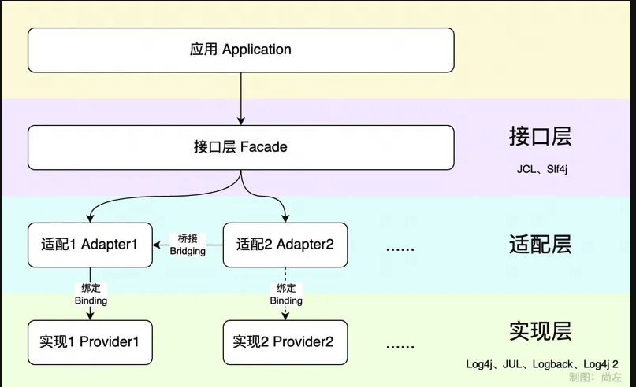
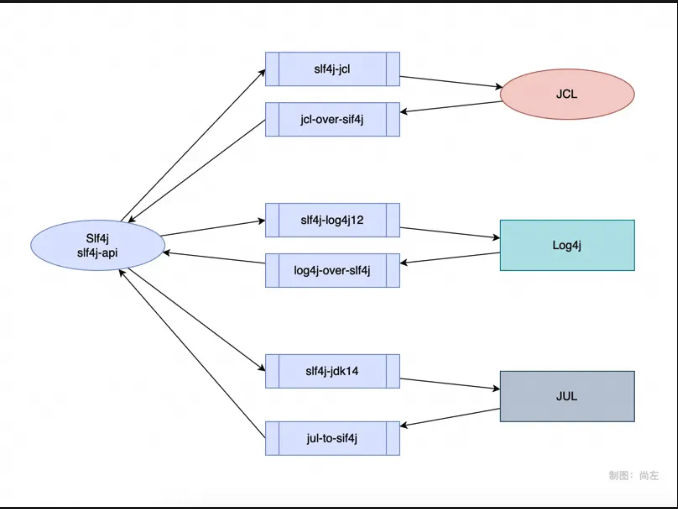
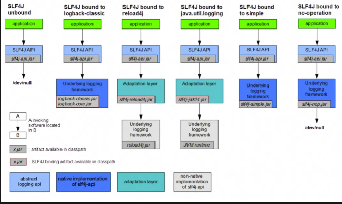
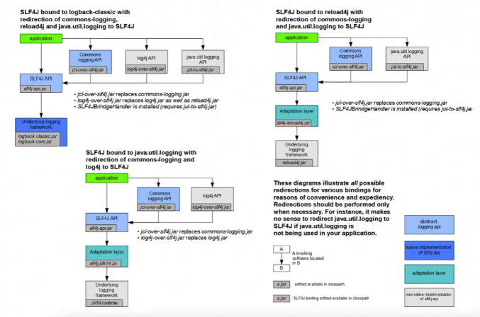
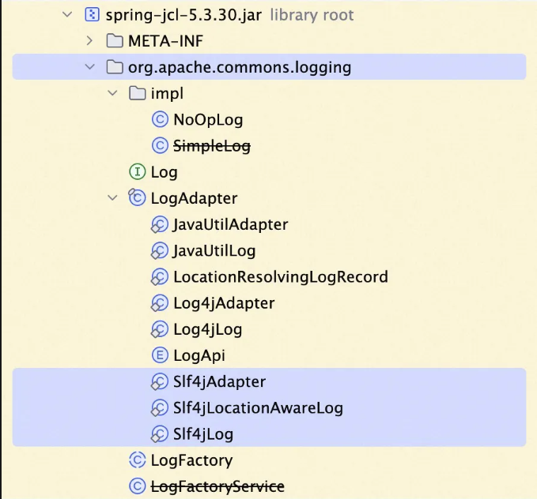
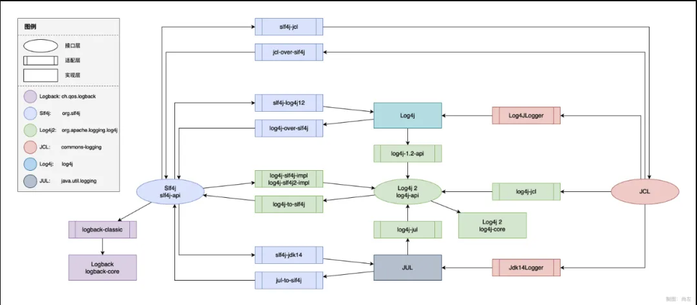
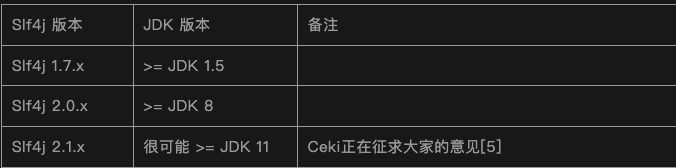
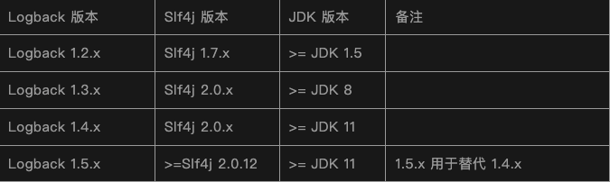
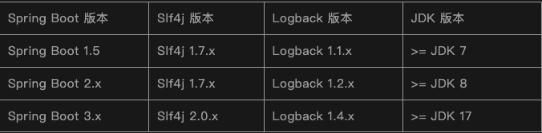

# Java日志实战


主要其实是学习[Java日志通关](https://mp.weixin.qq.com/s/eIiu08fVk194E0BgGL5gow)系列文章，大佬太强了




日志发展到今天，被抽象成了三层，接口层、实现层、适配层。

- 接口层：或者叫日志门面（facade），就是interface，只定义接口，等别人实现
- 实现层：真正干活的，能够把日志内存记录下来的工具，但请注意它不是上面接口实现，因为它不感知也不直接实现接口，仅仅是独立的实现
- 适配层：一般称为adapter，因为接口层和适配层并非都出自一家之手，它们之间无法直接匹配

适配层有可以分为绑定（binding）和桥接（bridging）两种能力：

- 绑定（binding）：将接口层绑定到某个实现层（实现一个接口层，并调用实现层的方法）
- 桥接（bridging）：将接口层桥接到另一个接口层（实现一个接口层，并调用另一个接口层的接口），主要作用是方便用户低成本的在各接口层和适配层之间迁移

## Java日志的历史

### Log4j (1999)

大神Ceki开发，提供了以下能力

- 日志可以输出到控制台、文件、数据库，甚至远程服务器和电子邮件（被称作Appender）
- 日志输出格式（被称作Layout）允许定制，比如错误日志和普通日志使用不同的展现方式
- 日志被分为5个级别（被称为Level），从低到高依次是debug、info、warn、error、fatal，输出前会校验配置的允许级别，小于此级别的日志将被忽略。除外之外还有all、off两个特殊级别，表示完全开放和完全关闭日志
- 可以在工程中随时指定不同的记录器（被称为Logger），可以为之配置独立的记录位置、日志级别
- 支持通过properties或者xml文件进行配置

不同Log4j有比较明显的性能短板，在Logback和Log4j 2推出后逐渐式微，最终Apache在2015年宣布终止开发Log4j并全面迁移至Log4j2

### JUL (2002.2)

Sun公司在2002年发布，这套系统称为Java Logging API，包路径是java.util.logging，简称JUL。

### JCL (2002.8)

对于独立且轻量的项目来说，开发者可以根据喜好使用某个日志方案即可，但更多的情况是一套业务系统依赖了大量的三方工具，而众多三方工具会各自使用不同的日志实现，当它们被集成在一起时，必然导致日志记录的混乱。

为此Apache在2002年推出了一套接口Jakarta Common Logging，简称JCL，它的主要作者仍然是Ceki，这套接口主动支持了Log4j、JUL等众多日志工具，开发者如果想打印日志，只需调用JCL的接口即可，至于最终使用的日志实现则由最上层的业务系统决定，我们可以看到，这其实就是典型的接口与实现分离的设计。


简单介绍一下JCL自带的几个适配层、实现层：

- Jdk14Logger：用于绑定JUL（因为JUL从JDK 1.4开始提供）的适配层
- Log4JLogger：用于绑定Log4j的适配层
- NoOpLog：JCL自带的日志实现，但它是空实现，不做任何事情
- SimpleLog：JCL自带的日志实现，让用户哪怕不依赖其他工具也能打印日志，只是功能非常简单

当时项目前缀取名Jakarta，是因为它属于Apache和Sun共同推出的Jakarta项目，现在JCL作为Apache Commons的子项目，叫Apache Commons Logging，与我们常用的Commons lang、CLommons Collections等是师兄弟，但JCL的简写命名被保留下来，并没有改成ACL。

### Slf4j (2005)

Log4j的作者Ceki看到了很多Log4j和JCL的不足，但又无力推动项目快速迭代，加上对Apache管理不满，认为自己失去了对Log4j项目的控制权，于是在2005年选择自立门户，并很快推出了一款新作品Simple Logging Facade for Java，简称Slf4j。

Slf4j也是一个接口层，接口设计与JCL非常接近（毕竟有师承关系），相比JCL有一个重要的区别是日志实现层的绑定方式：JCL是动态绑定，即在运行时执行日志记录时判定合适的日志实现，而Slf4j选择的是静态绑定，应用编译时已经确定日志实现，性能自然更好，这就是常被提到的classloader问题。

在推出Slf4j的时候，市面上已经有另一套接口JCL，为了将选择权交给用户，Slf4j推出了两个桥接层：

- jcl-over-slf4j：客户调用JCL接口，底层转到Slf4j接口
- slf4j-jcl：客户调用slf4j接口，底层转到JCL接口







这里解释一下`slf4j-log4j12`这个名字，它表示slf4j + log4j 1.2（Log4j的最后一个版本）的适配层。类似的，`slf4j-jdk14`表示slf4j + jdk1.4（就是JUL）的适配层。

### Logback (2006)

Ceki在2006年又推出一款日志记录实现方案：Logback，无论是易用度、功能、还是性能，Logback都优于Log4j，在加上天然支持Slf4j而不需要额外的适配层，自然拥趸者众，目前Logback已经成为Java社区最被广泛接受的日志实现层。

相较于Log4j，Logback提供了很多我们现在看起来理所当然的新特性：

- 支持日志文件切割滚动记录，支持异步写入
- 针对历史日志，既支持按时间或按硬盘占用自动清理，也支持自动压缩以节省硬盘空间
- 支持分支语法，通过`<if>`、`<then>`、`<else>`可以按条件配置不同的日志输出逻辑，比如判断仅在开发环境输出更详细的日志信息
- 大量的日志过滤器，甚至可以做到通过登陆用户Session识别每一位用户并输出独立的日志文件
- 异常堆栈支持打印jar信息，让我们不但知道调用出自哪个文件哪一行，也可以知道这个文件来自哪个jar包

Logback主要由三个部分组成：

- logback-core：记录、输出日志的核心实现
- logback-classic：适配层，完整实现了Slf4j接口
- logback_access：用于将Logback集成到Servlet容器（Tomcat、Jetty）中，让这些容器的HTTP访问日志也可以经由强大的Logback输出

### Log4j 2(2012)

Apache在2012年推出Apache Log4j 2，有以下亮点：

- 插件化结构，用户可以自己开发插件，实现Appender、Logger、Filter完成扩展
- 基于LMAX Disruptor的异步话输出，在多线程场景下相比Logback有10倍左右的性能提升

Log4j 2主要由两部分组成：

- log4j-core：核心实现，功能类似于logback-core
- log4j-api：接口层，功能类似于Slf4j，里面只包含Log4j 2的接口定义

Log4j 2提供JCL和Slf4j之外的第三个接口层（log4j-api，虽然只是自己的接口），不过目前大家一般把Log4j 2看做实现层看待，并引入JCL或Slf4j作为接口层，特别是JCL，在时隔近10年后，与2023年推出了1.3.0版，增加了对Log4j 2的适配。

虽然Log4j 2发布已经很久了，但它依然无法撼动Logbakc的江湖地方

- Log4j 2虽然顶着Log4j的名号，但却是一套完全重写的日志系统，无法只通过修改Log4j版本号完成升级，历史用户升级意愿低
- Log4j 2比Logback晚面世6年，却没有提供足够两眼及差异化的能力，而Slf4j+Logback这套组合已经非常优秀，先发优势明显

### spring-jcl

Spring Boot目前使用sprint-jcl + Logback这套方案，Spring曾在它的官方blog中提到，如果可以重来，Spring会选择Slf4j而不是JCL作为默认日志接口。Spring想要支持SLF4j，又要保证向前兼容JCL，于是从5.0 （Spring Boot 2.0）开始提供了spring-jcl这个包，它顶着Spring的名号，代码中报名却与JCL一致（`org.apache.commons.logging`），作用自然也与JCL一致，但它额外适配了Slf4j。并将Slf4j放在查找的第一顺位。



如果你是基于Spring Initialize新创建的应用，可以不必管这个包，它已经在背后默默工作了，如果你在项目开发过程中遇到包冲突，或者需要自己选择日志接口和实现，则可以把spring-jcl当做jcl对待，大胆排除即可。

### 总结



两个接口（JCL、Slf4j）和四个实现(Log4j、JUL、Logback、Log4j2)，再加上无数的适配层，组成了一张图。

- 相同颜色的模块具有相同的`groupId`
- JCL的适配层是直接在它自己的包中提供的
- 要想使用Logback，就一定绕不开Slf4j（引用它的适配层也算）。同样的，要想使用Log4j 2，那它的`log4j-api`也绕不开。

## Slf4j + Logback整合和排包

对[Java日志通关（二） - Slf4j+Logback 整合及排包](https://mp.weixin.qq.com/s/jABbG4MKvEiWXwdYwUk8SA)的学习

选择Slf4j + Logback的原因：

- Slf4j的API相较JCL更丰富，且得到Intellij IDEA编辑器的完整支持，这是核心优势
- Slf4j支持日志内容惰性求值，相比JCL性能更好
- 在前边选定Slf4j的前提下，同一厂牌且表现优异的Logback自然中标
- Slf4j + Logback是目前大部分开发者的选择（2021年Slf4j 76%,Logback 48%）

### 基础依赖项

根据前面的知识，我们很容易知道以下三个包是必须的：

- Slf4j是基本的日志门面，它的核心APi在`org.slf4j:slf4j-api`中
- Logback的核心实现层在`ch.qos.logback:logback-core`中
- Logback针对Slf4j的适配层在`ch.qos.logback:logback-classic`中

其中logback-classic会直接依赖其他两项，而且它依赖的一定是它能够支持的最合适版本，所以为了避免歧义，我们可以在项目中仅显式依赖logback-classic即可。

另外要注意，Slf4j和Logback的版本并不完全向前兼容，他们之间也有对应关系

#### slf4j版本兼容性

slfj4j 2.0.x版本有不小的改动，不再主动查找`org.slf4j.impl.StaticLoggerBinder`，而是改用JDK ServiceLoader（也就是SPI，Service Provider Interface）的方式来加载实现，这是JDK 8中的特性，所以Slf4j对JDK的依赖显而易见。



#### Logback版本兼容性

因为Slf4j技术方案变化，导致logback-classic也需要分别作适配，如果使用了不匹配的版本将会报异常



其中logback 1.3.x和1.4.x是并行维护版本，每次更新都会同时发布1.3.n和1.4.n，用户需要根据项目的JDK版本进行选择，不过目前Logback已经全面升级1.5.x，且1.3.x和1.4.x不再维护。

#### 总结

从前面的版本兼容性我们可以知道：

- 如果使用JDK8，建议选择Slf4j 2.0 + Logback 1.3
- 如果使用JDK 11及以上，建议选择Slf4j 2.0 + Logback 1.5

### 适配Spring Boot

Spring Boot通过`spring-boot-starter-logging`包直接依赖了Logback（然后再间接依赖了Slf4j），它通过`org.springframework.boot.logging.LoggingSystem`查找日志接口并自动适配，所以我们使用Spring Boot时一般并不需要关系日志依赖，只管使用即可。但因为slf4j 2.0.x和1.7.x实现不一致，导致Spring Boot也会挑版本。



根据这个表格，以及前一节总结的版本兼容关系，最终可以得出结论：

- 如果使用Spring Boot 2及以下，建议 Slf4j 1.7.x  + Logback 1.2.x
- 如果使用Spring Boot 3，建议选择Slf4j 2.0.x + Logback 1.4.x（如果Spring做好了Logback 1.4.x的适配，估计就推荐1.5.x了）

### 桥接其他实现层

我们还要保证项目依赖的二方、三方包能够正常打印日志，而它们可能依赖的是JCL/Log4j/Log4j2/JUL，我们可以统一引入适配层做好桥接：

- 通过`org.slf4j:jcl-over-slf4j`将JCL桥接到Slf4j上
- 通过`org.slf4j:log4j-over-slf4j`将Log4j桥接到Slf4j上
- 通过`org.slf4j:jul-to-slf4j`将JUL桥接到Slf4j上
- 通过`org.apache.logging.log4j:log4j-to-slf4j`将Log4j2桥接到Slf4j上

注意，所有`org.slf4j`的包版本要完全一致，所以如果引入这些桥接包，要保证它们的版本与前面选择的slf4j-api版本对应，为此Slf4j从2.0.8开始提供bom包，省去维护每个包版本的烦恼（至于低版本就只能人肉保持版本一致性了）。`log4j-to-slf4j`这个包，对Sfl4j1和slf2j2都能支持。

### 去除无用依赖

桥接层使用与被桥接包一样的包结构，再将调用转到另一个接口上，所以如果同时引入桥接层以及被桥接的包，大概率会引起包冲突。

由于很多工具会在不经意间引入日志接口层、实现层，所以我们有必要从整个应用级别着眼，把那些无用的接口层、实现层排除掉，包括JCL、Log4j和Log4j 2

- 排掉JCL：`commons-logging:commons-logging`
- 排掉Log4j：`log4j:log4j`
- 排掉Log4j2：`org.apache.logging.log4j:log4j-core`

以及，如果项目间接引入了其他的桥接包，也可能会引起和冲突，需要排掉。可以使用`maven-enforcer-plugin`插件标识那些包是要被排掉的，它只是一个校验，实际上你仍然需要在每个引入了错误包的依赖中进行排除。

### 注意事项

根据前面的介绍，我们在实际项目中将主要做两类事情：

- 引入期望的包，并指定版本
- 排除一些包（指定空版本）

以上两个动作，一般我们都是在父POM的`<dependencyManagement>`中完成的，但这只是管理包版本，在项目没有实际引用之前，并不会真的加载。

在实际项目中，我们一般会按照这个思路来处理：

- 有一个模块A，依赖Log4j打印日志，所以它依赖了`log4j:log4j`包
- 我们在父POM中把`log4j:log4j`排掉了，此时模块A调用`Log4j`会报错
- 我们在父POM中引入`log4j-over-slf4j`，目标是把`Log4j切换到Slf4j，让模块A不报错

看起来很完美，项目也能正常启动，但当模块A需要打印日志是，我们却还是得到了一个错误`log4j:WARN No appenders could be found for logger`。这是因为`log4j-over-slf4j`并没有真的被引入我们的项目中（很少有哪一个二方包会引这个东西，会被骂的）。

解决方案也很简单，将`log4j-over-slf4j`通过`dependencies>`引入即可，在父POM做这个也行，在实际有依赖的子POM也行。

## Slf4介绍

学习大佬[Java日志通关（三） - Slf4j 介绍](https://mp.weixin.qq.com/s/Ys9LxsvmRhhwgtL4Kji_FQ)

### 创建Logger实例

#### 工厂函数

要使用Slf4j，需要先创建一个`org.slf4j.Logger`实例，可以使用它的工厂函数`org.slf4j.LoggerFactory.getLogger()`，参数可以是字符串或Class：

- 如果是字符串，这个字符串会作为返回Logger实例的名字
- 如果是Class，会调用它的`getName`获取Class的全路径，作为Logger实例的名字

```java
public class ExampleService {
  // 传Class，一般都是传当前的Class
  private static final Logger log = LoggerFactory.getLogger(ExampleService.class);
  // 相当于
  private static final logger log = LoggerFactory.getLogger("com.example.service.ExampleService");
  // 你也可以指定任意字符串
  private static final Logger log = LoggerFactory.getLogger("service")
}
```

这个字符串格式的实例名字可以称之为LoggerName，用于在日志实现层区分如何打印日志。

#### Lombook

Lombok提供了针对各种日志系统的支持，比如你只需要`@lombok.extern.slf4j.Slf4j`注解就可以得到一个静态的`log`字段，不用在手动调用工厂函数，默认的LoggerName即是被注解的Class，同时也支持字符串格式的`topic`字段指定LoggerName。

```java
@Slf4j
public class ExampleService {
  // 注解 @Slf4j 会帮你生成下边这行代码
  // private staitc final org.slf4j.Logger log = org.slf4j.LoggerFactory.getLogger(ExampleService.class)
 
}
```

### 日志级别

通过`org.slf4j.event.Level`我们可以看到一共有五个等级，按优先级从低到高依次为：

- `TRACE`：一般用于记录调用链路，比如方法进入时打印`xxx start`
- `DEBUG`：类似于trace，可以用来打印方法的出入参
- `INFO`：默认级别，一般用于记录代码执行时的关键信息
- `WARN`：当代码执行遇到预期外场景，但它不影响后续执行时使用
- `ERROR`：出现异常，以及代码无法兜底时使用

日志的实现层会决定那个等级的日志可以输出，这也是我们打印日志是需要区分等级的原因，在保证重要的日志不丢失的同时，仅在有需要时才打印用于Debug的日志。

### 打印接口

通过`org.slf4j.Logger`可以看到有非常多的日志打印接口，打过定义的格式都类型，以`info`为例，一共有两大类

- `public boolean info(...)`
- `public boolean isInfoEnabled(...)`

#### info方法

这个方法有大量的重载，不过使用逻辑是一致的

```java
@Slf4j
public class ExampleService {
  public void querySomething(Long a, String b) {
    // 只传入一个String参数，String内容需要自己拼
    log.info("request")
    log.info("request a=" + a + ", b = " + b);
    
    // 使用格式模板，通过{}插入占位符
    // Intellij IDEA会校验后续参数数量是否与占位符一致，不一致时会给出警告
    log.info("request a={}"); // 警告：参数比占位符少
    log.info("request a={}", a);
    log.info("request a={}, b={}", a, b);
    
    // 所有参数的最后可以跟一个异常，它不占用占位符
    Exception e = new RuntimeException();
    log.info("request a={}", a, e);
  }
}
```


#### isInfoEnabled方法

通过`isInfoEnabled`方法可以获取当前Logger实例是否开启了对应的日志级别，比如我们可能见过类似这样的代码：

```java
if (log.isInfoEnabled()) {
  log.info(...)
}
```

但其实日志实现层本身就会判断当前Logger实例的输出等级，低于此等级的日志并不会输出，所以一般不太需要这样的判断，但如果你的输出需要额外消耗资源，那么还是先判断一下为好

```java
if (log.isIInfoEnabled()) {
  // 有远程调用
  String resource = rpcService.call();
  log.info("resource={}", resource)
  // 要解析大对象
  Object result = ...; // 一个大对象
  log.info("result={}", JSON.toJSONString(result));
}
```

#### Marker

有些接口支持`org.slf4j.Marker`类型的入参，比如`log.info(Marker, ...)`

我们可以通过工厂函数创建Marker并使用，比如

```java
Marker marker = MarkerFactory.getMarker("foobar");
log.info(marker, "test a={}", 1);
```

这个Marker是一个标记，它会传递给日志实现层，由实现层决定Marker的处理方式，比如

- 将Marker通过%marker打印出来
- 使用MarkerFilter过滤出（或过滤掉）带有某个Marker的日志，比如把需要Sunfire监控的日志都过滤出来写到一个单独的日志文件中。

#### MDC

MDC的全称是Mapped Diagnostic Context，直译为映射调试上下文，说人话就是用来存储扩展字段的地方，而且它是线程安全的，比如OpenTelemetry的traceId就会被存到MDC中

而且MDC的使用也很简单，就像是一个`Map<String, String>`实例，常用方法`put/get/remove/clear`都有

```java
// 和Map<String, String> 相似的接口定义
MDC.put("key", "value");
String valeu = MDC.get("key");
MDC.remove("key");
MDC.clear();

// 获取MDC中的所有内容
Map<String, String> context = MDC.getCopyOfContextMap();
```

## Logback介绍

学习[Java日志通关（四） - Logback 介绍](https://mp.weixin.qq.com/s/UR30lfp_Guu9d6f0jzWfJw)

### 配置入口

Logback支持XML、Groovy的配置方式，以XML来说，它会默认查找resources目录下的`logback-test.xml`用于测试/`logback.xml`文件。

而如果你是使用Spring Boot，那么你还可以使用logback-spring.xml文件进行配置，这两者的区别是

- `logback-spring.xml`是由Sprint Boot找到，插入自己的上下文信息并做进一步处理后再传递给Logback的，你可以在其中使用`<springProfile>`区分环境配置，也可以使用`<springProperty>`拿到Spring上下文信息（比如`spring.application.name`）。
- `logback.xml`是由logback自己找到，自然不会有Spring Boot相关的能力。

### 配置文件介绍

接下来我们以`logback-spring.xml`为例进行介绍，一个Logback配置文件主要有以下几个标签：

- `configuration`：最外层的父标签，其中有几个属性配置，但项目中较少使用
- `property`：定义变量
- `appender`：负责日志输出（一般是写到文件），我们可以通过它设置输出方案
- `logger`：用来设置某个LoggerNmae的打印级别
- `root`：logger的兜底配置，从而我们不必配置每个LoggerName
- conversionRule：定义转换规则

#### springProperty和property

前文提到`<springProperty>`用来插入Spring上下文，那`<property>`就是Logback自己定义变量的标签

```xml
<springProperty scope="context" name="APP_NAME" source="spring.application.name"/>

<property name="LOG_PATH" value="${user.home}/${APP_NAME}/logs"/>
<property name="APP_LOG_FILE" value="${LOG_PATH}/application.log"/>
<property name="APP_LOG_PATTERN" value="%date{yyyy-MM-dd HH:mm:ss.SSS}|%-5level|%X{trace_id}|%thread|%logger{20}|%message%n%exception"/>
```

我们首先使用`<springProperty>`插入`APP_NAME`这个变量来表示应用名，虽然用它拼出`LOG_PATH`变量，示例中还用到了`${user.home}`这个Logback内建支持的上下文变量，`APP_LOG_FILE`是log文件路径，`APP_LOG_PATTERN`是日志格式。

#### appender

```xml
<appender name="APPLICATION" class="ch.qos.logback.core.rolliing.RollingFileAppender">
  <file>${APP_LOG_FILE}</file>
  <encoder>
    <pattern>${APP_LOG_PATTERN}</pattern>
  </encoder>
  <rollingPolicy class="ch.qos.logback.core.rolling.SizeAndTimeBasedRollingPolicy">
    <fileNamePolicy>${APP_LOG_FILE}.%d{yyyy-MM-dd}.%i</fileNamePolicy>
    <maxHistory>30</maxHistory>
    <maxFileSize>200MB</maxFileSize>
    <totalSizeCap>10GB</totalSizeCap>
  </rollingPolicy>
</appender>

<appender name="APPLICATION-async" class="ch.qos.logback.classic.AsyncAppender">
  <queueSize>256</queueSize>
  <discardingThresold>0</discardingThresold>
  <nerverBlock>true</nerverBlock>
  <append-ref ref="APPLICATION"/>
</appender>
```

`ch.qos.logback.core.rolling.RollingFileAppender`负责将日志滚动打印，避免单文件体积过大，具体的滚动策略在`<rollingPolicy>`中指定。

`ch.qos.logback.classic.AsyncAppender`负责将日志异步打印，避免大量打印日志时阻塞线程

#### logger和root

`<logger>`用来设置某个LoggerName的打印级别，比如

```xml
<logger level="INFO" additivity="false" name="com.foo.bar">
  <appender-ref ref="APPLICATION-async"/>
</logger>

<root level="INFO">
  <appender-ref ref="APPLICATION-async"/>
</root>
```

上面的配置指定所有LoggerName为`com.foo.bar`的日志以`INFO`级别进行打印，此配置绑定的输出器（appender）为`APPLICATION-async`。

其中LoggerName会以`.`为分隔符逐级向上匹配，比如实际LoggerName为`com.foo.bar.service.ExampleService`，那么它的查找过程依次为：

1. `com.foo.bar.service.ExampleSerivce`
2. `com.foo.bar.service`
3. `com.foo.bar`（此时命中了我们提供的logger，另外因为配置了additivity="false"，所以停止继续向下查找
4. `com.foo`
5. `com`
6. `<root>`

而`<root>`就是兜底配置了，当LoggerName没匹配到任何一项`<logger>`时，就会使用`<root>`，所以它没有`additivity`和`name`属性的。一般实际业务场景中，所有`<logger>`都建议加上`additivity=false`，否则日志就会因查找到多个`<logger>`（或`<root>`）而打印多份。

#### springProfile

Spring还提供了`<springProfile>`标签，用来根据Spring Profiles（即`spring.profiles.active`的值）动态调整日志信息，比如我们希望线上环境使用INFO级别，而预发、日志使用TRACE级别。

```xml
<springProfile name="production">
  <root level="INFO">
    <appender-ref ref="APPLICATION-async"/>
  </root>
</springProfile>
<springProfile name="staging.testing">
  <root level="TRACE">
    <appender-ref ref="APPLICATION-async"/>
  </root>
</springProfile>
```

### Java API

除了使用XML配置文件外，Logback还提供了大量的Java API以支持更复杂的业务诉求，我们通过三个非常实用的场景来简单介绍一下：

1. 场景一：使用`log.info("obj={}", obj)`时，如何将obj统一转JSON String后输出
2. 场景二：日志中涉及到的手机号、身份证号，如何脱敏后再记录日志
3. 场景三：Logback配置基于XML，如何不改代码不发布，也可以动态修改日志级别

其中前两个问题都可以通过MessageConverter实现，第三个问题可以借助LoggerContext及Logger实现。

### MDB中的traceId

手动记录traceId，比如

```java
log.info("traceId={}, blah blah blah", Span.current().getSpanContext().getTraceId());
```

其实OpenTelemetry已经自动将traceId加到了MDC，对应的Key是`trace_id`，使用`%mdc{trace_id}`即可打印出traceI。

## 最佳实践

学习[Java日志通关（五） - 最佳实践](https://mp.weixin.qq.com/s/KrJ1s1bCjOQLlnWeUaHJvg)

### 总是使用接口层

无论是写代码还是实现一个三方工具，请只使用接口层记录日志

如果需要向外提供三方工具，记得在依赖中将日志的实现层及适配层标记为optional，比如：

```xml
<dependency>
  <groupId>ch.qos.logback</groupId>
  <artifactId>logback-core</artifactId>
  <version>${logback.version}</version>
  <scope>runtime</scope>
  <optional>true</optional>
</dependency>
```

- `<scope>runtime</scope>`：runtime的包编译时会被忽略（认为运行环境已经有对应包了）
- `<optional>true</optional>`：依赖不会传递，maven不会自动安装此包

### 不要打印分割线

不要打印类似这种只包含分割线的内容，`log.info("=========start========")`，因为在茫茫的日志中，这句日志的下一条很可能来自其他异步任务，如果使用SLS收集甚至来自另一台机器，这条分割线根本起不到任何作用。

正确的方式是通过关键字进行标记，比如：`log.info("FooBarProcessor start, request={}", request)`，之后就可以通过关键字`FooBarProcessor`快速过滤，这对于grep和SLS都适用。

另外，可以用Marker让日志语义更清晰，只是麻烦了点，看个人喜好。

### 避免因写日志而抛错

比如没有判空就直接调用了它的方法：

```java
Object result = rpcResource.call();
log.info("result.userId={}", result.getUserId());
```

### 两个FastJson参数

#### IgnoreErrorGetter

Fastjson的序列化其实是依赖于类中各个getter，如果某个getter抛异常则会阻断整个序列化，但其实有些getter异常并非严重问题，此时就可以使用SerializerFeature.IgnoreErrorGetter参数忽略getter中抛出的异常：

```java
public class Foo {
  private Long userId;
  @Deprecated
  private Long accountId;
  
  public long getAccountId() {
    throw new RuntimeException("accountId deprecated");
  }
}

log.info("foo={}", JSON.toJSONString(foo, SerializerFeature.IgnoreErrorGetter));
```

#### IgnoreNonFieldGetter

比如有个`Result`包装类如下，注意`isError`方法，当被Fastjson序列化时，会输出`"error":false`，如果希望忽略掉类似这种没有实体字段对应的getter方法，就可以追加`SerializerFeature.IgnoreNonFieldGetter`参数

```java
@Data
public class Result<T> {
  private boolean success;
  private T data;
  
  public boolean isError() {
    return !success;
  }
}
log.info("result={}", JSON.toJSONString(result, SerializerFeature.IgnoreNonFieldGetter))
```

这个参数对于打印Result包装类非常有帮助，如果打印出`"error": false`，那当你希望使用`error`作为关键字查询错误时，就会匹配到很多包含`error`却并非错误的无效数据。

### 不要遗漏异常堆栈

异常值参数是不占用字符模版的，如果你的参数数量不匹配，很可能打印结果与预期不符

```java
Exception e = new RuntimeException("blahblashblash");
log.error("exception={}", e);
```

因为此时e和对应的`{}`位置匹配，Slf4j会尝试将异常转为字符串拼到日志模版中，最终这句相当于

```java
log.error("exception={}", e.toString());
```

最终你只能得到`exception=blahblashblash`，而堆栈就丢掉了

正确的做法是要保证异常参数不占用字符模版

```java
// 用 e.getMessage()拼到日志信息后，通过有独立的e用于打印堆栈
log.error("exception={}", e.getMessage(), e);
```

最终会输出

```bash
exception=blashblashlbahs
换行后会有堆栈信息
```

### 限制日志输出长度

#### 限制日志文本最大长度

有时候一个POJO非常大，当我们通过

```java
log.info("result={}", JSON.toJSONString(result))
```

打印日志时，整条日志就会变得非常长，不但对性能有影响，主要是这么大的结果对实际问题排查也不见得有帮助。

可以通过`Format modifiers`限制消息最大长度，并将超出的部分丢弃

```java
%.-2000message
```

#### 限制堆栈的层级

其实Logback天然支持，比如`%exception{50}`就可以只打印50层，同时Logback针对异常堆栈有更多的控制能力

### 将堆栈合并为一行

有些同学希望将堆栈在一行输出，保证通过管道进行多层grep时捞到期望的记录。

其实通过Logback配置就可以支持这个能力，主要用到`%replace`

```bash
%replace(%exception){'[\r\n\t]+', '    '}%nopex
```

- `%replace(p){r, t}`，将给到的p，使用正则`r`进行匹配，命中的替换为`t`，所以上边就是，将`%exception`中的`[\r\n\t]`替换为四个空格
- `%nopex`：如果不加，Logabck会自动在日志最后追加`%exception`，导致异常堆栈被打两遍

### 不建议使用%method和%line

在Logback的配置中，可以通过`%method`和`%line`输出方法名和行号，但这两项都依赖于当前的堆栈轨迹（StackTrace），而获取堆栈轨迹的代价非常高，日志就会占用大量的CPU，所以一般情况下不建议在日志中输出这些字段。

如果对方法名有输出要求，可以直接硬编码到输出字符串中，比如

```java
log.info("queryUserInfo, request={}, result={}", request, result);
```

### 不要将日志输出到Console

我们平时调用`System.out.println`时，默认输出位置就是控制台，Logback也提供了`ch.qos.logback.core.ConsoleAppender`用于将日志输出到控制台，但控制台基本没人看，还浪费机器资源。

### 无用的LogUtil

有时会遇到其他人额外写的日志工具类，比如`LogUtil`，将Slf4j或Logback已有能力重新实现一遍，但实际上通过正确配置，直接使用Slf4j提供的强大API是更好的做法。

### 熟读《日志规约》

《阿里巴巴Java开发手册》有专门一章是《日志规约》，建议熟读，其实整个《阿里巴巴Java开发手册》都应该熟读，花不了多少时间。


