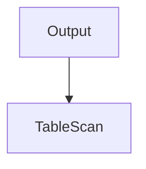

# Presto数据过滤和投影


## 简单拉取数据查询的实现原理

```sql
SELECT ss_item_sk, ss_sales_price
FROM store_sales;
```

### 执行计划的生成和优化

#### 初始逻辑执行计划


```mermaid
graph TD
    Output --> TableScan
```

TableScan节点：负责从

