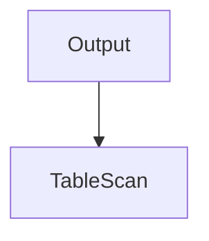
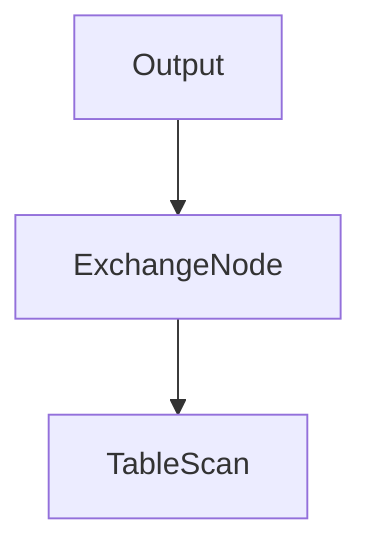
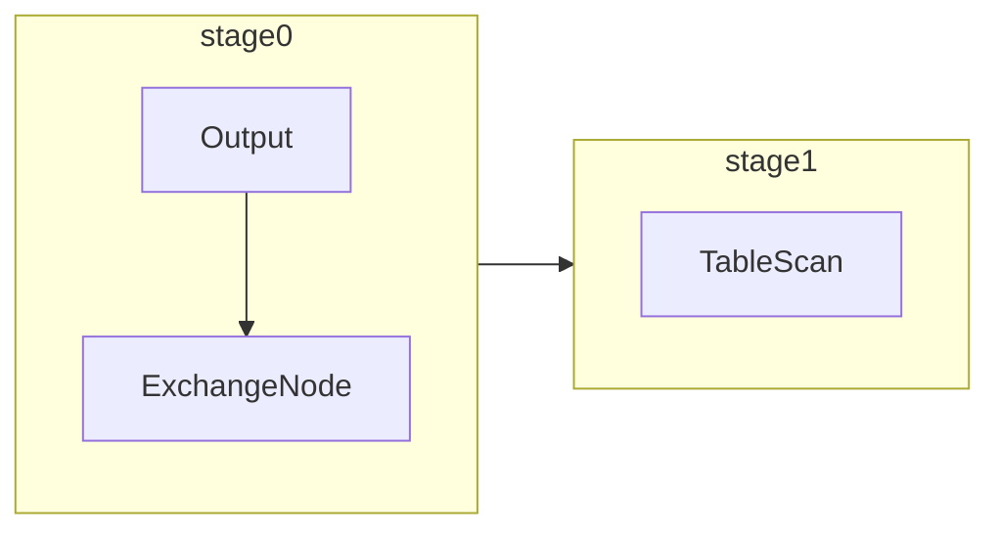
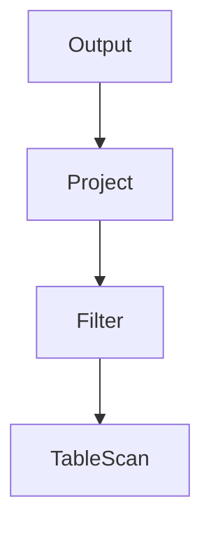
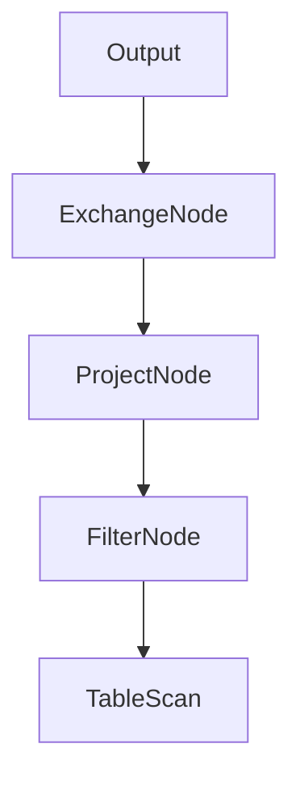

# Presto数据过滤和投影


## 简单拉取数据查询的实现原理

```sql
SELECT ss_item_sk, ss_sales_price
FROM store_sales;
```

### 执行计划的生成和优化

#### 初始逻辑执行计划



TableScan节点：负责从数据源连接器拉取数据

Output节点：逻辑执行计划的根节点，表示输出计算结果，其自身没有计算逻辑

```java
public class TableScanNode
        extends PlanNode
{
  	// TableHandle表示的是与当前TableScanNode对应的是数据源存储中的那个类
    private final TableHandle table;
  	// outputSymbols: TableScanNode输出的symbols列表，在Presto中使用Symbol表示要输出哪些列
    private final List<Symbol> outputSymbols;
  	// assignments：对于outputSymbols中的每个Symbol，明确其来源于数据源Connector的那个Column（用ColumnHandle表示）
    private final Map<Symbol, ColumnHandle> assignments; // symbol -> column

    private final TupleDomain<ColumnHandle> enforcedConstraint;
    private final boolean forDelete;
```

查询执行时，只要将TableHandle、ColumnHandl交给数据源连接器，它就知道拉取那些表、哪些列的数据，这是一个基本抽象，在考虑到各种下推优化时，这两个概念将发挥更大的作用

```java
public class OutputNode
        extends PlanNode
{
  	// 上游PlanNode节点
    private final PlanNode source;
  	// SELECT语句最终要输出结果的列名称
    private final List<String> columnNames;
  	// OutputNode输出的Symbol表示，与ColumnNames--对应
    private final List<Symbol> outputs; 
```

#### 优化后的逻辑执行计划



为了提升从数据源拉取数据的并发度，可将TableScanNode设计为多个任务并分别放置在多个节点上以并发拉取数据，对于OutputNode来说，其并行度只能是1，因为它需要将上游TableScanNode拉取的数据合并到一起，给到查询发起者。由于执行TableScanNode与OutputNode的并行度不同，在OutputNode与TableScanNode中间需要插入一个ExchangeNode来实现数据交换，改变并行度。

#### 查询执行阶段划分

Presto的AddExchange优化器基于逻辑执行计划的ExchangeNode划分逻辑执行计划的PlanFragment，每个PlanFragment对应生成一个查询执行阶段，。简而言之，凡是上游节点和下游节点要求的数据分布不一致，就需要做一次数据交换（无论是REPARTITION还是GATHER方式），两侧需要划分到不同的查询执行阶段。逻辑执行计划由AddExchanges优化器划分为2个PlanFragment，对应分布式执行时的2个查询执行阶段。




stage1：从数据源连接器拉取数据，stage1的输出数据会放到OutputBuffer中，等待下游stage0的任务来拉取。

stage0：从上游stage1拉取数据，输出结果给到集群协调节点，stage0输出的数据会放到OutputBuffer中，等待集群协调节点来取

### 分布式调度与执行的设计实现

stage1的任务执行时会按照PlanFragment的PlanNode子树，创建两个算子，TableScanOperator和TaskOutputOperator。TableScanOperator负责从存储系统中拉取数据后输出给TaskOutputOperator，TaskOutputOperator负责将待输出的数据放到当前任务的OutputBuffer中，等待下游Stage0的任务来拉取。

stage0的任务执行时会按照PlanFragment的PlanNode子树，创建两个算子，ExchangeOperator和TaskOutputOperator，ExchangeOperator负责从上游stage1的任务中拉取数据，而TaskOutputOperator则负责将待输出的数据放置到当前任务的OutputBuffer中等待集群协调节点来拉取。

## 数据过滤与数据投影的实现原理

```sql
SELECT
	i_category_id,
	upper(i_category) AS upper_category,
	concat(i_category, i_color) AS cname,
	i_category_id * 3 AS m_category
	icategory_id + i_brand_id AS a_num
FROM  item
WHERE i_item_sk IN (13631, 13283) OR i_category_id BETWEEN 2 AND 10;
```

### 执行计划的生成和优化

#### 初始逻辑执行计划




```java
public class FilterNode
        extends PlanNode
{
    private final PlanNode source;
  	// 数据过滤的表达式，类型是Expression
    private final Expression predicate;
```

```java
public class ProjectNode
        extends PlanNode
{
    private final PlanNode source;
  	// Assignments可以理解为Map<Symbol, Expression>，表示的是所有要输出的表达式
    private final Assignments assignments;
```

#### 优化后的逻辑执行计划



#### 查询执行阶段划分

也是从ExchangeNode划分成两个stage。

### 分布式调度与执行的设计实现

值得引起注意的是，执行计划树中的PlanNode并不是总与算子一一对应，例如ProjectNode、FilterNode实际上不存在对应的算子，这两种PlanNode都对应了FilterAndProjectOperator，而TableScanNode可能对应多个算子：TableScanOperator、ScanFilterAndProjectOperator，从PlanNode树生成OperatorChain的阶段，将根据不同的PlanNode组合生成不同的算子。

虽然数据过滤和数据投影在查询的功能上看是不同的，但是在OLAP引擎的底层设计上都可以归为表达式的执行。

- 数据过滤：给定某行数据作为过滤表达式的输入，执行此表达式并输出布尔型结果，只有结果是true时才会输出此数据行
- 数据投影：给定某行数据作为投影表达式的输入，执行此表达式并输出表达式执行结果

我们从表达式的视角看看从Presto接收包含表达式的sql到查询执行完成，都经历了哪些过程：

- SQL解析及语义分析阶段：SQL字符串转换为抽象语法树，其中表达式用Expression节点及其子类表示
- 生成逻辑执行计划阶段：将抽象语法树转换为PlanNode树，其中FilterNode的predicate字段属性对应数据过滤的表达式，ProjectNode的assignment字段属性对应所有数据投影字段的表达式
- 任务执行时的代码生成阶段：首先Expression转换为RowExpression（RowExpression所表示的表达式与Expression所表示的表达式在逻辑上完全等价），然后利用代码生成技术将RowExpression转换为可直接执行的代码。数据过滤表达式的代码生成逻辑及其周边逻辑被进一步封装为PageFilter这个java接口的实现类，数据投影表达式的代码生成逻辑及其周边逻辑被进一步封装为PageProjection这个java接口的实现类。最终自动生成的PageFilter、PageProjection的实现将被封装到一个PageProcessor的实例中。
- 任务执行时的遍历数据阶段：由ScanFilterAndProjectOperator或FilterAndProjectOperator驱动PageProcessor中的PageFilter、PageProjection遍历从存储拉取的所有数据行，逐行完成表达式的执行，为后续算子输出计算完成后封装的Page数据。

#### 表示表达式的两种形式

Expression和RowExpression是两种表达式。

Expression是在SQL抽象语法树、逻辑执行计划PlanNode树中用于表示表达式的形式，它的基类Expression继承自抽象语法树的基类Node节点，Expresssion有几十个子类来表示更具体的某个表达式逻辑，比如：

- SymbolReference表示对某个字段的引用
- FunctionCall表示对函数的调用
- ArithmeticBinaryExpression表示基本的二元算数运算，比如 x + y, x * y
- Cast表示将某个字面意思的字符串转换为具体的类型，比如CAST(3 AS BIGINT)

在将要利用代码生成技术生成特定的PageFilter、PageProjection实现类时，RowExpression将几十种Expression的表示简化为6种相同含义的表达，它们分别如下：

- ConstantExpression 表示某个字面常量，例如 i_category_id * 3中的3
- InputReferenceExpression 表示对某个字段的引用
- CallExpression 表示函数或者运算符调用
- SpecialForm 可用于表示多种负责的逻辑，包括但不限于IN、BETWEEN、IF、AND、OR
- LambdaDefinitionExpression 表示SQL中Lambda函数定义
- VariableReferenceExpression 表示对变量的引用

之所以要先用Expression及其子类作为表达式的结构，其后在算子执行时又将表达式转换为RowExpression结构，是因为在算子执行阶段自动生成数据处理代码时，RowExpression种类更少，对应的表达式树形结构更容易遍历。

#### PageProcessor、PageFilter、PageProjection

```java
public class PageProcessor
{
    public static final int MAX_BATCH_SIZE = 8 * 1024;
    static final int MAX_PAGE_SIZE_IN_BYTES = 4 * 1024 * 1024;
    static final int MIN_PAGE_SIZE_IN_BYTES = 1024 * 1024;

    private final ExpressionProfiler expressionProfiler;
    private final DictionarySourceIdFunction dictionarySourceIdFunction = new DictionarySourceIdFunction();
    private final Optional<PageFilter> filter;
    private final List<PageProjection> projections;

    private int projectBatchSize;
```


给定某个page的数据，PageProcessor可以利用它持有的PageFilter、PageProjection实例完成这个Page数据的过滤和投影操作。

```java
public interface PageFilter
{
    boolean isDeterministic();
		// 参与过滤的输入Page的所有列的channel ID
    InputChannels getInputChannels();

    SelectedPositions filter(ConnectorSession session, Page page);
```

为了避免数据过滤完成后立即创建新的Page再去做数据投影计算（这样可能导致在内存中物化中间过程的数据开销比较大），Presto利用SelectedPositions这样的数据结构记录数据过滤完成后被筛选出来的行的ID（row id）列表，PageProjection的数据投影操作只对SelectedPositions中记录的数据过滤保留下来的行做投影操作，并最终创建Page结果数据。

```java
public interface PageProjection
{
    Type getType();

    boolean isDeterministic();
		// 给定某个Page，InputChannels指定的blocks给到PageProjection，计算并输出Projection后的一个Block
    InputChannels getInputChannels();

    Work<Block> project(ConnectorSession session, DriverYieldSignal yieldSignal, Page page, SelectedPositions selectedPositions);
}
```

#### 利用代码生成技术生成表达式执行代码

首先需要生成表达式执行代码，数据过滤代码的生成流程是从PageFunctionCompiler::compileFilter到RowExpressionCompiler::compile，数据投影代码的生成流程是从PageFunctionCompiler::compileProjection到RowExpressionCompiler::compile，它们最后都是利用RowExpressionCompiler中的RowExpressionVisitor以深度优先的方式遍历用RowExpression树形结构表示的表达式执行逻辑，以生成表达式的执行代码。可以理解为生成了一个可调用的函数。实际上经过airlift bytecode代码库的包装，代码生成技术已经被大大简化了，可读性也很高。其次，PageFilter、PageProjection在遍历待计算Page数据的每一行时，会调用上述流程生成的表达式执行代码，并传入Page中需要参与表达式计算的所有列（对应为Block）。

整体的思想是将树形结构的RowExpression结构拍平为层层嵌套的执行逻辑，在这个过程中会直接将表达式的执行逻辑自动生成在一个函数的方法体中，以减少函数调用的开销。

表达式计算的优化

- 常量折叠（Constant Fold）：例如SELECT c1 + 2 + 3 FROM 这样的查询，为了避免在查询执行时迭代每行数据都需要做2 + 3这样的常量计算，所以在执行计划生成阶段直接将其优化为SELECT c1 + 5 FROM
- 相同子表达式优化（Common Sub Expression）：例如`SELECT strpos(upper(a)), 'FOO') > 0 OR strpos(upper(a), "BAR") > 0 FROM`这样的查询，可识别出upper(a)这个表达式被多次用到，不需要重复计算，可缓存器结果以实现多次复用。
- 子表达式计算动态重排序：例如，在做数据过滤时，如果发现先执行某些子表达式能显著减少过滤后的数据量，那么可在执行过程中动态地调整子表达式执行的顺序，将这些子表达式放在前面执行，这样可以减少那些过滤效果不好的子表达式的执行次数（Presto未实现此功能，Velox支持了此能力）


